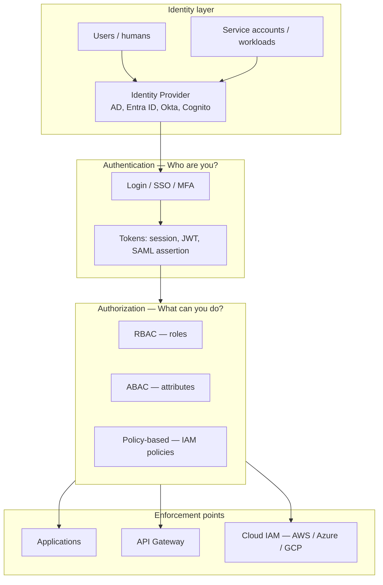
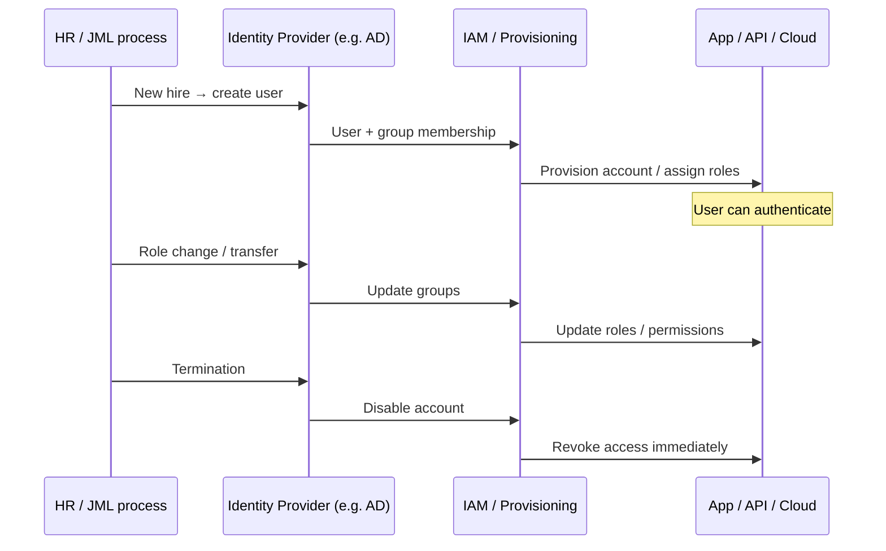
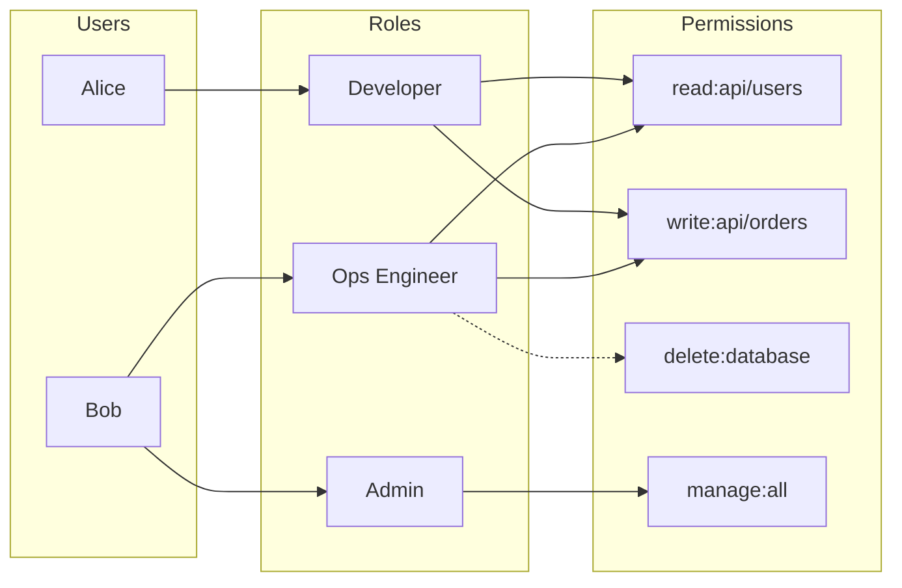
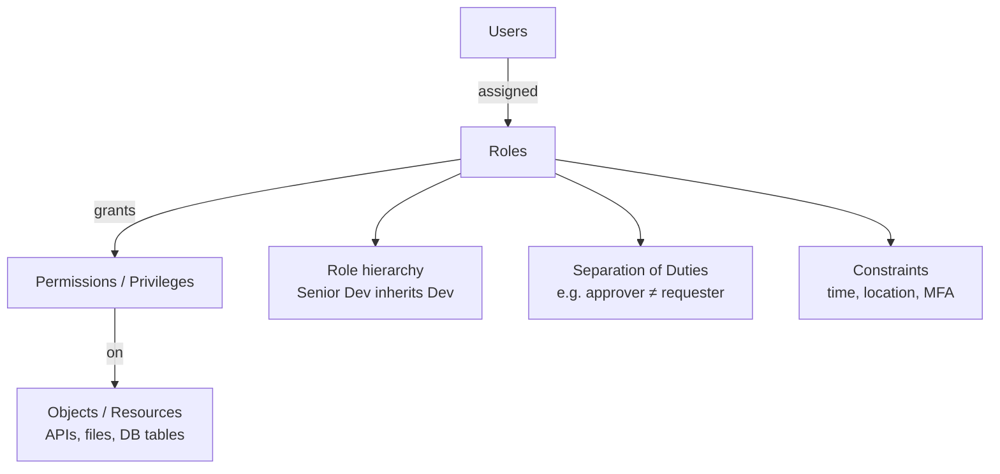
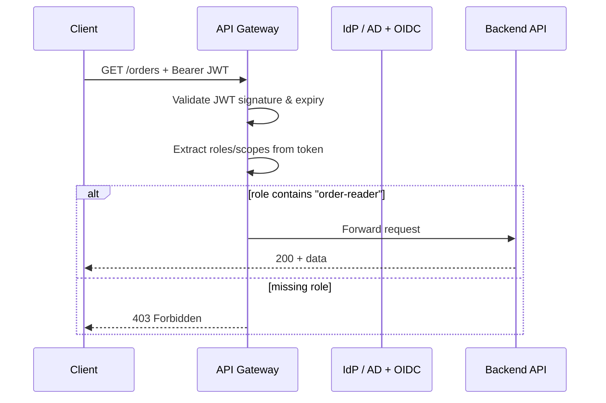

# Identity: RBAC, IAM & Active Directory

Enterprise identity foundations for APIs: how IAM governs access, how RBAC assigns permissions through roles, and how Active Directory (and cloud IdPs) feed tokens and policies your gateway and services enforce.

> **Related:** Auth protocols (OAuth(Open Authorization), JWT(JSON Web Token), mTLS(Mutual Transport Layer Security)) → [Auth model](04-auth-model.md) · Gateway enforcement → [Load Balancer & API Gateway](03-api-gateway.md) · Multi-tenant claims → [16-multi-tenant-apis.md](16-multi-tenant-apis.md) · DB connection identity → [database-connection-and-security](../../database-connection-and-security/README.md)

## Articles in this section

| Article | Topics |
|---------|--------|
| [Active Directory and enterprise IdP](12-identity-active-directory.md) | AD(Active Directory) structure, Kerberos, Entra hybrid, group → role mapping |
| [API access decisions](12-identity-enterprise-api.md) | Decision flow, takeaways, common mistakes |

## At a glance

| Concept | What it is | Primary question |
|---------|------------|------------------|
| **IAM** | Discipline + systems for identity and access lifecycle | Who are you, and are you allowed to do this? |
| **RBAC** | Access **model**: permissions via **roles** | What role do you have, and what does that role allow? |
| **Active Directory (AD(Active Directory))** | Microsoft **directory service** (identity store + auth) | Where do users, groups, and computers live in the org? |

**Relationship:** AD (or another IdP) holds identities → IAM is the overall framework that uses them → RBAC is one common way IAM assigns permissions at apps, APIs, and cloud layers.

For **how clients authenticate** (OAuth, API(Application Programming Interface) keys, JWT validation), see [Auth model](04-auth-model.md). This section covers **organizational identity** and **authorization structure**.

---

## What IAM is

**Identity and Access Management (IAM)** is the end-to-end lifecycle and enforcement of access across people, services, and resources.

| Area | Examples |
|------|----------|
| **Authentication (AuthN)** | Password, MFA, SSO, certificates, API keys |
| **Authorization (AuthZ)** | RBAC, ABAC, resource policies |
| **Provisioning** | SCIM, LDAP sync, just-in-time (JIT) access |
| **Governance** | Access reviews, least privilege, audit logs |
| **Federation** | SAML, OIDC(OpenID Connect) — trust external IdPs |
| **Secrets & keys** | Service principals, workload identity |

Cloud **IAM** (AWS IAM, Azure RBAC, GCP IAM) applies the same ideas to cloud control planes: principals + policies + enforcement at the API layer.

### IAM components

### IAM lifecycle (joiner-mover-leaver)

### Pros of a formal IAM program

- Single source of truth for who has access and why
- Faster onboarding/offboarding with fewer orphaned accounts
- Audit trail for compliance (SOC2, ISO 27001)
- Consistent mapping from org structure → app permissions

### Cons

- Tooling sprawl (AD, IdP, SCIM, cloud IAM, app-local roles)
- Group-to-role mapping drift if not governed
- Over-permissioning when teams copy "admin" roles for convenience

---

## What RBAC is

**Role-Based Access Control (RBAC)** assigns permissions to **roles**, not directly to every user. Users get roles; roles get permissions.

### RBAC model

### RBAC hierarchy (NIST-style)

### RBAC vs other access models

| Model | Basis of access | Good for |
|-------|-----------------|----------|
| **RBAC** | Job function (role) | Orgs with stable job titles |
| **ABAC** | Attributes (dept, clearance, resource tags) | Fine-grained, dynamic rules |
| **ACL** | Per-resource list of who can access | Small sets, file shares |
| **PBAC / Policy** | Declarative policies (Rego, IAM JSON) | Cloud, APIs, zero-trust |

### RBAC at the API layer

Map roles to **scopes** or **route policies** at the gateway and re-check in the app for object-level AuthZ ([Auth model — layered flow](04-auth-model.md#layered-auth-flow)).

| RBAC artifact | API example |
|---------------|-------------|
| **Role** | `order-reader`, `order-admin` |
| **Permission** | `GET /orders`, `POST /orders`, `DELETE /orders/{id}` |
| **Assignment** | Alice → `order-reader` (via AD group → app role mapping) |

Gateway checks **coarse** role/scope; the app still enforces **object ownership** (BOLA(Broken Object-Level Authorization)) — see [Auth model](04-auth-model.md).

---

---
