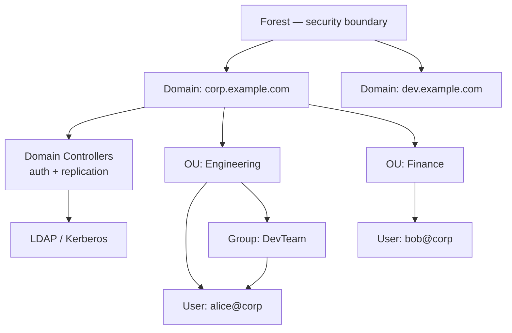
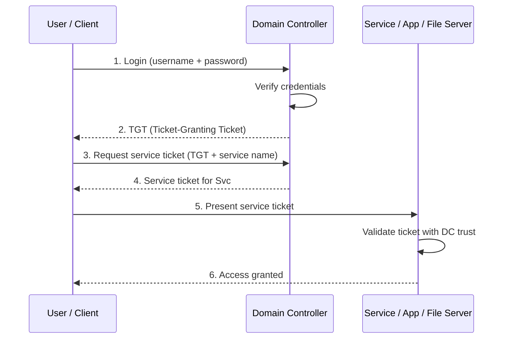
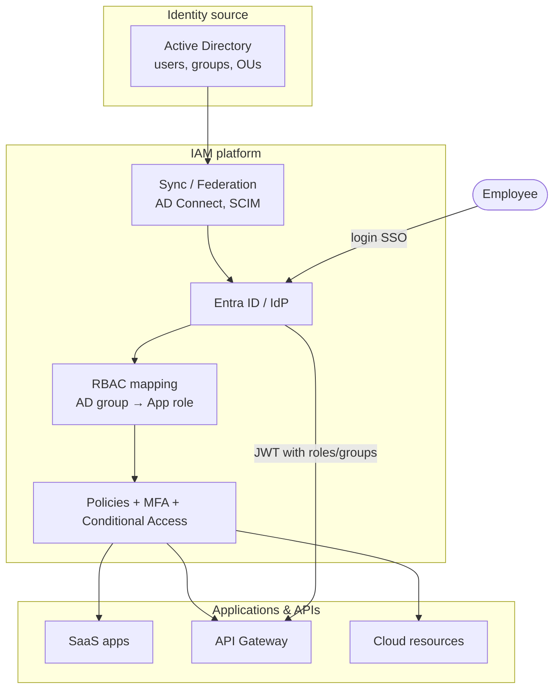
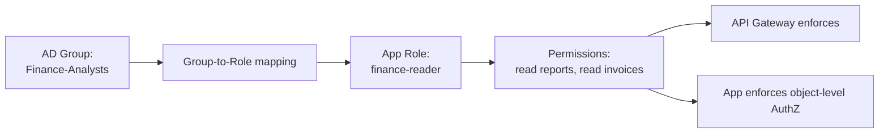
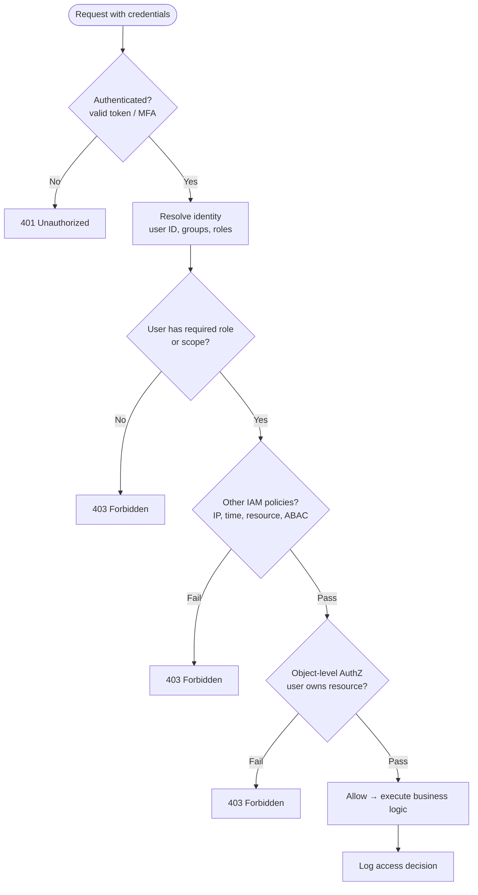

# Identity — Active Directory and enterprise IdP

> **Related:** IAM(Identity and Access Management) and RBAC(Role-Based Access Control) → [12-identity-rbac-iam-ad.md](12-identity-rbac-iam-ad.md) · API(Application Programming Interface) decisions → [12B-identity-enterprise-api.md](12B-identity-enterprise-api.md) · Auth protocols → [04-auth-model.md](04-auth-model.md)

## What Active Directory is

**Active Directory (AD)** is Microsoft's directory service for Windows-centric enterprises. It is primarily an **identity store and authentication system**, not a full IAM product by itself — though **Microsoft Entra ID** (Azure AD(Active Directory)) extends it for cloud and modern protocols.

### AD logical structure

### Key AD concepts

| Term | Meaning |
|------|---------|
| **Domain** | Administrative + authentication boundary (e.g. `corp.example.com`) |
| **Forest** | Collection of domains with shared schema |
| **Domain Controller (DC)** | Server that authenticates users and holds directory data |
| **OU (Organizational Unit)** | Container for users/groups/computers; delegation and GPO |
| **Security Group** | Collection of principals; permissions and RBAC mapping |
| **GPO (Group Policy)** | Central config for machines/users (password policy, software) |
| **Kerberos** | Default AD auth protocol (tickets, mutual auth) |
| **LDAP** | Directory query protocol (read users, groups, attributes) |

### AD authentication flow (Kerberos — simplified)

Modern APIs rarely terminate Kerberos at the gateway directly. Typical pattern: AD → Entra ID / IdP → **OIDC(OpenID Connect)/SAML** → JWT(JSON Web Token) with groups/roles → gateway + app.

### AD vs Microsoft Entra ID

| | **On-prem AD** | **Microsoft Entra ID** |
|--|----------------|------------------------|
| **Primary use** | Windows domain, LAN, legacy apps | Cloud, SaaS, modern auth (OIDC/SAML) |
| **Protocol** | Kerberos, NTLM, LDAP | OAuth(Open Authorization) 2.0, OIDC, SAML |
| **Structure** | Domains, OUs, GPO | Tenants, users, groups, conditional access |
| **Hybrid** | — | AD Connect syncs on-prem AD ↔ cloud |

---

## How RBAC, IAM, and AD work together

End-to-end enterprise picture for API access:

### Concrete example

1. **AD:** Alice is in security group `Finance-Analysts`
2. **IAM provisioning:** Sync maps `Finance-Analysts` → app role `finance-reader`
3. **RBAC:** Role `finance-reader` allows `GET /reports`, `GET /invoices`
4. **Enforcement:** API gateway reads JWT `roles: ["finance-reader"]`; app verifies resource ownership

---

## Decision flow: can this user access this API?

Unified authorization check (IAM + RBAC + token from AD-backed IdP):

Aligns with the [layered auth flow](04-auth-model.md#layered-auth-flow): gateway handles AuthN and coarse AuthZ; the app must still run the object check.

---

## Comparison summary

| | **IAM** | **RBAC** | **Active Directory** |
|--|---------|----------|----------------------|
| **Type** | Framework + tooling | Access **model** | Directory + auth **product** |
| **Answers** | Full identity lifecycle | "What can this role do?" | "Who is this user in the org?" |
| **Scope** | People, apps, cloud, APIs | Permissions via roles | Typically enterprise Windows / hybrid |
| **Typical artifacts** | Policies, MFA, audit, provisioning | Roles, bindings, permissions | Users, groups, OUs, GPO, DCs |
| **In API context** | Gateway auth, OAuth, lifecycle | JWT roles/scopes, usage plans | SSO source; groups → API roles |

