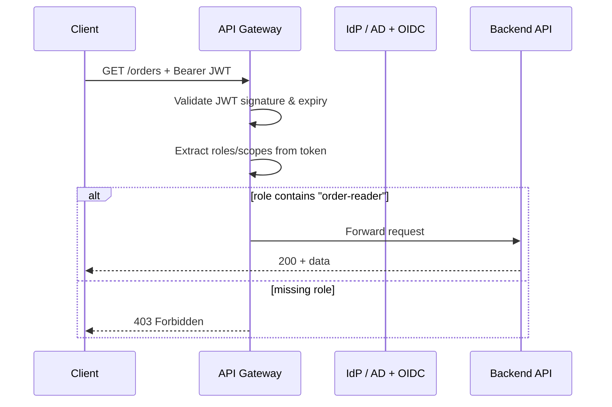

# Identity — API access decisions and practices

> **Related:** IAM(Identity and Access Management) and RBAC(Role-Based Access Control) → [12-identity-rbac-iam-ad.md](12-identity-rbac-iam-ad.md) · Active Directory → [12A-identity-active-directory.md](12A-identity-active-directory.md) · Multi-tenant → [16-multi-tenant-apis.md](16-multi-tenant-apis.md)

## API design takeaways

| Practice | Why |
|----------|-----|
| Map AD(Active Directory)/IdP **groups** → app **roles**, not raw group names in app code | Survives reorgs; central mapping table |
| Put **roles/scopes in JWT(JSON Web Token)** (short TTL) | Stateless validation at gateway |
| Enforce **object-level AuthZ in app** | RBAC alone does not prevent BOLA(Broken Object-Level Authorization) |
| Automate **JML** (joiner-mover-leaver) | Orphan accounts are a top audit finding |
| Regular **access reviews** | Least privilege over time |
| Log **who** (subject), **what** (resource), **decision** | Audit without logging tokens |

Default stack for public SaaS APIs (extends [overview default](00-overview.md#default-recommendation)):

1. **Entra ID / Okta** (fed from AD if hybrid) for employee SSO
2. **OAuth(Open Authorization) 2.0 + OIDC(OpenID Connect)** for user-facing apps → JWT with scopes/roles
3. **Scoped API keys** for partners (see [Auth model](04-auth-model.md))
4. **Gateway** validates token + coarse RBAC; **app** validates object ownership
5. **Cloud IAM** for service-to-service and data-layer access ([database-connection-and-security](../../database-connection-and-security/README.md))

---

## RBAC at the API layer

Map roles to **scopes** or **route policies** at the gateway and re-check in the app for object-level AuthZ ([Auth model — layered flow](04-auth-model.md#layered-auth-flow)).

| RBAC artifact | API example |
|---------------|-------------|
| **Role** | `order-reader`, `order-admin` |
| **Permission** | `GET /orders`, `POST /orders`, `DELETE /orders/{id}` |
| **Assignment** | Alice → `order-reader` (via AD group → app role mapping) |

Gateway checks **coarse** role/scope; the app still enforces **object ownership** (BOLA) — see [Auth model](04-auth-model.md).

Unified AuthN → AuthZ decision flow (MFA, policies, object check) → [12A — Decision flow](12A-identity-active-directory.md#decision-flow-can-this-user-access-this-api).

---

## Common mistakes

| Mistake | Fix |
|---------|-----|
| Checking AD group names hard-coded in every service | Central group → role mapping; roles in token claims |
| RBAC at gateway only, no object AuthZ in app | Layered AuthZ per [Auth model](04-auth-model.md) |
| Long-lived JWT with embedded admin role | Short TTL + refresh; minimal claims |
| No offboarding automation | Disable IdP account → revoke app + API access same day |
| Same role for humans and service accounts | Separate service principals with narrower permissions |
| Confusing cloud IAM with app RBAC | Cloud IAM protects AWS/Azure resources; app RBAC protects business operations |

---

## Related reading

| Guide | Topics |
|-------|--------|
| [Auth model](04-auth-model.md) | OAuth, JWT, API keys, mTLS(Mutual Transport Layer Security), webhook HMAC(Hash-based Message Authentication Code) |
| [API Gateway](03-api-gateway.md) | JWT validation, routing, policy at the edge |
| [database-connection-and-security](../../database-connection-and-security/README.md) | RDS IAM, Vault, workload identity to databases |
| [api-rate-limiting — scope identity](../../api-rate-limiting/includes/06-scope-identity.md) | Identity keys for rate-limit tiers |
