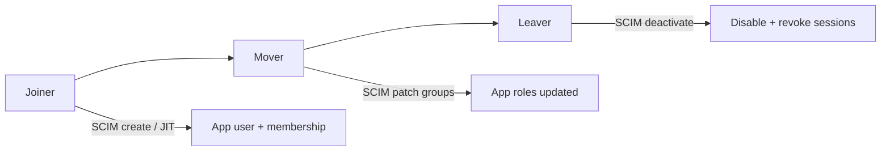
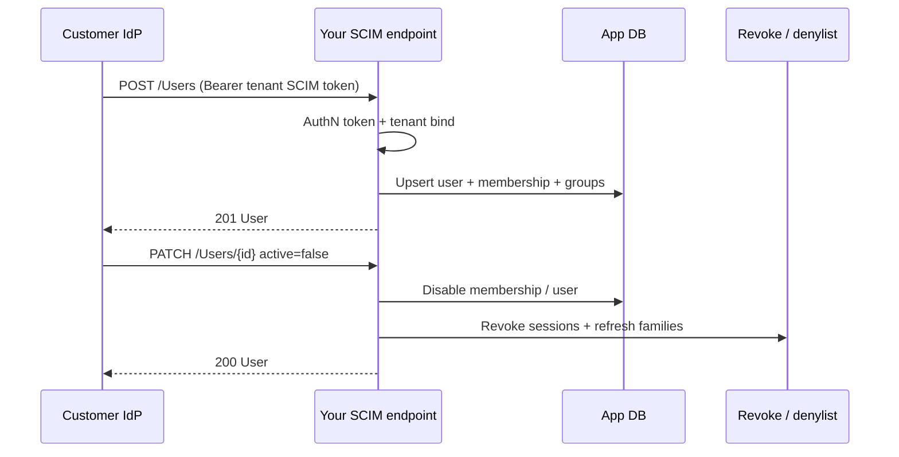

# Identity — SCIM and JML provisioning

Enterprise B2B SaaS(Software as a Service) needs more than SSO(Single Sign-On) login. Customer IT must **create, move, and disable** users in your app when HR does — often before (or without) the user ever signing in. That lifecycle is **JML(Joiner-Mover-Leaver)**; **SCIM(System for Cross-domain Identity Management)** is the common HTTP(Hypertext Transfer Protocol) API(Application Programming Interface) that automates it.

> **Scope:** Provisioning and deprovisioning playbook — JML stages, SCIM Users/Groups, JIT(Just-In-Time) vs pre-provision, group→role sync, lag/revocation races, multi-tenant SCIM tokens. AD(Active Directory)/Entra structure → [§12A](12A-identity-active-directory.md). API RBAC(Role-Based Access Control) takeaways → [§12B](12B-identity-enterprise-api.md). Session/token revoke after disable → [auth §3b](../../auth-oauth-oidc-and-login-security/includes/03B-revoke-logout-denylist.md). Multi-tenant IdP routing → [auth §2d](../../auth-oauth-oidc-and-login-security/includes/02D-multi-tenant-oidc-and-b2b-sso.md).
>
> **Related:** Identity hub → [§12](12-identity-rbac-iam-ad.md) · Auth protocols → [§4](04-auth-model.md) · Multi-tenant API claims → [§16](16-multi-tenant-apis.md) · Audit → [enterprise-security §6](../../enterprise-security-compliance/includes/06-audit-logging-and-retention.md) · PII(Personally Identifiable Information) → [§7](../../enterprise-security-compliance/includes/07-pii-and-data-classification.md)

---

## At a glance

| Concept | What it is | Owns |
|---------|------------|------|
| **JML** | Org process: joiner → mover → leaver | *When* access must change |
| **SCIM** | RFC 7643/7644 REST(Representational State Transfer) API for Users/Groups | *How* IdP pushes changes to your app |
| **JIT** | Create local user on first successful SSO | Onboarding without pre-provision |
| **Group → role** | Map IdP groups to app roles in **your** tables | Authorization after provision |

**Rule of thumb:** For regulated or large enterprise tenants, prefer **SCIM (or equivalent sync) as source of truth for membership**, with **immediate revoke** on disable — not “wait for JWT(JSON Web Token) TTL.” JIT alone is fine for SMB unless you pair it with short sessions and IdP checks.

---

## JML stages (what must happen)



| Stage | HR / IdP signal | App must |
|-------|-----------------|----------|
| **Joiner** | User created; assigned to groups/apps | Create (or link) user; grant membership + default roles; optional welcome |
| **Mover** | Group/dept change | Recompute roles from groups; drop stale privileges same day |
| **Leaver** | User disabled / removed from app | Disable login **and** revoke refresh/sessions/`jti` — [auth §3b](../../auth-oauth-oidc-and-login-security/includes/03B-revoke-logout-denylist.md) |

High-level sequence (IdP-centric) also appears in [§12A IAM lifecycle](12A-identity-active-directory.md#iam-lifecycle-joiner-mover-leaver); this section is the **app-side** contract.

---

## SCIM vs JIT vs manual

| Mode | How users appear | Offboarding strength | Typical fit |
|------|------------------|----------------------|-------------|
| **SCIM push** | IdP POSTs/PATCHes `/Users`, `/Groups` | Strong if deactivate → revoke is wired | Enterprise / regulated |
| **Directory sync** (AD Connect, LDAP job) | Batch pull/push into IdP or app | Depends on lag + revoke | Hybrid AD |
| **JIT on SSO** | First login creates user + membership | Weak unless short TTL + IdP session | SMB, self-serve |
| **Manual / CSV** | Admin UI | Error-prone | Early pilots only |

**Product choice (per tenant):** require SCIM before first login, or allow JIT and upgrade to SCIM later — [auth §2d](../../auth-oauth-oidc-and-login-security/includes/02D-multi-tenant-oidc-and-b2b-sso.md).

---

## SCIM surface your app should expose

Treat SCIM as a **privileged management API**, not a public product API.

| Resource | Typical ops | App effect |
|----------|-------------|------------|
| **User** | create, GET, replace/PATCH, delete/deactivate | Upsert identity + membership; `active=false` → disable |
| **Group** | create, PATCH members | Maintain group membership; remap → roles |
| **Schemas / ServiceProviderConfig** | discovery | Advertise supported attributes and auth |

### Identity keys

| Key | Use |
|-----|-----|
| **`externalId` / IdP id** | Stable link from IdP object → your `users` / `identities` row |
| **`(iss, sub)` on SSO** | Login link — must match the provisioned identity — [auth §2b](../../auth-oauth-oidc-and-login-security/includes/02B-sso-integration-playbook.md) |
| **Email** | Convenience / HRD(Home-Realm Discovery); **not** the sole primary key (people change email) |

```text
identities(user_id, iss, sub, scim_external_id, ...)
memberships(user_id, tenant_id, role, source)  -- source = scim | jit | invite
idp_groups(tenant_id, external_id, name)
group_members(group_id, user_id)
group_role_map(tenant_id, group_external_id, app_role)
```

### Minimal create / deactivate flow



---

## Authenticating the SCIM endpoint

| Pattern | Guidance |
|---------|----------|
| **Per-tenant bearer** | Long-lived token issued at admin-consent / SCIM setup; store hashed; rotate |
| **OAuth(Open Authorization) client credentials** | IdP obtains token for `scim` audience; prefer over static shared secret when IdP supports it |
| **mTLS(Mutual Transport Layer Security)** | Extra layer for high-assurance tenants |
| **IP allowlist** | Optional; never sole control |

**Multi-tenant:** SCIM credential **implies** `tenant_id`. Never accept a client-supplied tenant header that disagrees with the token — same binding rule as [§16](16-multi-tenant-apis.md).

---

## Group → role mapping and movers

1. SCIM (or claim) delivers IdP **groups**.
2. Your **`group_role_map`** (per tenant) maps group → app role(s).
3. On member add/remove or User PATCH, **recompute** effective roles; do not append forever.

| Mistake | Fix |
|---------|-----|
| Grant `admin` from one IdP group claim in the JWT alone | Map in your tables; require explicit admin path |
| Ignore group removals | Mover = drop privileges; treat PATCH members as authoritative when SCIM is SoT |
| Duplicate role grants from overlapping groups | Define union rules; document precedence |

API-layer RBAC enforcement → [§12B](12B-identity-enterprise-api.md#rbac-at-the-api-layer).

---

## Lag, races, and revoke

Provisioning is eventually consistent with the IdP. Design for the gap.

| Race | Risk | Mitigation |
|------|------|------------|
| **Disable → JWT still valid** | Leaver keeps API access until TTL | On SCIM deactivate: revoke refresh + session denylist / user epoch — [auth §3b](../../auth-oauth-oidc-and-login-security/includes/03B-revoke-logout-denylist.md), [§3c](../../auth-oauth-oidc-and-login-security/includes/03C-denylist-redis-patterns.md) |
| **SCIM lag after AD disable** | Hybrid sync delay | Monitor lag SLO(Service Level Objective); short access TTL; optional IdP introspection on sensitive routes |
| **JIT user before SCIM arrives** | Duplicate identities | Link on `(iss, sub)` / `externalId`; merge; prefer one SoT per tenant |
| **Delete vs deactivate** | Hard delete breaks audit / rehire | Prefer `active=false`; soft-delete with retention — [ESC §7](../../enterprise-security-compliance/includes/07-pii-and-data-classification.md) |

**Rule:** Deprovisioning is not done until **login is impossible and outstanding credentials are dead**, not merely when the SCIM response returns 200.

---

## Multi-tenant and B2B specifics

| Concern | Practice |
|---------|----------|
| **Per-customer IdP** | Separate SCIM base URL or token per tenant — [auth §2d](../../auth-oauth-oidc-and-login-security/includes/02D-multi-tenant-oidc-and-b2b-sso.md) |
| **Shared broker** | Broker may SCIM into your app once; still bind membership to customer `tenant_id` |
| **Admin consent** | Enable SCIM only after customer admin grants the app |
| **Seat / license caps** | Enforce on create; return SCIM-friendly errors |
| **External collaborators** | Do not auto-provision from partner IdP into wrong tenant |

---

## Operational checklist

- [ ] SCIM (or documented sync) path for enterprise tenants; credential per tenant
- [ ] Stable link keys: `externalId` + `(iss, sub)` on SSO
- [ ] Joiner: create/link user + membership; groups → roles via map table
- [ ] Mover: group PATCH recomputes roles (drops stale)
- [ ] Leaver: `active=false` → disable **and** revoke sessions/refresh — [§3b](../../auth-oauth-oidc-and-login-security/includes/03B-revoke-logout-denylist.md)
- [ ] Decide JIT vs SCIM-required per tenant; document merge rules
- [ ] Monitor provision/deprovision lag and failure rate
- [ ] Audit who was provisioned/disabled (no secrets in logs) — [ESC §6](../../enterprise-security-compliance/includes/06-audit-logging-and-retention.md)
- [ ] Load/chaos: duplicate SCIM PATCHes are idempotent
- [ ] Tests: deactivate mid-session loses API access within revoke SLA(Service Level Agreement)

---

## Common mistakes

| Mistake | Fix |
|---------|-----|
| SCIM create only; no deactivate handler | Implement deactivate + revoke as one unit |
| Treat email as primary key | Use IdP external id + `(iss, sub)` |
| Shared SCIM bearer across all tenants | Per-tenant credential; bind tenant from token |
| “Disabled in IdP” but long-lived refresh still works | Wire [§3b](../../auth-oauth-oidc-and-login-security/includes/03B-revoke-logout-denylist.md) on every disable path |
| Map groups in JWT only; ignore SCIM group membership | Persist map; recompute on SCIM events |
| Hard-delete users on SCIM DELETE | Soft-disable; retain audit trail |
| JIT and SCIM both create conflicting rows | Upsert/merge on stable keys; one SoT policy |
| Expose SCIM on the public internet with a guessable token | Rotate, hash at rest, rate-limit, optional mTLS |

---

## Pros and cons

### SCIM-backed JML

**Pros:** Customer IT controls lifecycle in their IdP; audit-friendly; offboarding does not depend on the user logging in; scales across many enterprise tenants.

**Cons:** Endpoint is high-privilege (protect like production admin); attribute/schema mismatches per IdP; sync lag; you must still own revoke and object AuthZ.

### JIT-only

**Pros:** Fast to ship; no SCIM surface.

**Cons:** No pre-provision; weak leaver story; regulated customers will reject it as sole control.