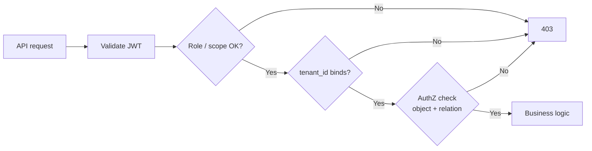

# Identity — Fine-grained AuthZ

RBAC(Role-Based Access Control) answers “what role can call this route?” Fine-grained AuthZ(Authorization) answers “can **this** subject act on **this** object?” — documents, folders, tickets, shared links. Stuffing that graph into a JWT(JSON Web Token) fails; query an AuthZ store or service instead.

> **Scope:** Object-level and relationship AuthZ — BOLA(Broken Object-Level Authorization) patterns, ReBAC(Relationship-Based Access Control) / Zanzibar-style tuples, ABAC(Attribute-Based Access Control) vs RBAC, caching and consistency with tenancy. Org roles and SCIM(System for Cross-domain Identity Management) → [§12](12-identity-rbac-iam-ad.md) · [§12B](12B-identity-enterprise-api.md) · [§12C](12C-scim-and-jml-provisioning.md). Token claims → [auth §3](../../auth-oauth-oidc-and-login-security/includes/03-token-lifecycle-and-validation.md). Multi-tenant claim binding → [§16](16-multi-tenant-apis.md).
>
> **Related:** Layered AuthN(Authentication)/AuthZ → [§4](04-auth-model.md) · Threat model BOLA → [§6](06-threat-model.md) · PostgreSQL RLS(Row-Level Security) → [PG §17](../../postgresql-performance/includes/17-row-level-security-multi-tenant.md)

---

## At a glance

| Layer | Question | Typical home |
|-------|----------|--------------|
| **AuthN** | Who is calling? | Gateway / IdP(Identity Provider) JWT |
| **Coarse AuthZ (RBAC/scopes)** | May this role hit this API(Application Programming Interface)? | Gateway + app |
| **Fine AuthZ** | May this subject act on **this** resource? | App + AuthZ store/service |
| **Tenant bind** | Is the resource in the active tenant? | Claim + DB/`tenant_id` — [§16](16-multi-tenant-apis.md) |

**Rule of thumb:** Put **stable, coarse** roles/scopes in short-lived JWTs. Keep **relationships and object ACLs** out of the token — look them up (with cache) at decision time.

---

## When RBAC is not enough

| Signal | Prefer |
|--------|--------|
| Users share individual objects (docs, boards, tickets) | Per-object ACL(Access Control List) or ReBAC |
| Permissions inherit (folder → file, org → project → issue) | ReBAC tuples / hierarchy |
| Rules need attributes (region, clearance, time) | ABAC / policy engine |
| Only “admin / member / viewer” on whole tenant | Stay on RBAC + tenant bind |

OIDC(OpenID Connect) mistake to avoid: “Putting huge authorization graphs in JWT” → [auth §2](../../auth-oauth-oidc-and-login-security/includes/02-oidc-discovery-and-tokens.md).

---

## Models

| Model | Stores | Good for | Cost |
|-------|--------|----------|------|
| **Object ACL** | `(resource_id, subject, relation)` rows | Small collaborator sets | Simple; hot objects get wide rows |
| **ReBAC / Zanzibar-style** | Relation tuples + graph walk (`user:alice#viewer@doc:42`) | Inheritance, groups-as-subjects, scale | New service + consistency design |
| **ABAC / policy** | Attributes + policy (OPA/Rego, Cedar) | Dynamic attributes, compliance rules | Policy authoring + test burden |
| **RLS / DB policies** | SQL(Structured Query Language) predicates on `tenant_id` / owner | Defense in depth for SQL paths | Not a substitute for API AuthZ |



---

## ReBAC sketch (Zanzibar-style)

Store **tuples**, not flattened permission lists:

```text
# subject_type:subject_id # relation @ object_type:object_id
user:alice # editor @ doc:42
group:eng # member @ user:alice
group:eng # viewer @ folder:reports
folder:reports # parent @ doc:42   -- optional rewrite / userset
```

| Check | Meaning |
|-------|---------|
| `doc:42#viewer@user:alice` | Direct or via group/folder rewrite |
| Expand | List who has `editor` on `doc:42` (sharing UI) |
| Write | Grant/revoke tuple; invalidate caches |

**Consistency:** AuthZ reads are often **slightly stale** vs the write path. Document the lag; for “just revoked, must die now,” couple with session/token revoke — [auth §3b](../../auth-oauth-oidc-and-login-security/includes/03B-revoke-logout-denylist.md) — and short AuthZ cache TTL(Time To Live).

---

## Placement and caching

| Concern | Guidance |
|---------|----------|
| **Who calls AuthZ?** | App service (or BFF(Backend for Frontend)), not the browser alone |
| **Gateway** | Coarse RBAC only; object checks need resource id + context |
| **Cache** | Cache `(subject, relation, object) → allow` with short TTL; bust on grant/revoke |
| **Negative cache** | Careful — revoke must invalidate quickly |
| **Bulk list APIs** | Filter in query (`WHERE` ownership) or AuthZ expand; never load-all-then-filter in memory at scale |
| **Multi-tenant** | Every tuple or ACL row includes `tenant_id` (or object ids that imply it); never cross-tenant expand |

---

## JWT claims vs AuthZ service

| In JWT | In AuthZ store |
|--------|----------------|
| `sub`, `iss`, `tenant_id`, coarse `roles`/`scopes` | Object relations, group membership graphs, share links |
| Short TTL | Mutable; source of truth for fine rights |
| Validated at edge | Queried per sensitive mutation / read |

---

## Testing checklist

- [ ] User A cannot read/update User B’s object id (BOLA) — [§6](06-threat-model.md)
- [ ] Revoke share → access fails within stated AuthZ/cache SLA(Service Level Agreement)
- [ ] Tenant switch / wrong `tenant_id` claim cannot hit other tenant objects — [§16](16-multi-tenant-apis.md)
- [ ] Group grant/revoke recomputes effective access (ReBAC rewrite)
- [ ] List endpoints never leak other tenants’ ids in sparse results
- [ ] Admin impersonation uses actor≠subject audit — [auth §5d](../../auth-oauth-oidc-and-login-security/includes/05D-impersonation-and-support-access.md)

---

## Common mistakes

| Mistake | Fix |
|---------|-----|
| Encode full ACL in JWT | Minimal claims; query AuthZ |
| Gateway RBAC only | App still checks object ownership / relation |
| Trust `resource_id` from client without tenant bind | Join on `tenant_id` from session/token |
| Infinite AuthZ cache | Short TTL + explicit invalidation on revoke |
| One global “admin” that skips object checks | Break-glass path with audit; still tenant-scoped |
| ReBAC without tenancy in tuples | Namespace objects per tenant or include tenant in object id |

---

## Pros and cons

### Externalized fine AuthZ (ReBAC/ABAC service)

**Pros:** Scales sharing models; keeps tokens small; central audit of grants.

**Cons:** New dependency and consistency story; list/filter APIs need careful design; overkill for pure RBAC products.

### App-local ACL tables

**Pros:** Ships fast; transactional with the resource write.

**Cons:** Inheritance and “groups of groups” get painful; hard to share AuthZ across many services without duplication.