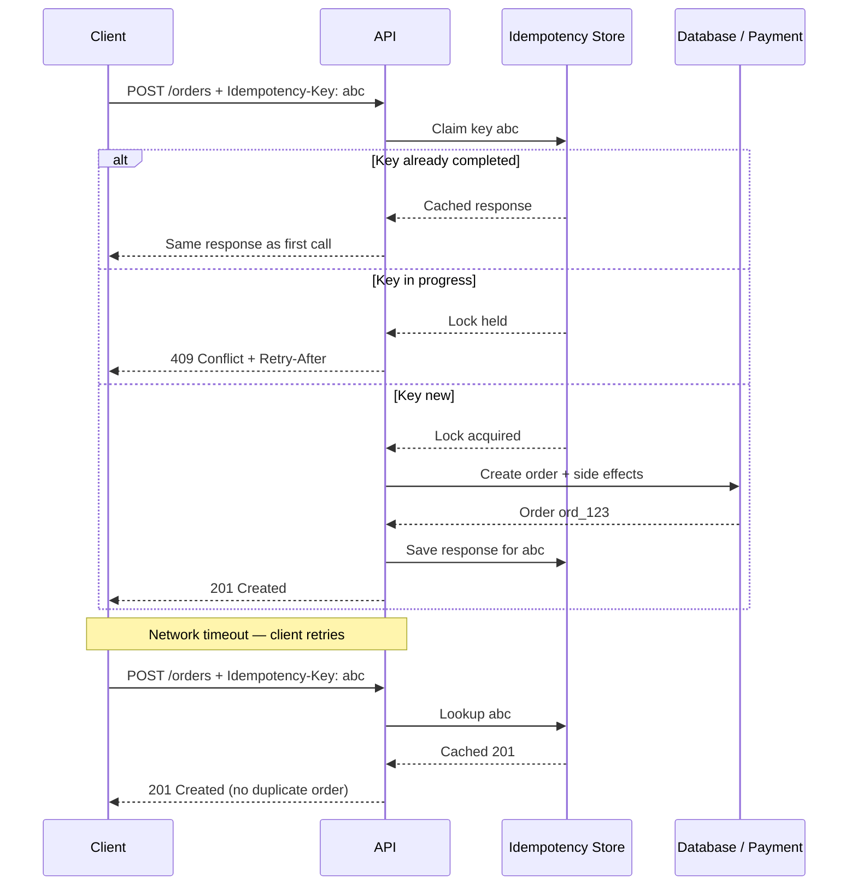

# Idempotency

How to design writes that are safe to retry: HTTP(Hypertext Transfer Protocol) semantics, `Idempotency-Key` headers, storage patterns, and how idempotency fits async jobs, webhooks, and stateless app tiers.

> **Related:** Write safety contract → [API design §7](01-api-design.md#7-write-safety) · Webhook replay → [API protection §6](02-api-protection.md#6-idempotency-and-replay-protection) · Async job retries → [Async patterns](10-async-patterns.md) · Shared stores → [Stateless architecture](11-stateless-architecture.md) · Event-sourced commands → [Event Sourcing & CQRS](../../event-sourcing-and-cqrs/includes/04-api-design-implications.md) · Multi-step sagas → [Sagas and distributed workflows](../../event-sourcing-and-cqrs/includes/07-sagas-and-distributed-workflows.md#idempotency-patterns-specific-to-sagas)

---

## At a glance

| Question | Answer |
|----------|--------|
| **What is it?** | Repeating the same operation has the same effect as doing it once |
| **Who enforces it?** | **Application layer** — not gateway or load balancer ([entry architecture](03-api-gateway.md#what-the-gateway-should-do)) |
| **When is a key required?** | `POST` (and some `PATCH`) with side effects: payments, orders, provisioning, external calls |
| **Where to store keys?** | Shared **Redis** or **PostgreSQL** — never per-instance memory ([stateless checklist](11-stateless-architecture.md#checklist-is-your-app-tier-stateless)) |
| **Updates to existing resources?** | Use `ETag` / `If-Match`, not idempotency keys |
| **Inbound webhooks?** | HMAC(Hash-based Message Authentication Code) + timestamp + dedup by event ID — see [API protection §6](02-api-protection.md#6-idempotency-and-replay-protection) |

**Rule of thumb:** If a client might retry on timeout and a duplicate would charge money, create a row, or send a notification — require `Idempotency-Key`.

---

## What it is

**Idempotent** means calling an operation multiple times does not change state beyond the first successful application.

| Term | Meaning |
|------|---------|
| **Safe** | No side effects (reads) |
| **Idempotent** | Side effects happen at most once; repeats are no-ops or return the same outcome |

### HTTP methods (default semantics)

| Method | Idempotent? | Safe? | Notes |
|--------|-------------|-------|-------|
| `GET` | Yes | Yes | Cache-friendly reads |
| `PUT` | Yes | No | Full replace — same payload → same final state |
| `DELETE` | Yes | No | Second call → `404` or `204`; still idempotent |
| `PATCH` | Design-dependent | No | Use version checks for safe updates |
| `POST` | **No** | No | Creates or triggers actions — **needs explicit protection** |

Examples:

- `GET /orders/123` twice → same order, no extra writes.
- `DELETE /orders/123` twice → gone after first call; second is harmless.
- `POST /orders` twice with the same JSON body → **two orders** unless you implement idempotency.

---

## When to use what

### Natural idempotency (no header)

Design these to be idempotent by HTTP semantics or resource identity:

- **`GET`** — all reads
- **`PUT /resources/{id}`** — client-known ID; same body → same state
- **`DELETE /resources/{id}`** — delete is naturally repeatable

### `Idempotency-Key` header (explicit)

Require on **`POST`** when the operation:

- Moves money (charges, refunds, transfers)
- Creates durable resources (orders, subscriptions, tickets)
- Triggers external side effects (email, SMS, partner API(Application Programming Interface) calls)
- Enqueues async work the client may retry ([Async patterns](10-async-patterns.md))
- Runs on unreliable networks (mobile, partner integrations)

```http
POST /v1/orders
Authorization: Bearer ...
Idempotency-Key: 7c9e6679-7425-40de-944b-e07fc1f90ae7
Content-Type: application/json
```

### Optimistic concurrency (updates, not creates)

For **`PATCH`** / **`PUT`** on existing resources, prefer **`ETag`** / **`If-Match`**:

```http
PATCH /v1/orders/123
If-Match: "v5"
Content-Type: application/json
```

Return **`409 Conflict`** on stale version. This prevents lost updates; it is complementary to idempotency keys, not a replacement.

### When you can skip idempotency keys

- Pure reads
- `PUT` / `DELETE` with stable resource IDs already designed for repeat calls
- Fire-and-forget events where duplicates are harmless
- Domain models with a **natural dedup key** (e.g. `client_reference_id` on payments with a unique constraint)

---

## Client contract

### Key generation

- Client generates a **UUID v4** (or similar) **once per user action**
- **Reuse the same key** on retries of the *same* logical operation
- **Never reuse** the key for a different operation (different amount, recipient, or payload)

### Scope

The server must scope keys per caller and route:

```
(tenant_id or client_id, endpoint, idempotency_key)
```

The same key from two different API keys or tenants must not collide.

### Same key, different body → reject

If the client sends the same `Idempotency-Key` with a **different request body**, return **`422`** or **`409`**:

```json
{
  "error": {
    "code": "idempotency_key_reused",
    "message": "Idempotency-Key was already used with a different request body.",
    "request_id": "req_9f2a"
  }
}
```

Store a hash of the normalized request body alongside the key to detect mismatches.

### Response replay

On retry, return the **same HTTP status and body** as the original — including errors.

| First response | Retry with same key |
|----------------|---------------------|
| `201 Created` + order body | Same `201` + same body |
| `422 Unprocessable Entity` | Same `422` — do not re-validate differently |
| `500` before completion | May retry processing (see in-progress below) |

Document whether you cache error responses for the full TTL (Stripe-style) or only successes.

---

## Server flow



### Order of operations (critical)

1. Authenticate and authorize
2. **Claim the idempotency key** (atomic)
3. If replay → return cached response
4. Execute business logic and external calls
5. Persist result and mark key **completed**
6. Return response

**Never** charge a card, insert a row, or send email before the key is claimed.

### Concurrent duplicates

Two identical requests arriving simultaneously:

| Strategy | Behavior |
|----------|----------|
| **First wins + lock** | Second gets `409 Conflict` with `Retry-After`, or blocks until first completes |
| **Optimistic insert** | DB unique constraint on key; loser reads cached result |

Avoid both requests executing business logic.

### In-progress and crashed workers

Use a short-lived **processing** state:

```
SET key "processing" NX EX 300   → claim with 5-minute lock
... work ...
SET key {response_json} EX 86400 → final state with 24h TTL
```

If the worker crashes mid-flight, the lock expires and a retry may safely re-attempt — or return `409` until you define recovery semantics for your domain.

---

## Where to store idempotency keys

Enforcement lives in the **application**; storage must be **shared** across all app instances ([Stateless architecture](11-stateless-architecture.md)).

| Store | Best for | Pros | Cons |
|-------|----------|------|------|
| **Redis** | Default for API idempotency | Fast `SET NX`, TTL, response cache; often colocated with rate limits | Another failure domain; define fail-closed vs fail-open |
| **PostgreSQL** | Writes already in same DB transaction | Strong consistency; unique constraint is authoritative | Slower than Redis; couples to DB availability |
| **Domain table** | Payments, orders with `client_reference_id` | No separate idempotency table; business key is the dedup key | Requires modeling upfront |

**Not here:** gateway, load balancer, or app instance memory.

### Pattern A — Redis

```text
Key:   idem:{tenant}:{endpoint}:{idempotency_key}
Value: { status, headers, body, request_hash, created_at }
TTL:   86400 (24h) for completed; 300 (5m) for "processing"
```

```text
SET key "processing" NX EX 300     → if fail, GET and return cached or 409
... do work ...
SET key {response_json} XX EX 86400
```

### Pattern B — PostgreSQL

```sql
CREATE TABLE idempotency_records (
  tenant_id       UUID NOT NULL,
  idempotency_key TEXT NOT NULL,
  request_hash    TEXT NOT NULL,
  response_status INT,
  response_body   JSONB,
  created_at      TIMESTAMPTZ DEFAULT now(),
  PRIMARY KEY (tenant_id, idempotency_key)
);
```

```text
BEGIN;
INSERT ... ON CONFLICT DO NOTHING RETURNING *;
-- no row → SELECT existing and return cached response
-- row inserted → process, UPDATE with response, COMMIT
```

Combine with the business write in one transaction when possible.

### Pattern C — Natural domain key

```json
{
  "amount": 5000,
  "currency": "usd",
  "client_reference_id": "checkout-session-abc"
}
```

Unique constraint on `(merchant_id, client_reference_id)`. Duplicate insert fails; return the existing payment. No separate idempotency table when the domain model already deduplicates.

### TTL and cleanup

| Setting | Typical value |
|---------|---------------|
| Completed response cache | **24 hours** to **7 days** |
| Processing lock | **5–15 minutes** |
| After TTL expires | Treat as new key, or return `409` if strict forever-dedup is required |

Expire with Redis TTL or a background job on DB rows.

---

## Async jobs

When `POST` returns **`202 Accepted`** with a job resource, the idempotency key prevents duplicate enqueue on client retry. Full flow → [Async patterns § Pattern 1 — Job resource + polling](10-async-patterns.md#pattern-1--job-resource--polling-default) and [§ Idempotency across async](10-async-patterns.md#idempotency-across-async).

Job **workers** must also deduplicate on `job_id` or message ID for at-least-once queue delivery.

---

## Webhook replay protection

Idempotency for **inbound** webhooks is replay protection — different header, same goal:

- HMAC signature over body + timestamp
- Reject requests older than a skew window (e.g. 5 minutes)
- Constant-time signature comparison
- Dedup by `event_id` in a shared store

Details → [API protection §6](02-api-protection.md#6-idempotency-and-replay-protection) and [Auth model — HMAC webhooks](04-auth-model.md#hmac-webhooks).

---

## Event-sourced commands

Command APIs (`POST /commands/PlaceOrder`) use the same `Idempotency-Key` header. Store `key → (aggregate_id, resulting_version)` with TTL so duplicate commands do not append duplicate events.

Details → [Event Sourcing & CQRS — API design](../../event-sourcing-and-cqrs/includes/04-api-design-implications.md).

---

## OpenAPI modeling

```yaml
paths:
  /v1/orders:
    post:
      summary: Create order
      parameters:
        - name: Idempotency-Key
          in: header
          required: true
          schema:
            type: string
            format: uuid
          description: >
            Unique key for this operation. Retries must reuse the same key
            and request body.
      responses:
        '201':
          description: Order created
        '409':
          description: Idempotency key conflict (in progress or body mismatch)
        '422':
          description: Idempotency key reused with different body
```

OpenAPI documents the contract; **runtime enforcement remains in application code** ([OpenAPI / Swagger](07-openapi-swagger.md)).

---

## Observability

Log safely:

- `idempotency_key` (or truncated hash)
- `request_id`, `client_id`, endpoint
- Outcome: `fresh`, `replay`, `conflict`, `body_mismatch`

Never log full payment payloads or PII unnecessarily. Idempotency replay metrics help investigate duplicate-charge reports.

---

## Common mistakes

| Mistake | Risk |
|---------|------|
| Check idempotency **after** charging or inserting | Duplicate side effects |
| No lock on concurrent requests | Race → duplicates |
| Reuse keys across different operations | Silent wrong dedup |
| Different response on replay | Client state machines break |
| Gateway-only dedup | Gateway does not know business outcome |
| Per-instance memory store | Breaks with multiple replicas |
| Idempotency key without auth scope | Cross-tenant collision |

---

## Decision checklist

| Question | Action |
|----------|--------|
| Is it a read? | Rely on `GET`; no key needed |
| Is it `PUT`/`DELETE` with stable ID? | Design for natural idempotency |
| Is it `POST` with money, creation, or external effects? | Require `Idempotency-Key` |
| Can the client retry on timeout? | Idempotency is mandatory |
| Is it an update to existing resource? | Use `ETag` / `If-Match` |
| Is it async (`202` + job)? | Key dedupes enqueue; worker dedupes processing |
| Is it a multi-step saga across services? | Per-step idempotency keys + saga state — see [Sagas §7](../../event-sourcing-and-cqrs/includes/07-sagas-and-distributed-workflows.md#idempotency-patterns-specific-to-sagas) |
| Is it an inbound webhook? | HMAC + timestamp + event ID dedup |
| Multiple app instances? | Shared Redis or DB store |

---

## Pre-launch checklist

| Check | Pass? |
|-------|-------|
| Side-effecting `POST`s document `Idempotency-Key` in OpenAPI | |
| Keys scoped to `(tenant, endpoint, key)` | |
| Claim happens before external side effects | |
| Same key + different body returns error | |
| Replays return identical status and body | |
| Storage is shared (Redis or DB), not in-memory | |
| TTL and processing-lock expiry documented | |
| Concurrent duplicate requests handled | |
| Async enqueue deduped on retry | |
| Metrics/logs distinguish fresh vs replay | |

---

## Pros and cons

### Pros of explicit idempotency keys

- Safe client retries on timeout without duplicate charges or orders
- Predictable behavior for partners integrating over unreliable networks
- Clear audit trail when combined with correlation IDs

### Cons / trade-offs

- Extra storage and lookup on every write
- Clients must generate and persist keys correctly
- TTL boundaries require documented client behavior
- Fail-open vs fail-closed when the idempotency store is down (default: **fail closed** on financial writes)
