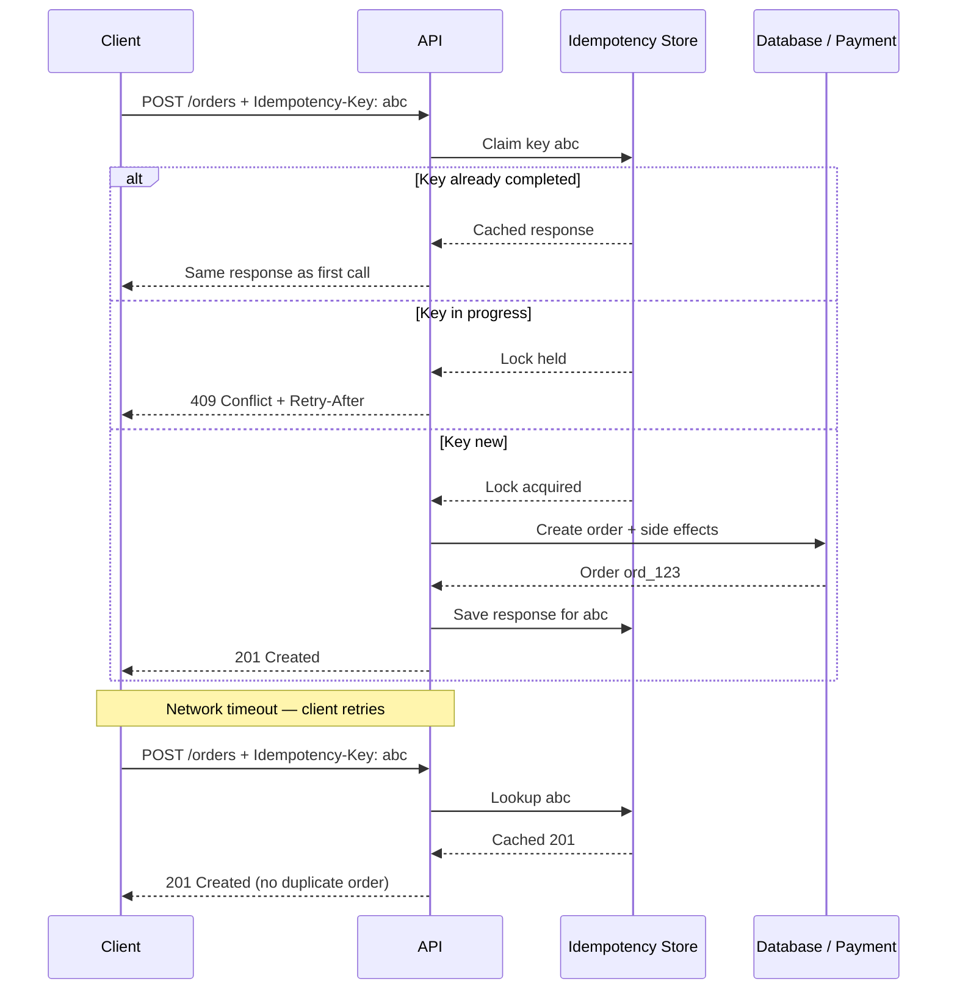

# Idempotency — client contract and server flow

> **Related:** Overview → [Idempotency](13-idempotency.md) · Storage patterns → [13B-idempotency-storage.md](13B-idempotency-storage.md) · Async and OpenAPI → [13C-idempotency-integrations.md](13C-idempotency-integrations.md)

---

## Client contract

### Key generation

- Client generates a **UUID v4** (or similar) **once per user action**
- **Reuse the same key** on retries of the *same* logical operation
- **Never reuse** the key for a different operation (different amount, recipient, or payload)

### Scope

The server must scope keys per caller and route:

```
(tenant_id or client_id, endpoint, idempotency_key)
```

The same key from two different API(Application Programming Interface) keys or tenants must not collide.

### Same key, different body → reject

If the client sends the same `Idempotency-Key` with a **different request body**, return **`422`** or **`409`**:

```json
{
  "error": {
    "code": "idempotency_key_reused",
    "message": "Idempotency-Key was already used with a different request body.",
    "request_id": "req_9f2a"
  }
}
```

Store a hash of the normalized request body alongside the key to detect mismatches.

### Response replay

On retry, return the **same HTTP(Hypertext Transfer Protocol) status and body** as the original — including errors.

| First response | Retry with same key |
|----------------|---------------------|
| `201 Created` + order body | Same `201` + same body |
| `422 Unprocessable Entity` | Same `422` — do not re-validate differently |
| `500` before completion | May retry processing (see in-progress below) |

Document whether you cache error responses for the full TTL (Stripe-style) or only successes.

---

## Server flow



### Order of operations (critical)

1. Authenticate and authorize
2. **Claim the idempotency key** (atomic)
3. If replay → return cached response
4. Execute business logic and external calls
5. Persist result and mark key **completed**
6. Return response

**Never** charge a card, insert a row, or send email before the key is claimed.

### Concurrent duplicates

Two identical requests arriving simultaneously:

| Strategy | Behavior |
|----------|----------|
| **First wins + lock** | Second gets `409 Conflict` with `Retry-After`, or blocks until first completes |
| **Optimistic insert** | DB unique constraint on key; loser reads cached result |

Avoid both requests executing business logic.

### In-progress and crashed workers

Use a short-lived **processing** state:

```
SET key "processing" NX EX 300   → claim with 5-minute lock
... work ...
SET key {response_json} EX 86400 → final state with 24h TTL
```

If the worker crashes mid-flight, the lock expires and a retry may safely re-attempt — or return `409` until you define recovery semantics for your domain.
