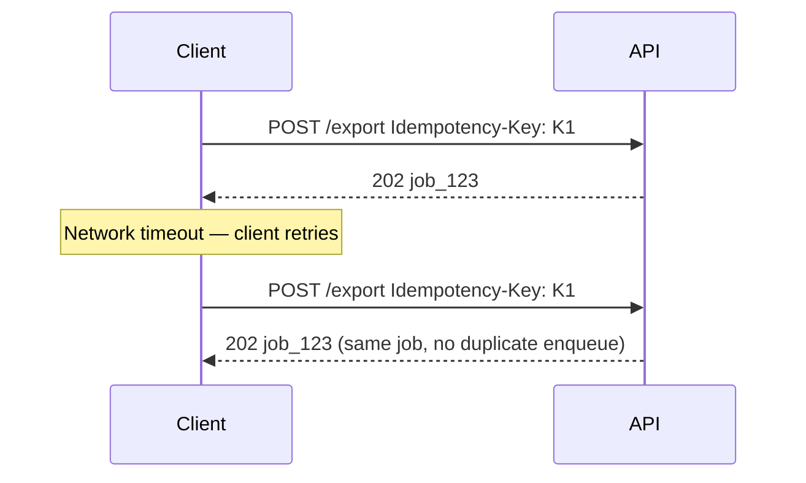

# Idempotency — async, webhooks, and OpenAPI

> **Related:** Overview → [Idempotency](13-idempotency.md) · Client flow → [13A-idempotency-client-and-server-flow.md](13A-idempotency-client-and-server-flow.md) · Storage → [13B-idempotency-storage.md](13B-idempotency-storage.md)

---

## Async jobs

When `POST` returns **`202 Accepted`** with a job resource, the idempotency key prevents duplicate enqueue on client retry. Full flow → [Pattern 1 — Job resource + polling](10A-async-jobs-polling.md#pattern-1--job-resource--polling-default) · Client contract → [13A client and server flow](13A-idempotency-client-and-server-flow.md).



Job **workers** must also deduplicate on `job_id` or message ID for at-least-once queue delivery.

---

## Webhook replay protection

Idempotency for **inbound** webhooks is replay protection — different header, same goal:

- HMAC(Hash-based Message Authentication Code) signature over body + timestamp
- Reject requests older than a skew window (e.g. 5 minutes)
- Constant-time signature comparison
- Dedup by `event_id` in a shared store

Details → [API protection §6](02-api-protection.md#6-idempotency-and-replay-protection) and [Auth model — HMAC webhooks](04-auth-model.md#hmac-webhooks).

---

## Event-sourced commands

Command APIs (`POST /commands/PlaceOrder`) use the same `Idempotency-Key` header. Store `key → (aggregate_id, resulting_version)` with TTL so duplicate commands do not append duplicate events.

Details → [Event Sourcing & CQRS — API design](../../event-sourcing-and-cqrs/includes/04-api-design-implications.md).

---

## OpenAPI modeling

```yaml
paths:
  /v1/orders:
    post:
      summary: Create order
      parameters:
        - name: Idempotency-Key
          in: header
          required: true
          schema:
            type: string
            format: uuid
          description: >
            Unique key for this operation. Retries must reuse the same key
            and request body.
      responses:
        '201':
          description: Order created
        '409':
          description: Idempotency key conflict (in progress or body mismatch)
        '422':
          description: Idempotency key reused with different body
```

OpenAPI documents the contract; **runtime enforcement remains in application code** ([OpenAPI / Swagger](07-openapi-swagger.md)).

---

## Observability

Log safely:

- `idempotency_key` (or truncated hash)
- `request_id`, `client_id`, endpoint
- Outcome: `fresh`, `replay`, `conflict`, `body_mismatch`

Never log full payment payloads or PII(Personally Identifiable Information) unnecessarily. Idempotency replay metrics help investigate duplicate-charge reports.

---

## Common mistakes

| Mistake | Risk |
|---------|------|
| Check idempotency **after** charging or inserting | Duplicate side effects |
| No lock on concurrent requests | Race → duplicates |
| Reuse keys across different operations | Silent wrong dedup |
| Different response on replay | Client state machines break |
| Gateway-only dedup | Gateway does not know business outcome |
| Per-instance memory store | Breaks with multiple replicas |
| Idempotency key without auth scope | Cross-tenant collision |

---

## Pros and cons

### Pros of explicit idempotency keys

- Safe client retries on timeout without duplicate charges or orders
- Predictable behavior for partners integrating over unreliable networks
- Clear audit trail when combined with correlation IDs

### Cons / trade-offs

- Extra storage and lookup on every write
- Clients must generate and persist keys correctly
- TTL boundaries require documented client behavior
- Fail-open vs fail-closed when the idempotency store is down (default: **fail closed** on financial writes)