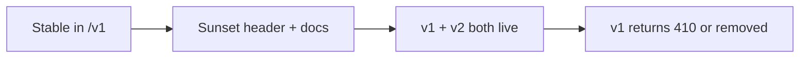

# API(Application Programming Interface) Versioning and Deprecation

Public APIs outlive clients. Versioning and deprecation policy is part of the contract — not an afterthought.

> **Related:** OpenAPI lifecycle → [07-openapi-swagger.md](07-openapi-swagger.md) · Contract testing → [15-contract-and-schema-testing.md](15-contract-and-schema-testing.md) · Deploy coupling → [deployment-strategies/includes/12-schema-migrations-and-deploy.md](../../deployment-strategies/includes/12-schema-migrations-and-deploy.md)

---

## At a glance

| Approach | Visibility | Default for public REST(Representational State Transfer) |
|----------|------------|-------------------------|
| **URL path** (`/v1/`, `/v2/`) | Obvious in logs and docs | ✅ Recommended |
| **Header** (`Accept-Version`, `Api-Version`) | Cleaner URLs | Internal or partner APIs |
| **Query param** (`?version=2`) | Easy to try; messy in caches | Avoid for public APIs |

**Rule of thumb:** Use **URL `/v1`** for public APIs. Support **one previous major version** during migration windows.

---

## Breaking vs non-breaking changes

| Non-breaking (same major version) | Breaking (new major version) |
|-----------------------------------|------------------------------|
| Add optional fields to response | Remove or rename response fields |
| Add optional query params | Change field type or semantics |
| Add new endpoints | Change auth requirements |
| Add new enum values (clients tolerate unknown) | Tighten validation on existing inputs |
| Deprecate with sunset header (still works) | Remove deprecated behavior |

Document every release in changelog; run OpenAPI diff in CI → [§15 contract testing](15-contract-and-schema-testing.md).

---

## Deprecation flow



| Phase | Client experience | Your obligations |
|-------|-------------------|------------------|
| **Announce** | `Deprecation: true`, `Sunset: <RFC 7231 date>` | Changelog, email, status page |
| **Parallel run** | `/v1` and `/v2` both work | Monitor `/v1` traffic decline |
| **Sunset** | `/v1` → `410 Gone` or redirect | Support window documented upfront |

Example headers:

```http
Deprecation: true
Sunset: Sat, 01 Nov 2026 00:00:00 GMT
Link: </v2/orders>; rel="successor-version"
```

---

## Version routing at the gateway

| Layer | Role |
|-------|------|
| **Gateway** | Route `/v1/*` vs `/v2/*` to same or different upstream pools |
| **App** | Shared codebase with versioned handlers, or separate deployables |
| **Database** | Expand/contract migrations — both versions during rolling deploy |

See [deployment-strategies §12](../../deployment-strategies/includes/12-schema-migrations-and-deploy.md) when v2 needs schema changes.

---

## Client guidance (document in developer portal)

- Pin to a major version in SDK base URL
- Treat unknown JSON fields as ignorable
- Subscribe to changelog and `Sunset` headers
- Migrate before sunset — no implicit auto-upgrade

---

## Common mistakes

| Mistake | Fix |
|---------|-----|
| Breaking change in patch release | Major version bump + migration period |
| No sunset date | Always publish `Sunset` with `Deprecation` |
| Two versions, one breaking schema | Expand/contract DB; both code paths work |
| Version in 5 places | Single config / gateway route table |

---

## Pros and cons

### URL versioning

**Pros:** Explicit in logs, WAF(Web Application Firewall) rules, rate limits, and docs.

**Cons:** URL proliferation; gateway routing required.

### Indefinite v1 support

**Pros:** Happy legacy clients.

**Cons:** Security and maintenance debt — set a maximum parallel window (e.g. 12 months).
