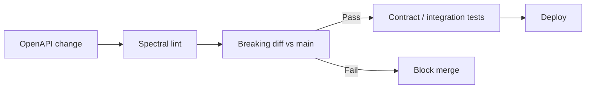

# Contract and Schema Testing

OpenAPI is not documentation only — it is the **contract** CI should enforce before deploy.

> **Deep dive:** Kafka Schema Registry compatibility and contract CI → [apache-kafka §6](../../apache-kafka/includes/06-serialization-and-schema-evolution.md) · [§12 testing](../../apache-kafka/includes/12-testing-and-verification.md)
>
> **Scope:** **CI enforcement** of the API(Application Programming Interface) contract — Spectral lint, breaking diff, consumer contracts (Pact), deploy coupling. How to **author** the spec, Swagger UI, and codegen → [§7 OpenAPI / Swagger](07-openapi-swagger.md).
>
> **Related:** OpenAPI tooling → [07-openapi-swagger.md](07-openapi-swagger.md) · Versioning → [14-api-versioning-and-deprecation.md](14-api-versioning-and-deprecation.md) · Deploy → [deployment-strategies](../../deployment-strategies/README.md)

---

## At a glance

| Check | Tooling examples | When it runs |
|-------|------------------|--------------|
| **Lint / style** | Spectral | Every PR |
| **Breaking diff** | openapi-diff, oasdiff | PR against `main` spec |
| **Consumer contract** | Pact, schema tests | PR + nightly |
| **Mock validation** | Prism, WireMock | CI integration tests |

**Rule of thumb:** **Breaking API(Application Programming Interface) changes fail CI** unless the major version path changes (`/v2`).

---

## CI pipeline (minimal)

| Step | Fail if |
|------|---------|
| Spectral | Missing descriptions, no `operationId`, insecure schemes |
| Breaking diff | Removed endpoint, required field added to request, type change |
| Contract tests | Provider response ≠ consumer expectation |

---

## Breaking change examples (openapi-diff)

| Change | Breaking? |
|--------|-----------|
| Add optional response field | No |
| Add required request field | **Yes** |
| Rename field | **Yes** |
| Change `string` → `integer` | **Yes** |
| Add new HTTP(Hypertext Transfer Protocol) method on path | No |
| Remove endpoint | **Yes** |

For intentional breaks: bump to `/v2` and update diff baseline.

---

## Consumer-driven contracts (Pact)

| Role | Responsibility |
|------|----------------|
| **Consumer** | Defines expected request/response |
| **Provider** | Verifies implementation matches pact |
| **Broker** | Stores pacts; gates deploy |

Use for **critical integrations** (billing, auth, partner APIs) — not every internal call.

---

## Pair with deployment

- **Canary:** compare error rate on routes whose spec changed
- **Feature flags:** ship code behind flag; spec documents both behaviors during transition
- **Rollback:** previous artifact must match previous spec version tagged in CI

---

## Checklist

- [ ] `openapi.yaml` in repo; single source of truth
- [ ] Spectral ruleset committed (`.spectral.yaml`)
- [ ] Breaking diff in CI on PR
- [ ] Version in spec `info.version` matches changelog
- [ ] Deprecated operations marked in spec + `deprecated: true`

---

## Pros and cons

**Pros:** Fewer production breakages; confident refactors; partners trust documented behavior.

**Cons:** CI maintenance; pact drift if consumers don't update; discipline on spec-first changes.

## Common mistakes

| Mistake | Fix |
|---------|-----|
| Breaking change merged without `/v2` | Fail CI on openapi-diff against `main` |
| Consumer tests skipped on PR | Run Pact/schema tests in pipeline |
| Spec version not tied to changelog | Bump `info.version` with release notes |
| Mock server never updated | Regenerate from spec in CI |
| Deprecated ops removed before sunset period | `deprecated: true` + telemetry on usage first |