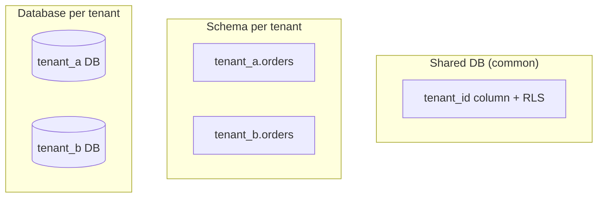

# Multi-Tenant APIs

SaaS APIs must isolate tenants in auth, data, rate limits, and operations — not only with a `tenant_id` column.

> **Related:** AuthZ / BOLA(Broken Object-Level Authorization) → [04-auth-model.md](04-auth-model.md) · Rate tiers → [05-rate-limit-tiers.md](05-rate-limit-tiers.md) · Idempotency keys → [13-idempotency.md](13-idempotency.md) · Identity → [12-identity-rbac-iam-ad.md](12-identity-rbac-iam-ad.md) · Consistency → [PG §14](../../postgresql-performance/includes/14-consistency-promises-and-costs.md)

---

## At a glance

| Layer | Tenant concern |
|-------|----------------|
| **Token** | `tenant_id` / `org_id` in JWT(JSON Web Token) claims |
| **Gateway** | Per-tenant usage plans, API(Application Programming Interface) keys |
| **Application** | Row-level checks on every query |
| **Database** | `tenant_id` on rows + indexes |
| **Cache** | Tenant prefix on every key |
| **Queues** | Tenant in message metadata; fair scheduling |
| **Observability** | Metrics and logs tagged by tenant |

**Rule of thumb:** **Every data access path** must include tenant scope — gateway auth alone does not prevent BOLA across tenants.

---

## Isolation models

| Model | Pros | Cons |
|-------|------|------|
| **Shared table + `tenant_id`** | Simple ops | Noisy neighbor; strict query discipline |
| **Row-level security (RLS)** | DB enforces tenant | Policy complexity |
| **Schema / DB per tenant** | Strong isolation | Ops scale; migration cost |
| **Silos for enterprise** | Compliance | Highest cost |

Default for most B2B SaaS: **shared PostgreSQL + `tenant_id` + RLS or app-level checks**.

---

## API patterns

| Pattern | Detail |
|---------|--------|
| **Claim binding** | `tenant_id` from token — never from client body alone |
| **URL design** | `/v1/orgs/{org_id}/orders` — validate `org_id` matches token |
| **Idempotency** | Key scoped `(tenant_id, endpoint, key)` — [§13](13-idempotency.md) |
| **Pagination** | Cursor includes tenant scope |
| **Rate limits** | Per-tenant + global abuse cap — [api-rate-limiting §6](../../api-rate-limiting/includes/06-scope-identity.md) |

---

## Data residency and scale

| Need | Approach |
|------|----------|
| EU-only data | Region-specific deployment + routing — [HTS §13](../../high-throughput-systems/includes/13-multi-region-read-routing.md) |
| Noisy neighbor tenant | Per-tenant rate limits; optional dedicated pool |
| Large enterprise | Dedicated DB or schema silo |

---

## Common mistakes

| Mistake | Fix |
|---------|-----|
| `tenant_id` from request body | JWT / API key only |
| Global cache key `user:123` | `tenant:a:user:123` |
| Missing index on `(tenant_id, ...)` | Composite indexes |
| One tenant's export blocks queue | Fair queue partitioning |

---

## Pros and cons

### Shared DB multi-tenancy

**Pros:** Cost-efficient; single migration path.

**Cons:** Requires rigorous authZ; blast radius on bugs.