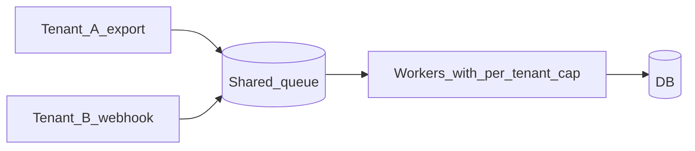

# Multi-Tenant APIs

SaaS APIs must isolate tenants in auth, data, rate limits, and operations — not only with a `tenant_id` column.

> **Scope:** **HTTP(Hypertext Transfer Protocol) API, cache, and queue tenancy** — claim binding, URL design, rate limits, cache/queue prefixes. Isolation model choice (pool vs silo) → [architecture-decisions §10](../../architecture-decisions/includes/10-multi-tenant-system-models.md). PostgreSQL RLS(Row-Level Security) → [PG §17](../../postgresql-performance/includes/17-row-level-security-multi-tenant.md). Schema/DB silos → [PG §18](../../postgresql-performance/includes/18-schema-and-database-per-tenant.md).
>
> **Deep dive:** Multi-tenant Kafka topic and ACL(Access Control List) patterns → [apache-kafka §2](../../apache-kafka/includes/02-topics-partitions-and-replication.md#multi-tenant-isolation)
>
> **Related:** AuthZ / BOLA(Broken Object-Level Authorization) → [04-auth-model.md](04-auth-model.md) · Rate tiers → [05-rate-limit-tiers.md](05-rate-limit-tiers.md) · Idempotency keys → [13-idempotency.md](13-idempotency.md) · Identity → [12-identity-rbac-iam-ad.md](12-identity-rbac-iam-ad.md) · Consistency → [PG §14](../../postgresql-performance/includes/14-consistency-promises-and-costs.md)

---

## What is a tenant?

A **tenant** is one customer organization using your product on shared infrastructure — typically a company, team, or workspace in B2B SaaS(Software as a Service), not a single end user.

| Product | Tenant unit |
|---------|-------------|
| Collaboration tool | Workspace |
| CRM(Customer Relationship Management) | Org / account |
| Partner API(Application Programming Interface) | `tenant_id` or `org_id` in token claims |

Each tenant has its own users, data, settings, and quotas. Tenants must not read or modify each other's resources.

---

## Tenant vs user vs role

| Concept | Meaning | Example |
|---------|---------|---------|
| **Tenant** | Customer org | Acme Corp |
| **User** | Person inside that org | `alice@acme.com` |
| **Role** | Permissions within the org | Admin, viewer |

Alice at Acme and Bob at Globex are different users in different tenants. Alice must never access Globex orders, even on the same API endpoint.

Gateway RBAC(Role-Based Access Control) checks coarse roles; the app still enforces **object ownership** per tenant — see [Auth model](04-auth-model.md) and [Identity §12B](12B-identity-enterprise-api.md).

---

## Multi-tenant vs single-tenant

| | **Multi-tenant** | **Single-tenant** |
|--|------------------|-------------------|
| **Deployment** | One app serves many orgs | Dedicated instance per customer |
| **Database** | Usually shared (with isolation) | Often dedicated |
| **Cost** | Lower per customer | Higher ops and infra |
| **Isolation** | Logical (discipline + RLS) | Physical (stronger by default) |
| **Typical fit** | Most B2B SaaS | Enterprise contract, strict compliance |

**Multi-tenant** is the default for scalable SaaS. Move to **schema/DB silos** or **single-tenant** when a large customer or regulator requires dedicated resources — decide the model in [architecture-decisions §10](../../architecture-decisions/includes/10-multi-tenant-system-models.md), then enforce it on every API path below.

---

## At a glance

| Layer | Tenant concern |
|-------|----------------|
| **Token** | `tenant_id` / `org_id` in JWT(JSON Web Token) claims |
| **Gateway** | Per-tenant usage plans, API(Application Programming Interface) keys |
| **Application** | Row-level checks on every query |
| **Database** | `tenant_id` on rows + indexes / RLS / silo routing — [arch §10](../../architecture-decisions/includes/10-multi-tenant-system-models.md), [PG §17](../../postgresql-performance/includes/17-row-level-security-multi-tenant.md), [PG §18](../../postgresql-performance/includes/18-schema-and-database-per-tenant.md) |
| **Cache** | Tenant prefix on every key |
| **Queues** | Tenant in message metadata; fair scheduling |
| **Observability** | Metrics and logs tagged by tenant |

**Rule of thumb:** **Every data access path** must include tenant scope — gateway auth alone does not prevent BOLA across tenants.

---

## Isolation models

**Canonical decision matrix:** [architecture-decisions §10](../../architecture-decisions/includes/10-multi-tenant-system-models.md) — pool, pool + RLS, schema/DB silo, cells.

| API implication | Detail |
|-----------------|--------|
| **Pool (default)** | Claim-bound `tenant_id` on every query; prefer RLS as safety net — [PG §17](../../postgresql-performance/includes/17-row-level-security-multi-tenant.md) |
| **Schema / DB silo** | Router maps auth tenant → schema/`search_path` or DB pool — never trust client-supplied DB name — [PG §18](../../postgresql-performance/includes/18-schema-and-database-per-tenant.md) |
| **Enterprise cell** | Region or stack routing in front of the API; same claim-binding rules |

Default for most B2B SaaS APIs: **shared PostgreSQL + `tenant_id` + RLS or app-level checks**, with cache/queue prefixes below.

---

## API patterns

| Pattern | Detail |
|---------|--------|
| **Claim binding** | `tenant_id` from token — never from client body alone |
| **URL design** | `/v1/orgs/{org_id}/orders` — validate `org_id` matches token |
| **Idempotency** | Key scoped `(tenant_id, endpoint, key)` — [§13](13-idempotency.md) |
| **Pagination** | Cursor includes tenant scope |
| **Rate limits** | Per-tenant + global abuse cap — [api-rate-limiting §6](../../api-rate-limiting/includes/06-scope-identity.md) |

---

## Cache and queue isolation

Shared Redis, Memcached, or message brokers are still **multi-tenant**. Prefix every key and message with tenant scope — the same discipline as SQL(Structured Query Language) `WHERE tenant_id = ?`.

### Cache

| Pattern | Detail |
|---------|--------|
| **Key prefix** | `{tenant_id}:{resource}:{id}` — e.g. `acme:user:123`, not `user:123` |
| **TTL per tenant** | Large tenants may need shorter TTL or separate cache namespace |
| **Invalidation** | Scope flush to tenant prefix; never `FLUSHALL` in shared clusters |
| **Stampede** | Per-tenant singleflight — [HTS §4](../../high-throughput-systems/includes/04-caching-layers.md) |

```text
Bad:  cache.get("user:123")           → cross-tenant collision
Good: cache.get("tenant:acme:user:123")
```

Application cache-aside and read-through patterns → [HTS §4 caching layers](../../high-throughput-systems/includes/04-caching-layers.md). PostgreSQL-side caching → [PG §11](../../postgresql-performance/includes/11-read-scaling-and-caching.md).

### Queues and async jobs

| Pattern | Detail |
|---------|--------|
| **Message metadata** | Every job carries `tenant_id`; workers reject jobs without it |
| **Fair scheduling** | Per-tenant concurrency caps so one export does not starve others |
| **Partition key** | `tenant_id` preserves per-tenant order but can hot-spot large tenants — [HTS §7](../../high-throughput-systems/includes/07-streaming-pipelines.md) |
| **Rate-limit escape** | Async exports still need per-tenant enqueue limits — [§10 async](10-async-patterns.md) |



Worker pools and queue depth → [HTS §6 async queues](../../high-throughput-systems/includes/06-async-queues-workers.md). HTTP(Hypertext Transfer Protocol) job contracts (202, polling) → [§10A async jobs](10A-async-jobs-polling.md).

**Noisy neighbor:** Combine per-tenant API rate limits, queue concurrency caps, and optional dedicated worker pools for enterprise silos.

---

## Data residency and scale

| Need | Approach |
|------|----------|
| EU-only data | Region-specific deployment + routing — [HTS §13](../../high-throughput-systems/includes/13-multi-region-read-routing.md) |
| Noisy neighbor tenant | Per-tenant rate limits; optional dedicated pool |
| Large enterprise | Dedicated DB or schema silo |

---

## Common mistakes

| Mistake | Fix |
|---------|-----|
| `tenant_id` from request body | JWT / API key only |
| Global cache key `user:123` | `tenant:a:user:123` |
| Missing index on `(tenant_id, ...)` | Composite indexes |
| One tenant's export blocks queue | Fair queue partitioning |

---

## Pros and cons

### Shared DB multi-tenancy

**Pros:** Cost-efficient; single migration path.

**Cons:** Requires rigorous authZ; blast radius on bugs.