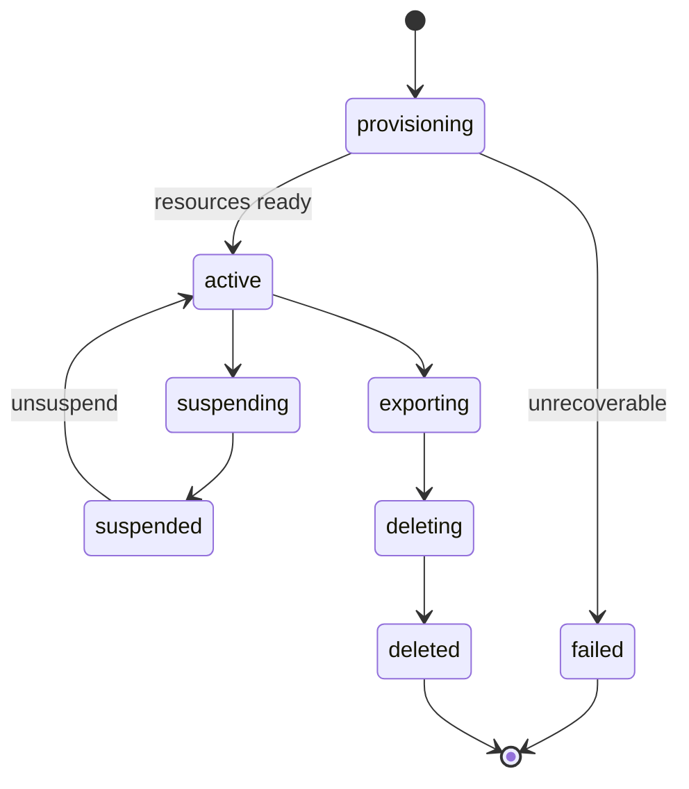

# Tenant Lifecycle APIs

Partners and admins manage orgs through **HTTP(Hypertext Transfer Protocol) contracts** — create, poll provision status, suspend, export, delete — that mirror the platform lifecycle without exposing internal orchestration details.

> **Scope:** **API(Application Programming Interface) contracts** — resources, status models, suspend semantics, async export/delete jobs. Program orchestration and fan-out → [architecture §10B](../../architecture-decisions/includes/10B-tenant-lifecycle-provision-suspend-delete.md). Tenancy in requests → [§16](16-multi-tenant-apis.md). SCIM(System for Cross-domain Identity Management) membership → [§12C](12C-scim-and-jml-provisioning.md). Billing-driven suspend → [payments §5A](../../payments-and-fintech/includes/05A-subscription-billing-and-dunning.md).
>
> **Related:** Async jobs pattern → [§10A](10A-async-jobs-polling.md) · Webhooks on lifecycle → [§10B](10B-async-webhooks.md) · Idempotency → [§13](13-idempotency.md) · Object export storage → [§18](18-object-storage-and-uploads.md)

---

## At a glance

| Resource | Sync vs async | Notes |
|----------|---------------|-------|
| `POST /tenants` | Async provision | Returns `201` + `status: provisioning` |
| `GET /tenants/{id}` | Sync | Includes `status`, `suspend_reason`, links |
| `POST /tenants/{id}/suspend` | Sync intent, async fan-out | Idempotent; reason code required |
| `POST /tenants/{id}/export` | Async job | Poll or webhook — [§10A](10A-async-jobs-polling.md) |
| `DELETE /tenants/{id}` | Async job | Requires export ack or waiver for enterprise |

**Rule of thumb:** Lifecycle mutations return **stable job ids** and **idempotency keys** — never block until every downstream store finishes. Depth → [architecture §10B](../../architecture-decisions/includes/10B-tenant-lifecycle-provision-suspend-delete.md).

---

## Status model

| Field | Purpose |
|-------|---------|
| `status` | Coarse lifecycle gate for clients |
| `status_detail` | Human-readable sub-step ("search index pending") |
| `suspend_reason` | `billing` · `security` · `admin` · `legal_hold` |
| `capabilities` | Derived flags: `can_write`, `can_invite`, `can_export` |

Expose `capabilities` so clients do not infer behavior from `status` strings alone.

---

## Suspend API semantics

| Request | Behavior |
|---------|----------|
| **Idempotent suspend** | Repeat `POST` returns same `suspended_at` |
| **403 on writes** | All mutating routes check tenant capability — [§16](16-multi-tenant-apis.md) |
| **401 vs 403** | Suspended login → 401 with `tenant_suspended`; member of active tenant unchanged |
| **Read path** | Export and read allowed per policy — [architecture §10B](../../architecture-decisions/includes/10B-tenant-lifecycle-provision-suspend-delete.md) |
| **Webhooks** | `tenant.suspended` event; stop outbound jobs for tenant |

Coordinate token revoke with [auth §03B](../../auth-oauth-oidc-and-login-security/includes/03B-revoke-logout-denylist.md) on security suspend.

---

## Export and delete jobs

| Pattern | Contract |
|---------|----------|
| **Create job** | `POST …/export` → `{ job_id, status: queued }` |
| **Poll** | `GET /jobs/{id}` — [§10A](10A-async-jobs-polling.md) |
| **Result** | `download_url` with short TTL(Time To Live); checksum |
| **Delete guard** | `409` if export required and not completed/waived |
| **Idempotency** | Same `Idempotency-Key` returns same job — [§13](13-idempotency.md) |

Large exports land in object storage — [§18](18-object-storage-and-uploads.md). Never stream multi-GB bodies through the API tier.

---

## OpenAPI and errors

| HTTP code | When |
|-----------|------|
| `202` | Accepted async work (provision, export, delete) |
| `409` | Illegal transition (delete active without waiver) |
| `410` | Tenant permanently deleted |
| `423` | Optional: locked during migration |

Document error bodies in OpenAPI — [§7](07-openapi-swagger.md). Contract tests for status transitions — [§15](15-contract-and-schema-testing.md).

---

## Common mistakes

| Mistake | Fix |
|---------|-----|
| `DELETE` returns `204` before fan-out completes | `202` + job status |
| Clients parse undocumented status strings | Enum + `capabilities` |
| Suspend only in admin API | Enforce in all tenant-scoped routes — [§16](16-multi-tenant-apis.md) |
| Export link never expires | Signed URL + TTL — [§18](18-object-storage-and-uploads.md) |
| No webhook for long provision | `tenant.ready` event — [§10B](10B-async-webhooks.md) |
| SCIM creates users into `provisioning` tenant | Reject or queue — [§12C](12C-scim-and-jml-provisioning.md) |

---

## Pros and cons

| Surface | Pros | Cons |
|---------|------|------|
| **Rich status + jobs API** | Integrator-friendly; mirrors internal truth | More schema to version — [§14](14-api-versioning-and-deprecation.md) |
| **Minimal CRUD only** | Simple docs | Partners poll wrong endpoints; surprise lag |
| **Admin-only lifecycle** | Smaller public surface | Enterprise self-serve blocked |
