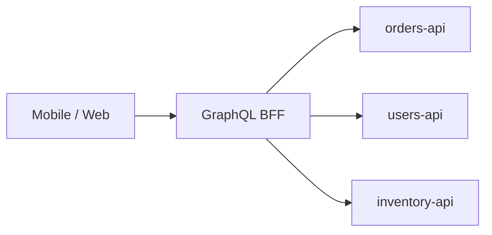
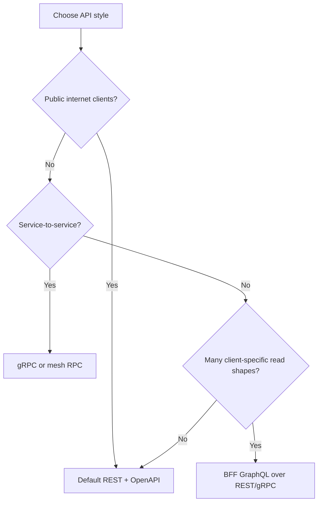

# GraphQL and gRPC

REST(Representational State Transfer) is the default in this corpus — use GraphQL or gRPC when the trade-offs are explicit, not because the name sounds modern.

> **Scope:** **Alternative API(Application Programming Interface) styles** — when to pick GraphQL or gRPC vs REST. Default HTTP(Hypertext Transfer Protocol)/REST patterns → [§1 API design](01-api-design.md). ES/CQRS(Command Query Responsibility Segregation) APIs → [ES §4](../../event-sourcing-and-cqrs/includes/04-api-design-implications.md).

> **Related:** Gateway routing → [03-api-gateway.md](03-api-gateway.md) · Contract testing → [15-contract-and-schema-testing.md](15-contract-and-schema-testing.md) · Internal mesh → [03-api-gateway.md#gateway-vs-load-balancer-vs-service-mesh](03-api-gateway.md)

---

## At a glance

| Style | Best for | Weak for |
|-------|----------|----------|
| **REST** | Public HTTP APIs, CRUD, caching | Highly variable mobile payloads (without BFF(Backend for Frontend)) |
| **GraphQL** | Flexible reads, one endpoint, BFF | Cache at CDN(Content Delivery Network); auth per field; N+1 at scale |
| **gRPC** | Internal low-latency RPC, streaming | Browser-native public APIs |

**Rule of thumb:** **REST (+ OpenAPI)** for public partners. **gRPC** for service-to-service. **GraphQL** at a **BFF** or dedicated query tier — rarely as the sole public edge without hard limits.

---

## GraphQL

| Topic | Guidance |
|-------|----------|
| **Depth / cost limits** | Max depth, complexity scoring, query cost analysis |
| **Authorization** | Field-level rules — not only gateway JWT(JSON Web Token) |
| **N+1** | DataLoader batching to backing REST/DB |
| **Caching** | HTTP cache weak; prefer persisted queries + CDN for public reads |
| **Versioning** | Schema deprecation vs REST URL versioning — [§14](14-api-versioning-and-deprecation.md) |

| Pros | Cons |
|------|------|
| One request, shaped response | Operational complexity |
| Good for varied clients | Abuse via expensive queries |

---

## gRPC

| Topic | Guidance |
|-------|----------|
| **Contracts** | `.proto` files; version fields in messages |
| **Transport** | HTTP/2, binary protobuf |
| **Gateway** | gRPC-Web or envoy transcoding for browser edge cases |
| **Mesh** | Often paired with mTLS(Mutual Transport Layer Security) — [§3 Gateway / mesh](03-api-gateway.md) |
| **Errors** | Map gRPC status to client retry policy |

| Pros | Cons |
|------|------|
| Fast, typed, streaming | Not browser-default |
| Strong codegen | Load balancer / debugging tooling differs from REST |

---

## Decision flow

---

## Common mistakes

| Mistake | Fix |
|---------|-----|
| GraphQL at edge without query cost limits | Depth/complexity caps |
| gRPC everywhere including public mobile | REST or BFF for public |
| Skip contract tests on `.proto` | Same CI discipline as OpenAPI — [§15](15-contract-and-schema-testing.md) |
| GraphQL N+1 to database | Batch loaders |

---

## Pros and cons

### GraphQL BFF

**Pros:** Client flexibility; aggregates microservices.

**Cons:** Another tier to secure, cache, and operate.

### gRPC internal

**Pros:** Performance and strong contracts between services.

**Cons:** Requires gateway/transcoding for external clients.