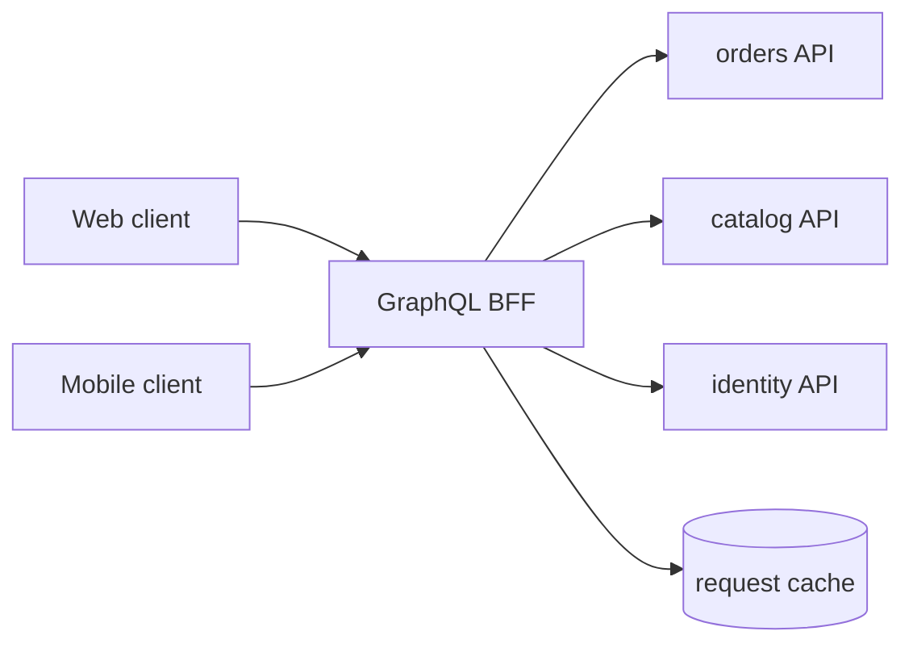
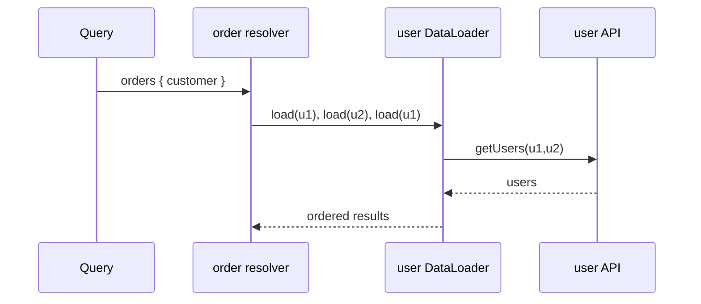

# GraphQL in Production

> **Scope:** This section owns production design of a GraphQL(Graph Query Language) BFF(Backend for Frontend): query cost, field authorization, batching, and operations. For choosing GraphQL versus REST(Representational State Transfer) or gRPC(Google Remote Procedure Call), see [§17](17-graphql-and-grpc.md).

> **Related:** [§17 GraphQL and gRPC](17-graphql-and-grpc.md) · [fullstack BFF](../../fullstack-bff-and-clients/README.md) · [gateway architecture](03-api-gateway.md)

---

## At a glance

| Concern | Production default |
|---------|--------------------|
| Placement | GraphQL as a BFF/query tier, not direct database access |
| Query shape | Depth, breadth, alias, and complexity limits |
| Data fetch | Request-scoped DataLoader batching and caching |
| Authorization | Resolver/field checks at the owning service boundary |
| Public traffic | Persisted queries, allowlists, rate and cost limits |
| Observability | Operation name, query hash, cost, resolver latency, error class |

**Rule of thumb:** GraphQL moves client flexibility into the server; operate the server as an API(Application Programming Interface) gateway with a query planner, not as a thin schema facade over every table.

---

## BFF boundary

The BFF owns a client-oriented schema and composition, while domain services own mutations, data authorization, and invariants. It may call REST, gRPC, or a read model. Avoid exposing internal microservice schemas one-for-one; that couples clients to topology and makes ownership unclear.

| BFF responsibility | Domain-service responsibility |
|--------------------|-------------------------------|
| Response composition, query limit, presentation defaults | Business validation and durable writes |
| Request-scoped batching | Object-level AuthZ(Authorization) |
| Client error shape and deprecation notices | Canonical entity state |
| Persisted-query registry | Idempotency for mutations |

---

## Stop N+1 before it ships

A parent resolver fetching 100 orders and a child resolver fetching a user for each order makes 101 calls. A request-scoped DataLoader collects keys in the same event-loop turn, issues one bulk fetch, and maps results back in requested order.

| Rule | Why |
|------|-----|
| Create loaders per request | Prevents cross-user data leakage and stale cache |
| Batch by access policy too | Do not combine keys that need different authorization |
| Cap batch size | A single giant `IN` query can be its own outage |
| Return `null`/typed error deliberately | Missing record is not a positional mismatch |
| Measure batch size and downstream calls | Confirms batching actually works |

DataLoader is not a global cache. Use a domain cache only with explicit freshness, invalidation, tenant isolation, and authorization behavior.

---

## Query cost and admission

Depth alone does not protect a query with wide lists or aliases. Assign each field a base cost, multiply list fields by bounded pagination size, and charge expensive fan-out or search fields more. Reject before resolver execution when cost, depth, aliases, or payload size exceed a client's tier.

| Limit | Example policy |
|-------|----------------|
| Depth | 8 levels for public operations |
| Page size | Default 20, maximum 100 |
| Complexity | 1,000 units per request; lower anonymous budget |
| Aliases | Maximum 20 to prevent repeated expensive fields |
| Execution time | Remaining request deadline enforced at each dependency |
| Concurrency | Per-client and per-operation semaphore for expensive fields |

Publish error codes such as `QUERY_TOO_COMPLEX` and cost headers for trusted clients. Do not return internal resolver plans or authorization details. Review query costs when schema fields gain a new backing dependency.

---

## Authorization is field-aware

Gateway token validation proves who called; it cannot decide whether `order.refundReason`, `employee.salary`, or an `adminNotes` connection may be returned. Enforce authorization in resolvers or, preferably, in the service that owns the data; the BFF should pass a verified principal and request purpose.

| Case | Safe pattern |
|------|--------------|
| Hidden field | Return authorization error or omit through a documented nullable field |
| List connection | Filter and paginate after authorization in source service |
| Mutation | Domain service validates intent, object ownership, and idempotency |
| Federated entity | Re-authorize at each owning subgraph/service |
| Cache | Key by authorization-relevant scope or cache only public data |

Avoid relying on schema visibility alone. Introspection controls may hide types from casual discovery, but authorization must still handle a caller who knows the field name.

---

## Persisted queries and caching

For public traffic, clients send a registered operation hash rather than arbitrary query text. The gateway resolves hash to reviewed document, applies known cost, and can cache GET-compatible reads at CDN(Content Delivery Network) layers when identity and cache scope allow.

| Mode | Benefit | Guardrail |
|------|---------|-----------|
| Persisted allowlist | Blocks ad hoc expensive queries | Release registry before client use |
| Automatic persisted query | Smaller repeat requests | Disable query-text fallback for untrusted clients |
| Response cache | Reduces resolver load | Include tenant/auth scope and invalidation |
| Entity cache | Reuse backing reads | Respect ownership and mutation invalidation |

Persisted queries are an admission-control tool, not an authorization tool. Mutations still require CSRF(Cross-Site Request Forgery) protections for cookie sessions and idempotency keys for externally visible effects.

---

## Schema lifecycle and observability

Make changes additive: add nullable field or input, migrate clients, deprecate with a replacement, observe usage, then remove after a published window. Never silently change a field's semantic meaning or pagination ordering.

Track operation hash/name, client version, cost, depth, resolver latency, downstream call count, authorization failure class, and error rate. Do not label metrics by raw query text, user ID, or variables. Sample traces for slow operations and include a sanitized operation hash.

| Incident question | Signal |
|-------------------|--------|
| Which operation caused load? | Operation hash + cost + client version |
| Is there N+1? | Resolver count and downstream calls per request |
| Did a rollout break clients? | Schema error by client version |
| Is a field slow? | Resolver p95/p99 and dependency spans |

## Common mistakes

| Mistake | Fix |
|---------|-----|
| Expose database tables as schema types | Put a BFF/domain boundary between clients and storage |
| Add DataLoader as a singleton | Scope loaders and cache to one request |
| Limit only query depth | Enforce breadth, aliases, page size, and weighted cost |
| Authorize only at the gateway | Enforce field/object rules in the data-owning service |
| Permit arbitrary public query text | Use persisted allowlists and tiered cost budgets |
| Cache a response across users | Include authorization scope or cache public data only |