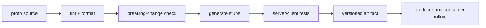
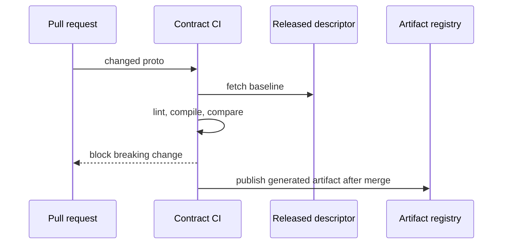

# gRPC and Protobuf CI

> **Scope:** This section owns service-to-service gRPC(Remote Procedure Call) contracts, Protocol Buffers evolution, and CI(Continuous Integration) enforcement. For API(Application Programming Interface)-style selection, see [§17](17-graphql-and-grpc.md); for cross-interface contract testing, see [§15](15-contract-and-schema-testing.md).

> **Related:** [§17 GraphQL and gRPC](17-graphql-and-grpc.md) · [§15 Contract and schema testing](15-contract-and-schema-testing.md) · [service mesh topology](../../resilience-patterns/includes/11A-service-mesh-topology.md)

---

## At a glance

| Topic | Default |
|-------|---------|
| Boundary | Internal service-to-service APIs, not browser-default public APIs |
| Contract source | Versioned `.proto` files reviewed like code |
| Evolution | Add fields; never reuse tag numbers; reserve removals |
| Compatibility gate | Generated descriptor diff in CI |
| Errors | Stable gRPC status plus machine-readable details |
| Streaming | Explicit deadlines, flow control, cancellation, and load tests |

**Rule of thumb:** A protobuf field number is durable wire protocol. Treat deleting or repurposing one like dropping or repurposing a production database column.

---

## Contract as a product

The service that owns a method owns its semantics, deadlines, authorization rules, and compatibility promise. Generated clients improve type safety but do not remove the need for retries, idempotency, or a deprecation policy.

| Contract element | Define explicitly |
|------------------|-------------------|
| Method | Read, command, or stream; expected idempotency |
| Request | Required meaning, optional fields, size limits |
| Response | Freshness and partial-result semantics |
| Errors | Status code, typed detail, retryability |
| Metadata | Trace context, deadline, caller identity |
| Ownership | Team, repository, release and support window |

---

## Safe protobuf evolution

Protocol Buffers readers ignore unknown fields, so additive changes generally work when older clients can tolerate missing values. This is not permission to change semantics invisibly.

| Change | Safe? | Notes |
|--------|-------|-------|
| Add optional field with new number | Usually | Supply a server-side default |
| Add enum value | Cautiously | Old clients must handle unknown values |
| Rename field | Wire-safe, source-risky | Generated API changes; coordinate clients |
| Remove field | Only after migration | Reserve name and number |
| Reuse deleted number | Never | Old data/client can decode it incorrectly |
| Change field type | Usually breaking | Use a new field and migrate |
| Change RPC method semantics | Breaking | Add a new method/version |

Use `reserved 4, 9;` and `reserved "legacy_status";` after removal. Do not use proto3's default value as proof that a caller intentionally sent zero/empty; model presence when “unset” differs from zero.

---

## Compatibility CI

CI should compile every proto, lint naming/package rules, generate a descriptor set, and compare it to the latest released contract. The compatibility check runs against the consumer-visible baseline, not merely the previous commit on a feature branch.

| CI gate | Failure it catches |
|---------|--------------------|
| Format/lint | Inconsistent packages, comments, naming |
| Compile/generate | Invalid imports and language stubs |
| Descriptor compatibility | Removed method, tag reuse, incompatible type |
| Golden wire test | Unexpected serialization behavior |
| Consumer contract test | Server violates business semantics |
| API inventory | Unowned or undocumented externally consumed method |

Code generation must be reproducible: pin compiler/plugin versions, generate in CI, and fail if checked-in generated code differs. Publish language artifacts with semantic versions and keep source descriptors available for downstream checks.

---

## Deadlines, retries, and errors

Every client call needs a deadline. A server should stop work when the client cancels, and downstream calls must receive the remaining budget. Do not use unlimited deadlines because a streaming client worked during local testing.

| gRPC status | Typical caller action |
|-------------|-----------------------|
| `INVALID_ARGUMENT` | Fix request; do not retry |
| `UNAUTHENTICATED` / `PERMISSION_DENIED` | Refresh/re-authorize only as policy allows |
| `NOT_FOUND` | Handle domain absence; do not retry |
| `ALREADY_EXISTS` | Reconcile idempotency/business state |
| `RESOURCE_EXHAUSTED` | Back off; respect retry hint |
| `UNAVAILABLE` | Bounded retry only if operation is safe |
| `DEADLINE_EXCEEDED` | Outcome may be unknown; reconcile before retry |

Expose stable error details for validation or retry hints, never raw stack traces. Keep retry ownership in the application client unless a mesh policy has been explicitly designated; see [resilience §11](../../resilience-patterns/includes/11-policy-placement.md).

---

## Streaming caveats

Server, client, and bidirectional streams are long-lived distributed state. They complicate load balancing, connection draining, backpressure, and observability.

| Risk | Control |
|------|---------|
| Slow receiver | Respect flow control; bound per-stream buffers |
| Lost connection | Define resume token or idempotent reconnect semantics |
| Deploy drain | Stop accepting streams, send retry guidance, allow bounded drain |
| Large message | Enforce request/response size before allocation |
| Idle stream | Ping/idle timeout and cancellation propagation |
| Ordering assumption | Document per-stream ordering only; reconnect changes it |

Test streams through the real gateway, mesh, and load balancer. HTTP(Hypertext Transfer Protocol)/2(Hypertext Transfer Protocol version 2) connection limits, proxy buffering, and idle policies frequently differ from unary calls.

---

## Rollout discipline

Deploy consumers that tolerate the new field before producers start relying on it. For removals, stop producers, measure usage, deprecate, migrate consumers, then reserve the field indefinitely. A service method used by another team needs a published migration window even if both deploy from one monorepo.

Instrument method, status class, peer service, deadline exceeded, request/response size buckets, stream lifetime, and retry count. Avoid raw message contents and unbounded identifiers in metric labels.

## Common mistakes

| Mistake | Fix |
|---------|-----|
| Reuse a deleted field number | Reserve names and numbers forever |
| Treat generated stubs as the whole contract | Test semantics, errors, deadlines, and consumers |
| Retry `DEADLINE_EXCEEDED` blindly | Reconcile outcome or use idempotency first |
| Add enum values without unknown handling | Make clients default safely |
| Run compatibility only against main | Compare against latest released descriptor |
| Use streaming without drain/backpressure design | Define cancellation, resume, limits, and load tests |