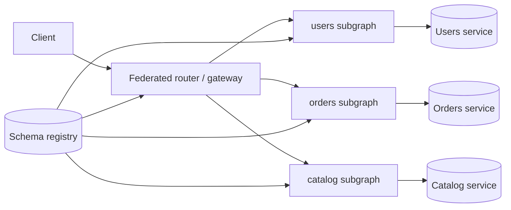

# GraphQL Federation and Schema Ownership

GraphQL(Graph Query Language) federation splits one **supergraph** across team-owned **subgraphs**. The gateway composes types at query time; each team owns its slice of the schema, resolvers, and authorization — extending production GraphQL guidance in [§17A](17A-graphql-production.md).

> **Scope:** Federation topology, subgraph boundaries, schema review, and ownership rules. Single BFF(Backend for Frontend) GraphQL → [§17A](17A-graphql-production.md). REST(Representational State Transfer) vs GraphQL choice → [§17](17-graphql-and-grpc.md).
>
> **Related:** [§17A GraphQL in production](17A-graphql-production.md) · [§17 GraphQL and gRPC](17-graphql-and-grpc.md) · Gateway → [§3](03-api-gateway.md) · Cross-team APIs → [tech-lead §8](../../tech-lead-practice/includes/08-cross-team-api-ownership.md)

---

## At a glance

| Concern | Federation default |
|---------|-------------------|
| **Ownership** | One team per subgraph; one entity owner per `@key` |
| **Gateway** | Query planning, cost limits, auth passthrough |
| **Breaking changes** | Schema registry + CI(Continuous Integration) checks |
| **AuthZ(Authorization)** | Field checks in the owning subgraph, not the gateway alone |
| **N+1** | Entity batch loaders per subgraph — [§17A](17A-graphql-production.md) |
| **Public traffic** | Persisted queries / allowlists at the router |

**Rule of thumb:** Federation moves **composition** to the router; it does not move **business invariants** out of domain services.

---

## Topology

| Component | Owns |
|-----------|--------|
| **Router** | Query plan, timeouts, global cost, optional AuthN(Authentication) |
| **Subgraph** | Types, resolvers, `@key` fields, field-level AuthZ |
| **Registry** | Composed supergraph version, compatibility checks |
| **Domain service** | Durable state, mutations, idempotency — [§13](13-idempotency.md) |

---

## Entity ownership and `@key`

| Rule | Why |
|------|-----|
| Exactly one **home subgraph** defines an entity | Clear write path |
| Other subgraphs **extend** via `@key` + `@requires` sparingly | Avoid distributed monolith |
| Stable `@key` fields (IDs, not display names) | Refetch and cache correctness |
| Document **reference resolver** SLAs | Cross-subgraph latency adds up |

When two teams both mutate the same entity, you have a **bounded-context** problem — fix ownership before adding federation sugar.

---

## Schema change process

| Stage | Gate |
|-------|------|
| Local | Subgraph CI: breaking-change detection |
| Registry | Compose supergraph; fail on conflicts |
| Review | Consumer teams for `@requires` and shared types |
| Deploy | Roll router + subgraphs in compatible order |
| Runtime | Deprecate fields with dates — [§14](14-api-versioning-and-deprecation.md) |

Shared value types (enums, scalars) need a **platform owner** or they become merge bottlenecks.

---

## Operational checklist

- [ ] Every entity has a named owning team and on-call
- [ ] Query cost / depth limits at router — [§17A](17A-graphql-production.md)
- [ ] Field AuthZ enforced in subgraph that owns the data
- [ ] Schema registry blocks breaking compose in CI
- [ ] Traces include subgraph span per entity fetch

---

## Common mistakes

| Mistake | Fix |
|---------|-----|
| Gateway resolves business AuthZ | Enforce in owning subgraph |
| `@requires` chains across many subgraphs | Denormalize read models or BFF batch |
| Shared mutable types without owner | Assign platform or domain owner |
| Subgraph exposes raw DB schema | Client-oriented types — [§17A](17A-graphql-production.md) |
| Ad-hoc `_entities` fan-out in prod | Batch loaders + query cost limits |
| Federation to avoid REST versioning | Version at field level + deprecation policy |
