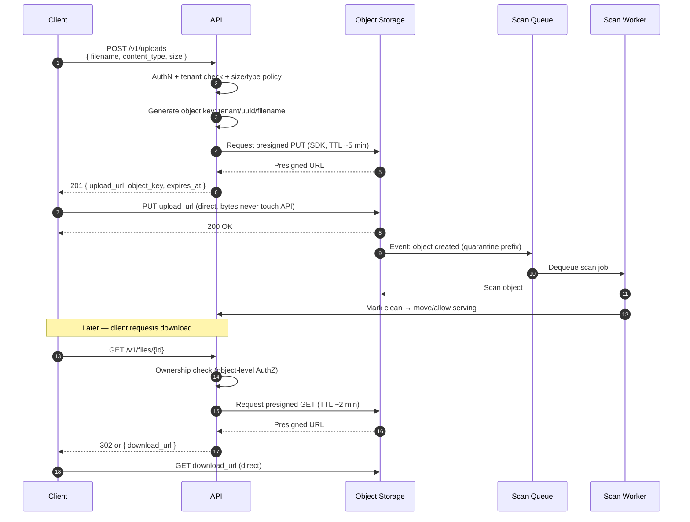
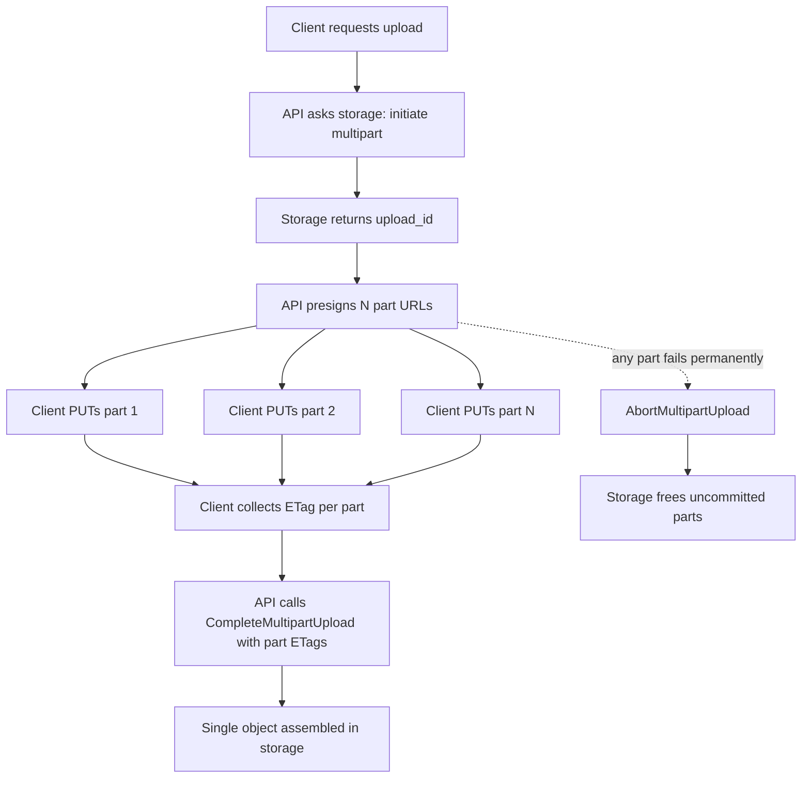
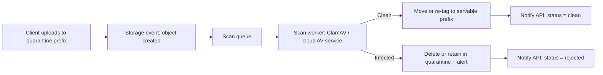
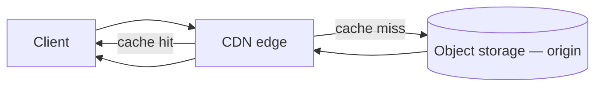
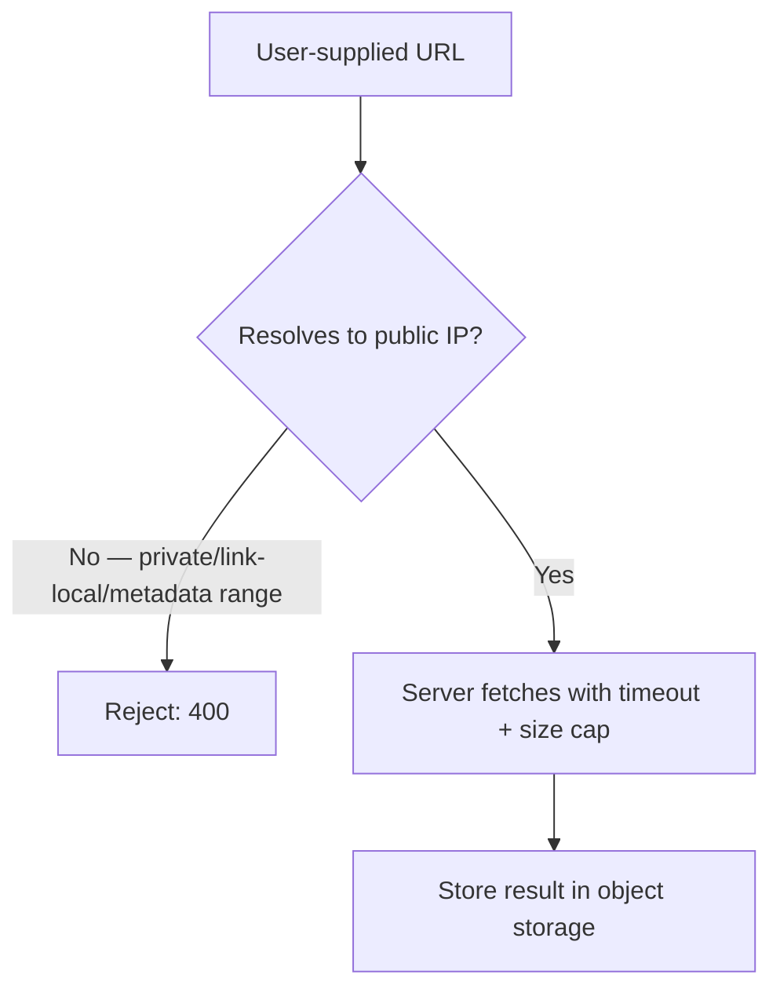

# Object Storage and Uploads

Large files (images, video, exports, documents) do not belong in your application database or on your API(Application Programming Interface)'s request thread. Object storage (S3/GCS/Azure Blob) is the durable store; the API's job is **authorization and orchestration**, not moving bytes.

> **Scope:** **API-facing upload/download design** — presigned URLs, multipart, scan pipeline, and AuthZ on objects. General storage tiering/cost policy → [finops-and-cost §4 Storage and retention cost](../../finops-and-cost/includes/04-storage-and-retention-cost.md). CDN(Content Delivery Network) cache mechanics and invalidation → [HTS §4 Caching layers](../../high-throughput-systems/includes/04-caching-layers.md).
>
> **Related:** Files as externalized state → [§11 Stateless architecture](11-stateless-architecture.md#3-externalize-all-durable-state) · Async result delivery → [§10 Async patterns](10-async-patterns.md) + [10A jobs and polling](10A-async-jobs-polling.md) · SSRF(Server-Side Request Forgery) and OWASP(Open Worldwide Application Security Project) API #7 → [§6 Threat model](06-threat-model.md#owasp-api-security-top-10-2023) · Auth model → [§4 Auth model](04-auth-model.md) · Idempotent upload intents → [§13 Idempotency](13-idempotency.md) · Tenant-scoped prefixes → [§16 Multi-tenant APIs](16-multi-tenant-apis.md)

---

## At a glance

| Flow | Use when | Key control |
|------|----------|--------------|
| **Presigned upload** | Client uploads directly to storage | Short-TTL signed URL, size/content-type constraints |
| **Presigned download** | Serve private objects without proxying bytes | Short-TTL signed URL, one object only |
| **Multipart upload** | Files above ~100MB | Parallel parts, resumable, abort incomplete |
| **Scan pipeline** | Any user-supplied file | Quarantine until clean, async |
| **CDN + object storage** | Public media, high egress | Cache at edge, signed cookies for private content |

**Rule of thumb:** Never proxy large file bytes through your API. Generate a scoped, time-limited URL and let the client (or CDN) talk directly to the store — your API's job is auth, metadata, and orchestration.

---

## Presigned URL upload/download flows

| Decision | Recommendation |
|----------|-----------------|
| **Object key** | Server-generated (`tenant_id/uuid/filename`) — never trust a client-supplied path |
| **Upload TTL** | Minutes, not hours — re-request if expired |
| **Download TTL** | As short as the UX allows; re-sign per request for sensitive files |
| **Content-Type / size constraints** | Enforce in the presigned policy (S3 POST policy conditions, GCS signed policy) — not just client-side |
| **Response shape** | Return `object_key` separately from the signed URL so the API can reference the object without re-parsing the URL |

The API never sees the file bytes — it only issues the credential and later confirms the object exists via the storage event, not the client's word.

---

## Multipart upload for large files

Single-request `PUT` degrades above roughly 100MB — a dropped connection means restarting from zero. **Multipart upload** splits the file into parts uploaded independently (in parallel, and resumable per part).

| Practice | Why |
|----------|-----|
| Part size 5MB–100MB (provider minimums apply) | Balance parallelism vs per-part overhead |
| Client retries a failed part, not the whole file | Resumability is the point |
| **Always abort incomplete uploads** on failure or timeout | Uncommitted parts still bill for storage until aborted or a lifecycle rule sweeps them |
| Use the provider SDK's transfer manager | Handles part sizing, retries, and concurrency correctly |
| Track `upload_id` + part list server-side, keyed to the upload intent | Lets you resume or abort after a client crash |

Same idempotency discipline as any long write — an `Idempotency-Key` on the initiate call prevents duplicate multipart sessions on client retry. See [§13 Idempotency](13-idempotency.md).

---

## Virus/malware scan pipeline (async after upload)

User-supplied files are untrusted input. Never serve or process an uploaded object until it has been scanned — and never scan synchronously on the request thread.

| Rule | Why |
|------|-----|
| Uploads land in a **quarantine prefix/bucket** first | Never public or servable before scan verdict |
| Scan is **async**, triggered by a storage event, not the upload request | Keeps the upload request fast; scanning can take seconds |
| API-visible status starts as `pending`, then `clean` or `rejected` | Client polls or gets a webhook — same pattern as [§10A async jobs](10A-async-jobs-polling.md) |
| Rejected files are deleted or held in isolated storage with restricted access | Limits blast radius; supports abuse investigation |
| Scan **every** object type, including images | Polyglot files and embedded payloads exist even in "safe" formats |

Downstream consumers (thumbnail generation, indexing, CDN promotion) must gate on `status = clean` — treat the storage event alone as untrusted until the scan verdict lands.

---

## CDN + object storage for media delivery

Public media (images, video, static assets) should not be served by your app tier at all — put a CDN in front of the bucket.

| Content class | Pattern |
|----------------|---------|
| **Public assets** (marketing images, public avatars) | CDN caches aggressively; long `Cache-Control`, versioned filenames or content-hash keys for cache-busting |
| **Private/tenant media** | Bucket stays private; CDN serves via **signed URLs or signed cookies** with short TTL — same authZ boundary as a direct presigned URL |
| **User-generated uploads shown back to the uploader only** | Presigned GET is usually enough; add CDN only if traffic volume justifies it |

Cache invalidation strategy, TTL tuning, and hit-rate tradeoffs are a caching-layer concern, not an object-storage one — see [HTS §4 Caching layers](../../high-throughput-systems/includes/04-caching-layers.md).

---

## Lifecycle policies and cost

Storage cost compounds silently: every object, every part, every version, every replica keeps billing until a policy removes it.

| Lifecycle rule | Effect |
|-----------------|--------|
| **Abort incomplete multipart uploads** after N days | Removes orphaned parts from failed/abandoned uploads — the #1 forgotten cost leak |
| **Transition to infrequent/cold tier** after N days | Cuts storage cost for rarely-accessed objects (exports, old avatars) |
| **Expire objects** after a TTL | Temporary exports, job artifacts — pair with the job TTL in [§10A](10A-async-jobs-polling.md#design-rules) |
| **Version cleanup** if versioning enabled | Old versions otherwise accumulate indefinitely |

Full tiering model, retention defaults, and the "delete or tier by default" rule → [finops-and-cost §4 Storage and retention cost](../../finops-and-cost/includes/04-storage-and-retention-cost.md).

---

## AuthZ on objects, SSRF risks on user-supplied URLs

### Object-level authorization

A presigned URL is only as safe as the check performed **before** it is issued.

| Control | Why |
|---------|-----|
| Ownership/tenant check before signing any URL | Same BOLA(Broken Object-Level Authorization) risk as any `{id}` route — [§6 Threat model](06-threat-model.md#owasp-api-security-top-10-2023) |
| Object keys are unguessable (UUID, not sequential) | Defense in depth — the URL should not be the only barrier |
| Bucket/object ACLs default to **private** | Public read is an explicit, reviewed exception, not a default |
| Scope the presigned policy narrowly | One object, one verb (GET or PUT), minimal TTL — not a bucket-wide credential |
| Never return long-lived storage credentials to the client | Presigned URLs or short-lived tokens only, never IAM(Identity and Access Management) access keys |

### SSRF on user-supplied URLs

Any feature where the **server** fetches a URL the user supplied — "import avatar from URL," webhook callback registration, link preview generation — is a server-side request forgery vector (OWASP API #7).

| Control | Why |
|---------|-----|
| Block private IP ranges and cloud metadata endpoints (`169.254.169.254`, etc.) | Prevents pivoting into internal infrastructure — same control as [10B webhook `callback_url`](10B-async-webhooks.md#security-controls) |
| Resolve DNS(Domain Name System) and re-check the resolved IP, not just the hostname | Blocks DNS-rebinding around a hostname allowlist |
| Enforce a fetch timeout and maximum response size | Prevents slow-loris and storage-bomb abuse |
| Fetch from a network-isolated egress path (no route to internal services) | Belt-and-suspenders beyond IP filtering |

---

## Common mistakes

| Mistake | Fix |
|---------|-----|
| API proxies file bytes through itself | Presigned URL — client/CDN talks to storage directly |
| Client-supplied object key or path | Server generates the key; never trust client-supplied paths (path traversal) |
| Serving uploads before scan verdict | Quarantine prefix; gate serving on `status = clean` |
| Long-lived or bucket-wide presigned credentials | Short TTL, single object, single verb |
| No lifecycle rule for incomplete multipart uploads | Abort-incomplete rule after a few days |
| "Import from URL" fetches any hostname the user provides | Validate resolved IP against private/metadata ranges; re-check after redirects |
| Public bucket by default "to make it easier" | Private by default; CDN + signed URL for the public case that needs it |
| Skipping object-level ownership check because "the URL is already signed" | Ownership check happens **before** signing, every time |

---

## Pros and cons

### Presigned direct-to-storage upload/download

**Pros:** API stays stateless and fast; no bandwidth or memory cost on app instances; storage provider handles retries and scale.

**Cons:** Client complexity for multipart and retry logic; scan verdict is necessarily async, so "instant preview" needs a pending state; misconfigured policies can over-scope access.

### Proxying uploads through the API

**Pros:** Simplest client integration; one place to validate before any byte reaches storage.

**Cons:** App instance memory/CPU spent moving bytes; doesn't scale to large files or high upload volume; becomes the bottleneck under load.