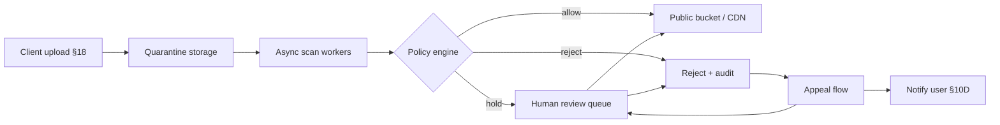

# UGC Moderation and Abuse

User-generated content (UGC(User-Generated Content)) — uploads, posts, comments, profiles — flows through **scan → policy → human review → appeal** before it is public and indexable. The API(Application Programming Interface) orchestrates; object storage holds bytes — [§18](18-object-storage-and-uploads.md); edge and rate limits absorb spray — [§02A](02A-edge-abuse-waf-and-bots.md).

> **Scope:** Moderation pipeline, policy tiers, human review queues, appeals, and abuse response for UGC surfaces. Upload auth and presigned flows → [§18](18-object-storage-and-uploads.md). Edge volumetric and bot abuse → [§02A](02A-edge-abuse-waf-and-bots.md). User notifications on decisions → [§10D](10D-notification-delivery.md). PII(Personally Identifiable Information) in content → [ESC §7](../../enterprise-security-compliance/includes/07-pii-and-data-classification.md).
>
> **Related:** Threat model → [§6](06-threat-model.md) · Multi-tenant isolation → [§16](16-multi-tenant-apis.md) · Async jobs → [§10A](10A-async-jobs-polling.md) · Rate limits → [§5](05-rate-limit-tiers.md)

---

## At a glance

| Stage | Default |
|-------|---------|
| **Upload** | Quarantine bucket; no public URL until cleared — [§18](18-object-storage-and-uploads.md) |
| **Scan** | Malware + CSAM/hash + text/image classifiers |
| **Policy** | Auto allow / hold / reject by category and trust tier |
| **Human review** | Queue for edge cases; SLA(Service Level Agreement) by severity |
| **Publish** | CDN(Content Delivery Network) only after `approved` |
| **Appeal** | User challenge; re-queue; notify outcome — [§10D](10D-notification-delivery.md) |

**Rule of thumb:** If a presigned URL is public before scan completes, moderation is cosmetic — [§18](18-object-storage-and-uploads.md).

---

## Pipeline

| Artifact | Stored |
|----------|--------|
| Content hash | Dedup illegal/resubmit |
| Model scores | Appeal evidence |
| Reviewer decision + reason code | Audit |
| User trust tier | Rate of auto-approve |

---

## Policy tiers

| Tier | Typical treatment |
|------|-------------------|
| **New / low trust** | Hold all public media |
| **Established** | Auto-approve text; sample image scans |
| **Verified / paid** | Faster path; still scan malware |
| **Reported content** | Priority queue; temporary visibility hide |

Align auto-moderation with **rate limits** and **edge bot controls** — [§02A](02A-edge-abuse-waf-and-bots.md) · [§5](05-rate-limit-tiers.md) — so upload floods do not drown reviewers.

---

## Human review and appeals

| Practice | Why |
|----------|-----|
| Reason codes (not free-text only) | Metrics and model feedback |
| Dual control for CSAM / legal holds | Regulatory requirement |
| Time-boxed SLA by severity | Trust and safety ops |
| Appeal reopens same asset id | No bypass via re-upload |
| Notify on reject and appeal outcome — [§10D](10D-notification-delivery.md) | Required UX; idempotent send |
| Escalation to law enforcement path | Documented, rare |

Reviewers get **minimum necessary** PII — [ESC §7](../../enterprise-security-compliance/includes/07-pii-and-data-classification.md).

---

## Abuse response

| Signal | Action |
|--------|--------|
| Mass reporting | Rate-limit reporters; detect brigading |
| Evolving spam patterns | Update classifiers; WAF(Web Application Firewall) rules — [§02A](02A-edge-abuse-waf-and-bots.md) |
| Repeat offender | Account strike + upload ban |
| Tenant-scoped UGC | Isolate prefix — [§16](16-multi-tenant-apis.md) |

Log moderation actions for downstream fraud and legal — separate from public API logs.

---

## Operational checklist

- [ ] Quarantine-first upload — [§18](18-object-storage-and-uploads.md)
- [ ] Async scan before any public URL
- [ ] Human queue with SLA and reason codes
- [ ] Appeal flow with notifications — [§10D](10D-notification-delivery.md)
- [ ] Edge and tier limits on upload endpoints — [§02A](02A-edge-abuse-waf-and-bots.md)
- [ ] Audit trail retained per policy — [ESC §6](../../enterprise-security-compliance/includes/06-audit-logging-and-retention.md)

---

## Common mistakes

| Mistake | Fix |
|---------|-----|
| Public URL before scan | Quarantine + promote — [§18](18-object-storage-and-uploads.md) |
| Moderation only by user reports | Proactive scan pipeline |
| Free-text-only rejections | Reason codes + user message |
| No appeal path | Re-queue + notify — [§10D](10D-notification-delivery.md) |
| Reviewers see full production DB | Scoped review UI |
| Same bucket for quarantine and CDN | Separate buckets/prefixes |
