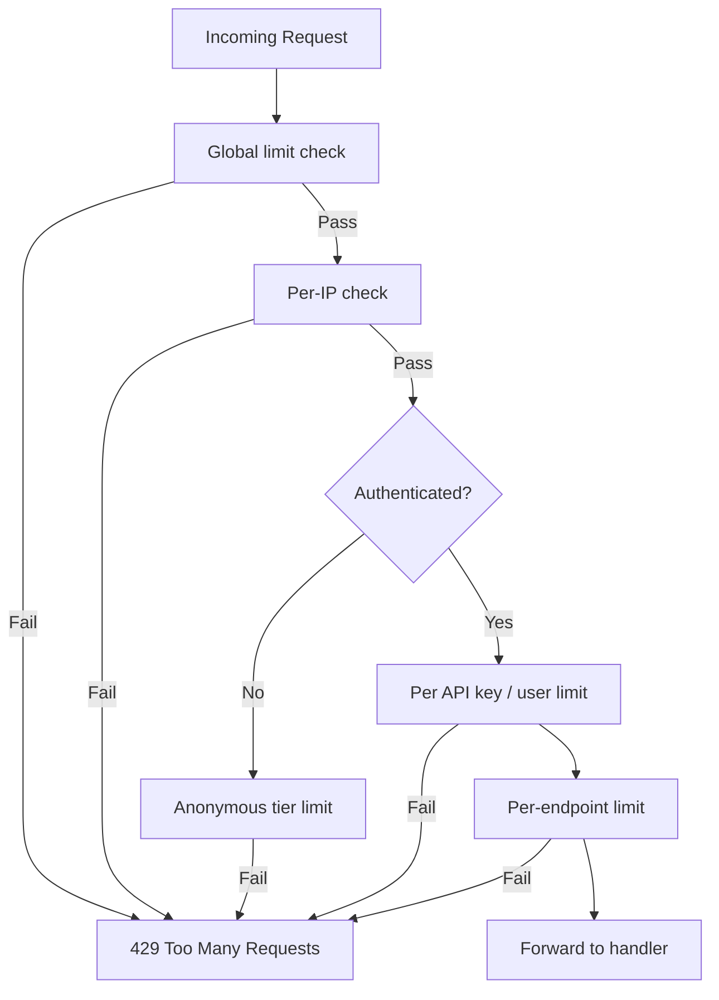
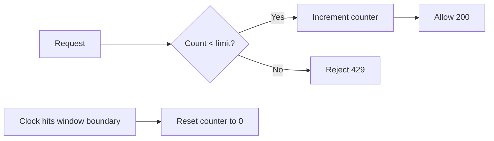
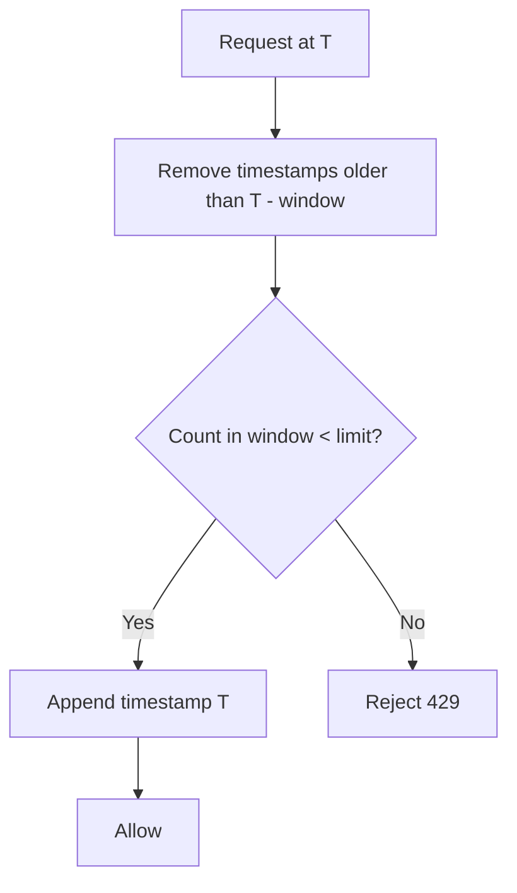
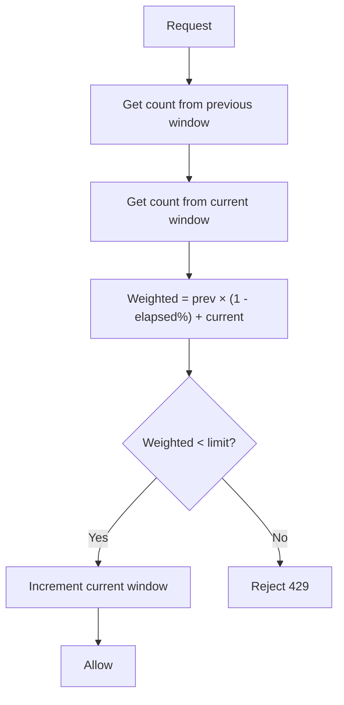
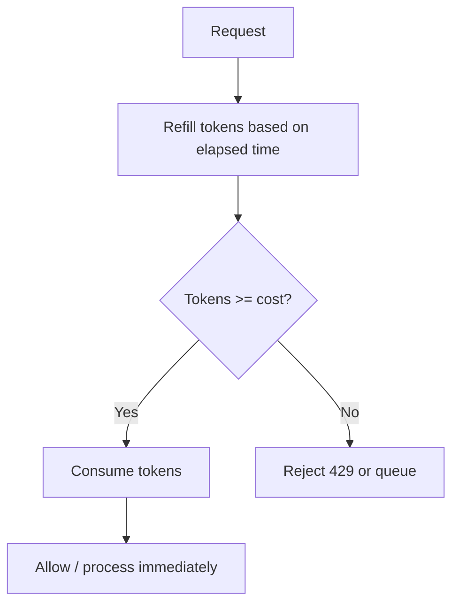
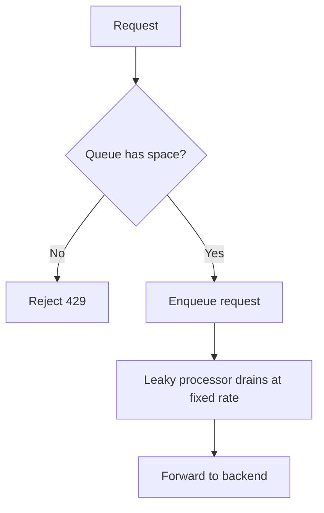
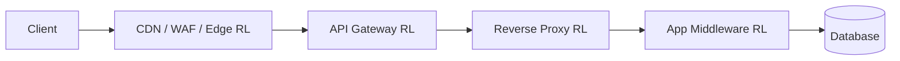
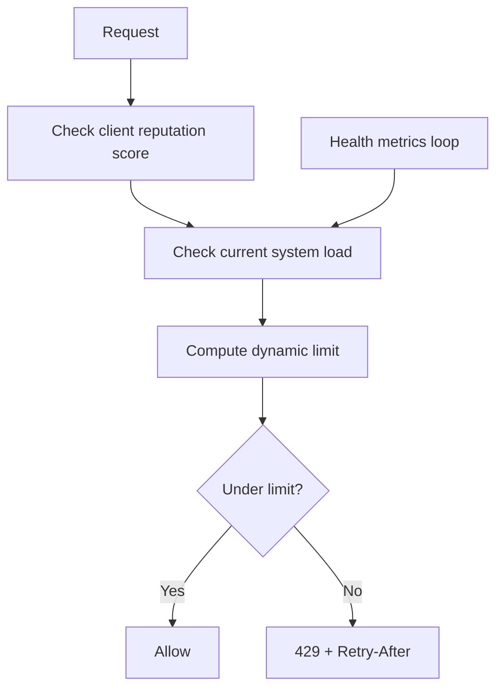
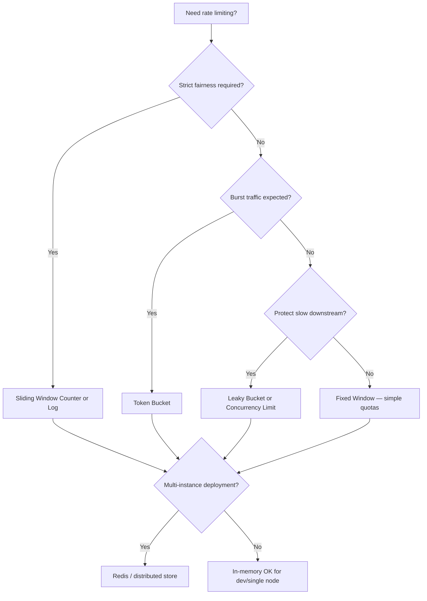
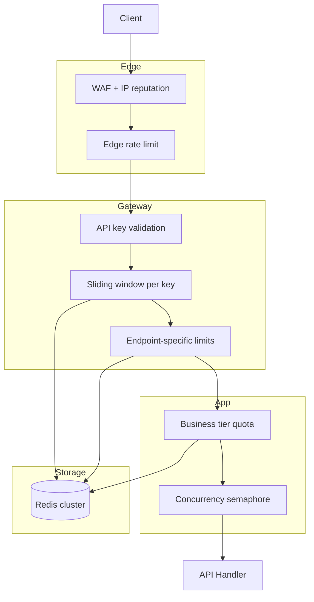

# API Rate Limiting Guide (Full)

> Combined view of all sections. Modular sources live in `includes/`.

---

# Overview — What Rate Limiting Is

Rate limiting controls **how many requests** a client can make in a given time window. It protects **availability**, **cost**, and **fairness** — but it is **not** authentication or authorization on its own.

> **Related:** Product tiers → [api-design §5 Rate-limit tiers](../api-design-and-protection/includes/05-rate-limit-tiers.md) · Backpressure → [HTS §9](../high-throughput-systems/includes/09-backpressure-and-limits.md) · Decision guide → [§10](10-decision-guide.md)

Use it together with auth, WAF(Web Application Firewall) rules, and abuse detection.

## Types at a glance

| Category | Examples |
|----------|----------|
| **Algorithms** | Fixed window, sliding window, token bucket, leaky bucket |
| **Scope** | Global, per-IP, per API(Application Programming Interface) key, per user, per endpoint |
| **Deployment** | CDN(Content Delivery Network)/edge, API gateway, reverse proxy, app middleware |
| **Specialized** | Concurrent limits, quotas, cost-based, adaptive |

## Algorithm quick comparison

| Algorithm | Memory | Burst handling | Accuracy | Complexity |
|-----------|--------|----------------|----------|------------|
| Fixed Window | Low | Poor | Low | ★☆☆ |
| Sliding Window Log | High | Good | High | ★★☆ |
| Sliding Window Counter | Low | Good | High | ★★☆ |
| Token Bucket | Low | **Best** | Medium | ★★☆ |
| Leaky Bucket | Medium | Poor (queues) | High | ★★★ |

## Default recommendation

For most public APIs:

1. **Sliding Window Counter** in Redis (or similar distributed store)
2. Layered checks: **global → per-IP → per API key/user → per expensive endpoint**
3. Add **Token Bucket** where controlled bursts are a product requirement

## Request flow (layered protection)



## Common mistakes

| Mistake | Fix |
|---------|-----|
| Rate limiting as sole security control | Pair with auth, WAF, abuse detection |
| Fixed window on strict per-second fairness | Sliding window counter or token bucket |
| IP-only limits behind corporate NAT | Authenticated per-key limits |
| No `Retry-After` on 429 | Document backoff; return header |
| Limits tuned without load test data | Measure normal traffic before setting ceilings |

## See also

| Guide | Topics |
|-------|--------|
| [api-design-and-protection](../api-design-and-protection/README.md) | Gateway layers, rate-limit tiers, scope identity |
| [api-design-and-protection §5](../api-design-and-protection/includes/05-rate-limit-tiers.md) | Product tiers and async escape hatch |
| [high-throughput-systems §9](../high-throughput-systems/includes/09-backpressure-and-limits.md) | Backpressure and overload protection |

---

# Fixed Window Counter

> **Related:** Product tiers → [api-design §5 Rate-limit tiers](../api-design-and-protection/includes/05-rate-limit-tiers.md) · Decision guide → [§10](10-decision-guide.md) · Gateway enforcement → [§7 Deployment layers](07-deployment-layers.md)

## What it is

Counts requests in **fixed time buckets** (e.g. per minute). The counter resets when the window boundary is reached.

## Flow



## Pros

- Simple, fast, low memory
- Easy to implement in Redis (`INCR` + TTL)
- Good for coarse quotas (daily/monthly limits)

## Cons

- **Boundary burst problem** — e.g. 100 requests at `12:00:59` + 100 at `12:01:00` = 200 in 2 seconds
- Uneven traffic distribution at window edges
- Poor for strict per-second fairness

## When to use

- Daily or monthly API(Application Programming Interface) quotas
- Coarse API tier limits (free vs paid)
- Internal services where edge bursts are acceptable
- Billing/usage metering where exact per-second fairness is not required

## Implementation note

```text
Key:   ratelimit:{client_id}:{window_start}
Value: request count
TTL:   window duration
```

## Common mistakes

| Mistake | Fix |
|---------|-----|
| Using fixed window for strict per-second fairness | Use sliding window counter or log for login/OTP endpoints |
| Ignoring boundary burst at window rollover | Prefer sliding window counter for public APIs |
| Daily quota keyed to UTC while product is regional | Align window timezone to billing or document UTC clearly |

---

# Sliding Window Log

> **Related:** Default hybrid alternative → [§3 Sliding window counter](03-sliding-window-counter.md) · Sensitive endpoints → [api-design §5](../api-design-and-protection/includes/05-rate-limit-tiers.md) · Common mistakes → [§11](11-common-mistakes-and-architecture.md)

## What it is

Stores a **timestamp for every request**. On each new request, count only timestamps within the last N seconds.

## Flow



## Pros

- Accurate — true sliding window behavior
- No boundary burst problem
- Fair per-client limits

## Cons

- **Memory-heavy** — one timestamp per request
- Expensive at high request rates (RPS)
- Hard to scale without pruning or sampling strategies

## When to use

- Low-to-medium traffic APIs
- Strict fairness requirements
- Sensitive endpoints: login, password reset, OTP verification, account recovery

## Implementation note

```text
Key:   ratelimit:{client_id}:log
Value: sorted set of timestamps (or list with pruning)
```

Prune entries older than `now - window_size` on each request.

## Common mistakes

| Mistake | Fix |
|---------|-----|
| Storing every timestamp at high RPS | Use sliding window counter (§3) or sample/prune aggressively |
| Same Redis key without TTL | Set TTL ≥ window size; prune on read |
| Log per IP behind carrier NAT | Combine with per-identity limits ([§6](06-scope-identity.md)) |

---

# Sliding Window Counter (Hybrid)

> **Related:** Product tiers → [api-design §5](../api-design-and-protection/includes/05-rate-limit-tiers.md) · Gateway stack → [§7 Deployment layers](07-deployment-layers.md) · Overload coupling → [HTS §9 Backpressure](../high-throughput-systems/includes/09-backpressure-and-limits.md)

## What it is

Combines the **previous window** and **current window** with weighted overlap. The most common production choice for public APIs.

## Flow



## Pros

- Smooths fixed-window boundary bursts
- Memory-efficient (only 2 counters per client)
- **Best general-purpose choice** for most APIs
- Works well with Redis atomic operations

## Cons

- Slightly more complex than fixed window
- Approximation — not mathematically perfect (but close enough in practice)
- Requires a distributed store for multi-instance deployments

## When to use

- Public REST(Representational State Transfer) or GraphQL APIs
- SaaS products with per-plan limits
- API(Application Programming Interface) gateways (Kong, AWS API Gateway, Envoy)
- Any production API where fairness matters but log-based storage is too costly

## Implementation note

```text
weighted_count = prev_window_count × (1 - elapsed_in_current_window)
               + current_window_count

if weighted_count < limit → allow and increment current window
else → reject 429
```

## Common mistakes

| Mistake | Fix |
|---------|-----|
| Per-app-instance counters | Shared Redis (or equivalent) — see [§11 fail-open vs fail-closed](11-common-mistakes-and-architecture.md) |
| Clock skew across Redis and app nodes | Use Redis time for window boundaries |
| One global counter for all endpoints | Layer global → IP → tier → expensive endpoint ([§6](06-scope-identity.md)) |

---

# Token Bucket

> **Related:** vs leaky bucket → [§5 Leaky bucket](05-leaky-bucket.md) · Product burst tiers → [api-design §5](../api-design-and-protection/includes/05-rate-limit-tiers.md) · Partner traffic → [HTS §12](../high-throughput-systems/includes/12-decision-guide-and-common-mistakes.md)

## What it is

A bucket holds **tokens** that refill at a steady rate. Each request consumes one or more tokens. Unused tokens accumulate up to a **maximum capacity**, allowing controlled bursts.

## Flow



## Pros

- **Allows bursts** up to bucket capacity
- Smooth average rate over time
- Natural fit for variable workloads (mobile apps, batch jobs)
- Easy to explain: "100 requests/minute with burst up to 20"

## Cons

- Large bursts can still stress backends if capacity is set too high
- Tuning `refill_rate` and `capacity` requires thought
- Stateless refill math can drift across nodes without shared state

## When to use

- APIs where occasional bursts are acceptable
- Mobile app backends
- Batch upload or webhook delivery endpoints
- Background job consumers
- Streaming or long-polling APIs

## Key parameters

| Parameter | Meaning | Example |
|-----------|---------|---------|
| `refill_rate` | Tokens added per second | 10 tokens/sec = 600/min |
| `capacity` | Max tokens in bucket (burst size) | 50 |
| `cost` | Tokens per request | 1 (or higher for expensive ops) |

## vs Leaky Bucket

| | Token Bucket | Leaky Bucket |
|---|-------------|--------------|
| Burst | Allows bursts | Queues excess, no burst |
| Output | Immediate if tokens available | Fixed steady output rate |
| Use case | Variable client traffic | Protect slow downstream |

## Common mistakes

| Mistake | Fix |
|---------|-----|
| High `capacity` that overwhelms DB on burst | Size burst to what downstream can absorb; pair with [§8 concurrent limits](08-specialized-limiters.md) |
| Per-node token state | Centralize in Redis for multi-instance APIs |
| Token bucket for strict OTP fairness | Use sliding window log ([§2](02-sliding-window-log.md)) on auth endpoints |

---

# Leaky Bucket

> **Related:** vs token bucket → [§4 Token bucket](04-token-bucket.md) · DB write protection → [PG §12 bulk](../postgresql-performance/includes/12-bulk-operations-and-concurrency.md) · Backpressure → [HTS §9](../high-throughput-systems/includes/09-backpressure-and-limits.md)

## What it is

Requests enter a **queue**. They "leak" out to the backend at a **fixed rate**. Excess requests are dropped or delayed.

## Flow



## Pros

- **Strict output rate** to downstream systems
- Protects fragile backends from overload
- Smooth, predictable load on databases and third-party APIs

## Cons

- Adds **latency** (requests wait in queue)
- Queue overflow causes drops or timeouts
- More complex to operate (queue depth, worker sizing)

## When to use

- Protecting databases from write storms
- Legacy systems with hard throughput caps
- Third-party API(Application Programming Interface) integrations with strict rate contracts
- Message processors and async job ingestion
- Any downstream that cannot handle burst traffic

## vs Token Bucket

Use **Leaky Bucket** when you need a **steady output rate** regardless of input bursts.

Use **Token Bucket** when you want to **allow bursts** but cap the average rate over time.

## Common mistakes

| Mistake | Fix |
|---------|-----|
| Unbounded queue depth | Cap queue size; reject with `429` when full |
| Leaky bucket at edge for user-facing latency | Prefer token bucket or sliding window at API; reserve leaky for downstream protection |
| Same leak rate for reads and writes | Tighter leak rate on write paths |

---

# Scope & Identity-Based Limiters

> **Related:** Product tier definitions → [api-design §5 Rate-limit tiers](../api-design-and-protection/includes/05-rate-limit-tiers.md) · Gateway identity → [api-design §3 Gateway](../api-design-and-protection/includes/03-api-gateway.md) · Layer order → [§7 Deployment layers](07-deployment-layers.md)

Rate limits can be keyed by different dimensions. Layer them from cheapest to most specific.

## Comparison

| Type | Key | Pros | Cons | When to use |
|------|-----|------|------|-------------|
| **Global** | Single counter for entire API(Application Programming Interface) | Simple DDoS brake | One noisy client affects everyone | Emergency circuit, small APIs |
| **Per IP** | Source IP / `X-Forwarded-For` | Easy, no auth needed | Shared NAT, VPN, mobile carriers; spoofable behind bad proxies | Public unauthenticated endpoints |
| **Per API Key** | `Authorization` header | Ties to billing and plan | Key sharing, leaked keys | B2B APIs, developer portals |
| **Per User / Account** | User ID from JWT(JSON Web Token)/session | Fair per customer | Requires auth on every request | Logged-in SaaS APIs |
| **Per Tenant / Org** | `org_id` | Multi-tenant fairness | Large tenants may need custom limits | B2B multi-tenant platforms |
| **Per Endpoint** | `method + path` | Protects expensive ops only | Many rules to maintain | Search, export, ML inference |
| **Per Resource** | `user:123:project:456` | Fine-grained abuse control | Key explosion, storage cost | File uploads, object CRUD |

## Layered check order

Run cheapest checks first:

```text
1. Global limit        → stop volumetric attacks early
2. Per-IP limit        → catch unauthenticated abuse
3. Per identity limit  → API key / user / tenant
4. Per-endpoint limit  → protect expensive operations
```

## Best practices

- **Combine IP + identity** — per-IP alone punishes corporate NAT and mobile carriers
- **Different limits per tier** — free vs paid vs enterprise
- **Stricter limits on auth endpoints** — login, password reset, OTP
- **Looser limits on read, tighter on write** — `GET` vs `POST`/`DELETE`

## Common mistakes

| Mistake | Fix |
|---------|-----|
| Per-IP only on authenticated API | Add per API key / user / tenant ([§6 table](#comparison)) |
| Trusting `X-Forwarded-For` without trusted proxy config | Strip/spoof at edge; only trust from load balancer |
| Same limit for `GET /health` and `POST /export` | Per-endpoint multipliers → [api-design §5](../api-design-and-protection/includes/05-rate-limit-tiers.md#per-endpoint-multipliers) |

---

# Deployment Layers

> **Scope:** **Technical lens** — which infrastructure layer enforces limits (edge, gateway, app, Redis). Product tier quotas and header contract → [api-design §5 Rate-limit tiers](../api-design-and-protection/includes/05-rate-limit-tiers.md).
>
> **Related:** Gateway architecture → [api-design §3 Gateway](../api-design-and-protection/includes/03-api-gateway.md) · Entry / edge → [HTS §2 Entry and edge](../high-throughput-systems/includes/02-entry-and-edge.md) · Production architecture → [§11](11-common-mistakes-and-architecture.md)

Where you enforce rate limits matters as much as which algorithm you choose.

## Comparison

| Layer | Examples | Pros | Cons | When to use |
|-------|----------|------|------|-------------|
| **CDN(Content Delivery Network) / Edge** | Cloudflare, Fastly, Akamai | Blocks abuse before origin; global PoPs | Limited custom logic | Public APIs, DDoS absorption |
| **API(Application Programming Interface) Gateway** | Kong, AWS API Gateway, Apigee | Central policy, no app code changes | Extra hop, config sprawl | Microservices, multi-team APIs |
| **Reverse Proxy** | Nginx `limit_req`, Envoy | High performance, close to app | Per-instance unless shared store | Single-region, moderate scale |
| **App Middleware** | Express, Spring, Django | Business-aware limits (plan tier) | Duplicated across services | Plan-based quotas, cost-aware limits |
| **Service Mesh** | Istio, Linkerd | Per-service, mTLS(Mutual Transport Layer Security)-aware | Operational complexity | Large Kubernetes estates |

## Traffic flow



## Rule of thumb

| Concern | Best layer |
|---------|------------|
| Block garbage traffic | Edge / CDN (as early as possible) |
| Enforce API key validity | API Gateway |
| Per-plan business quotas | App middleware |
| Protect database writes | App middleware or leaky bucket near DB |

## Distributed vs local storage

| Type | Pros | Cons | When to use |
|------|------|------|-------------|
| **In-memory (per instance)** | Fastest, no network | Inconsistent across replicas | Dev, single-node, soft limits |
| **Centralized (Redis)** | Consistent global view | Latency, dependency on Redis | Production multi-instance |
| **Local + sync (gossip)** | No single bottleneck | Eventually consistent | Very large edge deployments |

**Production pattern:** Redis with atomic `INCR` or Lua scripts; optional local shadow cache to reduce round-trips.

## Fail-open vs fail-closed

If Redis (or your limit store) is down, choose per endpoint class. Full tradeoffs, war stories, and production checklist → [§11 Common mistakes & production architecture](11-common-mistakes-and-architecture.md#5-fail-open-vs-fail-closed).

**Rule of thumb:** fail-open with a conservative local cap for reads; fail-closed on auth and expensive writes.

## Common mistakes

| Mistake | Fix |
|---------|-----|
| Rate limit only in app middleware | Add edge/gateway layer for abuse — see traffic flow above |
| In-memory limits on horizontally scaled app | Redis or gateway counters ([§11](11-common-mistakes-and-architecture.md)) |
| Fail-open on expensive write routes during Redis outage | Fail-closed on export, payment, and auth endpoints |

---

# Specialized Limiters

> **Related:** Expensive endpoint multipliers → [api-design §5](../api-design-and-protection/includes/05-rate-limit-tiers.md#per-endpoint-multipliers) · Async long jobs → [api-design §10 Async](../api-design-and-protection/includes/10-async-patterns.md) · Decision guide → [§10](10-decision-guide.md)

Beyond standard request-per-second algorithms.

---

## Concurrent Request Limiter

Limits **in-flight** requests, not requests per second.

| Pros | Cons |
|------|------|
| Prevents thread/connection exhaustion | Does not stop fast-completing request floods |
| Great for long-running operations | Timeouts make counting tricky |

**When to use:** Report generation, video transcoding, DB-heavy queries, WebSocket connections.

---

## Quota / Credit System

Time-based budgets: e.g. 10,000 calls/month. Endpoints can have different credit costs.

| Pros | Cons |
|------|------|
| Aligns with billing and plans | Needs persistence and reset logic |
| Flexible per-plan pricing | Users hit walls at period boundaries |

**When to use:** Paid API(Application Programming Interface) products, freemium tiers, marketplace APIs.

---

## Cost-Based / Weighted Limiting

Different endpoints consume different "weight" from the same bucket.

| Pros | Cons |
|------|------|
| Fair for mixed light/heavy endpoints | Requires accurate cost modeling |
| One bucket per user | Hard to explain to API consumers |

**When to use:**

- GraphQL (query complexity scoring)
- Search + CRUD on the same API key
- LLM APIs (tokens as cost unit)

**Example weights:**

| Endpoint | Cost |
|----------|------|
| `GET /users` | 1 |
| `POST /search` | 5 |
| `POST /export` | 20 |
| `POST /inference` | 50 |

---

## Adaptive / Dynamic Rate Limiting

Limits change based on server load, error rate, or client reputation.



| Pros | Cons |
|------|------|
| Self-protecting under stress | Complex to implement and tune |
| Punishes bad actors automatically | Can surprise legitimate users |

**When to use:** High-scale public APIs, platforms under frequent attack, auto-scaling clusters.

---

## Bandwidth / Throughput Limiter

Limits bytes per second, not request count.

**When to use:** File upload/download APIs, streaming endpoints, CDN(Content Delivery Network) origin protection.

## Common mistakes

| Mistake | Fix |
|---------|-----|
| Concurrent limit without request timeout | Stale in-flight count when clients disconnect |
| GraphQL complexity scoring without depth cap | Combine with query depth limit → [api-design §1](../api-design-and-protection/includes/01-api-design.md) |
| Monthly quota without `Retry-After` at period boundary | Return reset timestamp in headers ([§9](09-response-strategies.md)) |

---

# Response Strategies

> **Scope:** **Behavior lens** — hard reject vs throttle vs queue, retry-storm prevention. Canonical `429` headers and tier contract → [api-design §5 Response headers](../api-design-and-protection/includes/05-rate-limit-tiers.md#response-headers).
>
> **Related:** Standard headers → [api-design §5 Response headers](../api-design-and-protection/includes/05-rate-limit-tiers.md#response-headers) · Async escape hatch → [api-design §5 Async escape hatch](../api-design-and-protection/includes/05-rate-limit-tiers.md#async-escape-hatch) · Retry storms → [HTS §9 Backpressure](../high-throughput-systems/includes/09-backpressure-and-limits.md)

How you respond when a limit is hit is as important as the algorithm itself.

## Comparison

| Strategy | Behavior | Pros | Cons | When to use |
|----------|----------|------|------|-------------|
| **Hard reject** | Immediate `429 Too Many Requests` | Simple, protects fast | Bad UX for legitimate retries | Default for abuse prevention |
| **Throttle / delay** | Slow down responses | Softer on clients | Ties up connections | Partner APIs, scraping deterrence |
| **Queue** | Buffer then process | No immediate loss | Latency, memory risk | Async job ingestion |
| **Graduated** | Warn → throttle → block | Better UX for good users | More logic to maintain | Enterprise SaaS |
| **Priority tiers** | Premium bypasses limits | Revenue-aligned | Complexity, fairness debates | Paid vs free tiers |

## Standard response headers

Canonical `429` example and header names for product tiers → [api-design §5 Response headers](../api-design-and-protection/includes/05-rate-limit-tiers.md#response-headers).

| Header | Purpose |
|--------|---------|
| `Retry-After` | Seconds (or HTTP(Hypertext Transfer Protocol)-date) until client should retry |
| `X-RateLimit-Limit` | Max requests allowed in the window |
| `X-RateLimit-Remaining` | Requests left in current window |
| `X-RateLimit-Reset` | Unix timestamp when the window resets |

## Retry storm prevention

Clients that retry aggressively on `429` amplify load. Mitigate with:

1. Document exponential backoff in your API(Application Programming Interface) docs
2. Return accurate `Retry-After` values
3. Use jitter in client SDKs
4. Consider a separate, stricter limit for rapid retries from the same client

## Common mistakes

| Mistake | Fix |
|---------|-----|
| `429` without `Retry-After` | Always set seconds or HTTP-date |
| Same error body for tier vs abuse blocks | Distinct `code` in JSON for client handling |
| Throttling without closing idle connections | Time out slow clients; see [§5 Leaky bucket](05-leaky-bucket.md) for queue caps |

---

# Decision Guide — Choosing a Limiter

> **Related:** Algorithm sections §1–§5 · Deployment layers → [§7](07-deployment-layers.md) · Common mistakes → [§11](11-common-mistakes-and-architecture.md) · Product tiers → [api-design §5](../api-design-and-protection/includes/05-rate-limit-tiers.md)

## Algorithm decision flow



## Scenario recommendations

| Scenario | Recommended stack |
|----------|-------------------|
| Public REST(Representational State Transfer) API (SaaS) | Sliding window + per API key + per-endpoint on heavy routes |
| Mobile app backend | Token bucket (burst-friendly) + per user |
| Login / auth endpoints | Sliding window log, strict per-IP + per-username |
| Internal microservices | Gateway global limit + per-service concurrency |
| GraphQL | Cost-based limiting + query depth/complexity analysis |
| File upload API | Per-user quota + concurrent upload limit + bandwidth cap |
| LLM / inference API | Token bucket on tokens/min + per-user daily quota |
| DDoS / volumetric attack | Edge/CDN(Content Delivery Network) rate limit + WAF(Web Application Firewall) before app logic |
| Paid API with tiers | Quota system + per API key + graduated response |

## Common stack combinations

### Starter (single service)

```text
Nginx limit_req (per-IP) → App middleware (per user) → Handler
```

### Production SaaS

```text
Cloudflare (edge) → Kong (per API key, sliding window) → App (per-endpoint weights) → Redis
```

### High-stakes / attack-prone

```text
CDN + WAF → API Gateway → Adaptive limits → Redis → App concurrency semaphore
```

## Common mistakes

| Mistake | Fix |
|---------|-----|
| One algorithm for all endpoints | Match algorithm to fairness and burst needs |
| In-memory limiter on multi-node app | Redis or gateway-enforced distributed store |
| Login endpoint same limit as read API | Stricter per-IP + per-username on auth routes |
| GraphQL with only request count | Cost-based limits + depth/complexity caps |
| No fail-open/closed policy documented | Define behavior when Redis is unavailable |

---

# Common Mistakes & Production Architecture

> **Related:** Decision guide → [§10](10-decision-guide.md) · Response headers → [§9](09-response-strategies.md) · Gateway enforcement → [§7](07-deployment-layers.md)

## Common mistakes

### 1. Rate limiting is not security

Attackers rotate IPs, API(Application Programming Interface) keys, and accounts. Rate limiting reduces abuse volume — it does not stop determined attackers.

### 2. Clock skew

Distributed window counters need synchronized time or TTL-based buckets. Avoid relying on wall-clock alignment across nodes.

### 3. Retry storms

Clients that retry on every `429` amplify load. Always return `Retry-After` and document backoff in your API reference.

### 4. Shared IPs

Corporate NAT, VPNs, and mobile carriers punish strict per-IP limits. Combine with authenticated identity limits when possible.

### 5. Fail-open vs fail-closed

If your rate limit store (Redis) is down:

- **Fail-open** — traffic flows (risk of overload)
- **Fail-closed** — all traffic blocked (causes outage)

Most teams choose **fail-open with a conservative local emergency cap**.

### 6. No observability

Without metrics per limiter rule, you cannot tune thresholds. Track:

- `429` rate per rule
- Remaining capacity distribution
- Top clients hitting limits
- False positive rate (legitimate users blocked)

---

## Minimal production architecture



## Checklist before going live

- [ ] Limits defined per tier (free, paid, enterprise)
- [ ] `429` response includes `Retry-After` and rate limit headers
- [ ] Redis (or store) has failover strategy documented
- [ ] Metrics and alerts on `429` spike per endpoint
- [ ] Auth endpoints have stricter limits than read endpoints
- [ ] API docs explain limits and backoff behavior
- [ ] Load test validates limits do not block normal traffic patterns

---

## Production war stories

### Redis primary fails over

| Symptom | All counters reset or split-brain limits |
|---------|------------------------------------------|
| **Cause** | New Redis primary empty; windows restart |
| **Mitigation** | Redis Cluster with persistence; conservative local cap during failover; monitor `429` spike |
| **Prevention** | Document fail-open policy; run failover game day |

### OAuth(Open Authorization) token refresh burst

| Symptom | `/oauth/token` hammers rate limit; legitimate apps get `429` |
|---------|----------------------------------------------------------------|
| **Cause** | Shared IP + per-IP limit; all clients refresh at hour boundary |
| **Mitigation** | Per-client_id limit; separate bucket for token endpoint; jitter refresh in SDK docs |
| **Prevention** | Load test token path separately from API path |

### Global vs regional counters

| Symptom | Limit exceeded in EU but US idle |
|---------|-----------------------------------|
| **Cause** | Global Redis key; viral traffic in one region |
| **Mitigation** | Regional limit keys + global cap; or geo-sharded Redis |
| **Prevention** | Define whether quota is per-account global or per-region |

### Partner on corporate NAT

| Symptom | One `429` blocks entire enterprise |
|---------|-------------------------------------|
| **Cause** | Strict per-IP on authenticated API |
| **Mitigation** | Require API key; rate limit by `client_id` not IP |
| **Prevention** | Never IP-only limits for B2B authenticated APIs |

### Retry storm after partial outage

| Symptom | Recovery slower than outage — clients retry into `429` |
|---------|--------------------------------------------------------|
| **Cause** | No `Retry-After`; exponential backoff missing in SDK |
| **Mitigation** | Return `Retry-After`; document backoff; temporary raise ceiling |
| **Prevention** | Client SDK defaults + integration test for `429` handling |

---


---

## See also

| Guide | Topics |
|-------|--------|
| [api-design-and-protection](../api-design-and-protection/README.md) | Gateway enforcement, rate-limit tiers, scope identity |
| [high-throughput-systems](../high-throughput-systems/README.md) | Backpressure, circuit breakers, system-wide overload order |
| [deployment-strategies](../deployment-strategies/README.md) | Edge vs app-layer limit rollout during deploys |
| [postgresql-performance](../postgresql-performance/README.md) | Connection storms and pool saturation |
| [database-connection-and-security](../database-connection-and-security/README.md) | Edge identity vs DB credentials |
