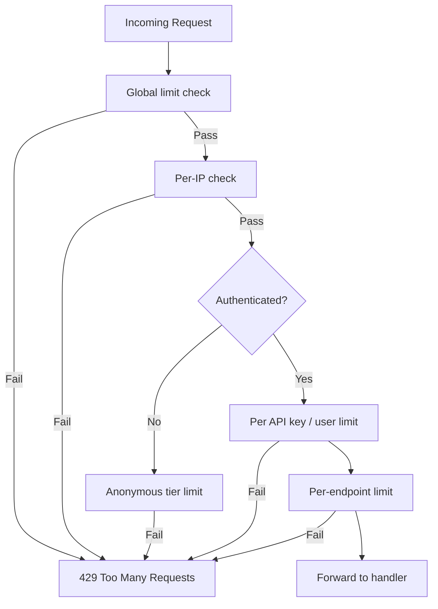

# Overview — What Rate Limiting Is

Rate limiting controls **how many requests** a client can make in a given time window. It protects **availability**, **cost**, and **fairness** — but it is **not** authentication or authorization on its own.

> **Related:** Product tiers → [api-design §5 Rate-limit tiers](../../api-design-and-protection/includes/05-rate-limit-tiers.md) · Backpressure → [HTS §9](../../high-throughput-systems/includes/09-backpressure-and-limits.md) · Decision guide → [§10](10-decision-guide.md)

Use it together with auth, WAF(Web Application Firewall) rules, and abuse detection.

## Types at a glance

| Category | Examples |
|----------|----------|
| **Algorithms** | Fixed window, sliding window, token bucket, leaky bucket |
| **Scope** | Global, per-IP, per API(Application Programming Interface) key, per user, per endpoint |
| **Deployment** | CDN(Content Delivery Network)/edge, API gateway, reverse proxy, app middleware |
| **Specialized** | Concurrent limits, quotas, cost-based, adaptive |

## Algorithm quick comparison

| Algorithm | Memory | Burst handling | Accuracy | Complexity |
|-----------|--------|----------------|----------|------------|
| Fixed Window | Low | Poor | Low | ★☆☆ |
| Sliding Window Log | High | Good | High | ★★☆ |
| Sliding Window Counter | Low | Good | High | ★★☆ |
| Token Bucket | Low | **Best** | Medium | ★★☆ |
| Leaky Bucket | Medium | Poor (queues) | High | ★★★ |

## Default recommendation

For most public APIs:

1. **Sliding Window Counter** in Redis (or similar distributed store)
2. Layered checks: **global → per-IP → per API key/user → per expensive endpoint**
3. Add **Token Bucket** where controlled bursts are a product requirement

## Request flow (layered protection)

## Common mistakes

| Mistake | Fix |
|---------|-----|
| Rate limiting as sole security control | Pair with auth, WAF, abuse detection |
| Fixed window on strict per-second fairness | Sliding window counter or token bucket |
| IP-only limits behind corporate NAT | Authenticated per-key limits |
| No `Retry-After` on 429 | Document backoff; return header |
| Limits tuned without load test data | Measure normal traffic before setting ceilings |

## See also

| Guide | Topics |
|-------|--------|
| [api-design-and-protection](../../api-design-and-protection/README.md) | Gateway layers, rate-limit tiers, scope identity |
| [api-design-and-protection §5](../../api-design-and-protection/includes/05-rate-limit-tiers.md) | Product tiers and async escape hatch |
| [high-throughput-systems §9](../../high-throughput-systems/includes/09-backpressure-and-limits.md) | Backpressure and overload protection |