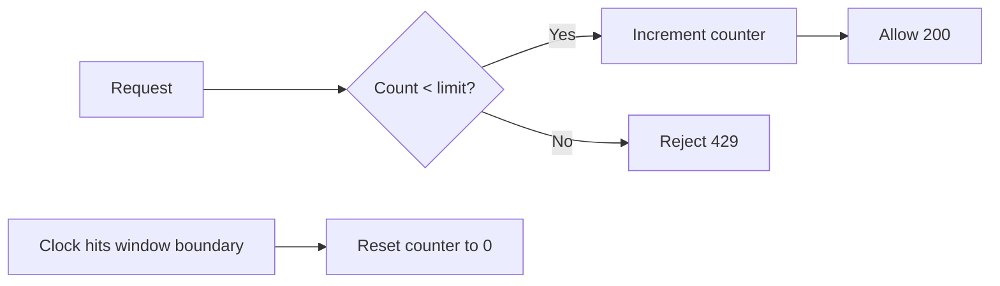

# Fixed Window Counter

> **Related:** Product tiers → [api-design §5 Rate-limit tiers](../../api-design-and-protection/includes/05-rate-limit-tiers.md) · Decision guide → [§10](10-decision-guide.md) · Gateway enforcement → [§7 Deployment layers](07-deployment-layers.md) · Redis keys → [§6](06-scope-identity.md) · Distributed → [§12](12-distributed-rate-limiting.md)

---

## At a glance

| | Fixed window |
|--|--------------|
| **Memory** | One integer per key |
| **Redis ops** | `INCR` + `EXPIRE` (1–2 per request) |
| **Fairness** | Poor at window boundaries (2× burst possible) |
| **Best fit** | Daily/monthly quotas, coarse tier limits |

---

## What it is

Counts requests in **fixed time buckets** (e.g. per minute). The counter resets when the window boundary is reached.

## Flow



## Pros

- Simple, fast, low memory
- Easy to implement in Redis (`INCR` + TTL)
- Good for coarse quotas (daily/monthly limits)

## Cons

- **Boundary burst problem** — e.g. 100 requests at `12:00:59` + 100 at `12:01:00` = 200 in 2 seconds
- Uneven traffic distribution at window edges
- Poor for strict per-second fairness

## When to use

- Daily or monthly API(Application Programming Interface) quotas
- Coarse API tier limits (free vs paid)
- Internal services where edge bursts are acceptable
- Billing/usage metering where exact per-second fairness is not required

## Redis implementation

Key convention (shared with [§6](06-scope-identity.md#key-template)):

```text
ratelimit:{scope}:{identity}:{bucket}:{window_start}
```

Fixed-window example (per API key, 1-minute UTC window):

```text
Key:   ratelimit:key:key_abc123:global:1735689660
Ops:   INCR key → if count == 1, EXPIRE key 60
Limit: 600/min (from tier)
```

TTL bucket variant (no `window_start` in key) → [§6 TTL variant](06-scope-identity.md#ttl-bucket-variant-no-window_start-in-key). Multi-instance requires shared Redis → [§12](12-distributed-rate-limiting.md).

## Common mistakes

| Mistake | Fix |
|---------|-----|
| Using fixed window for strict per-second fairness | Use sliding window counter or log for login/OTP endpoints |
| Ignoring boundary burst at window rollover | Prefer sliding window counter for public APIs |
| Daily quota keyed to UTC while product is regional | Align window timezone to billing or document UTC clearly |
| Per-app-instance counter | Shared Redis — [§12](12-distributed-rate-limiting.md) |
| Tier embedded in Redis key (`ratelimit:paid:…`) | Use scope prefix `key:`; resolve tier from cache at check time ([§6](06-scope-identity.md)) |