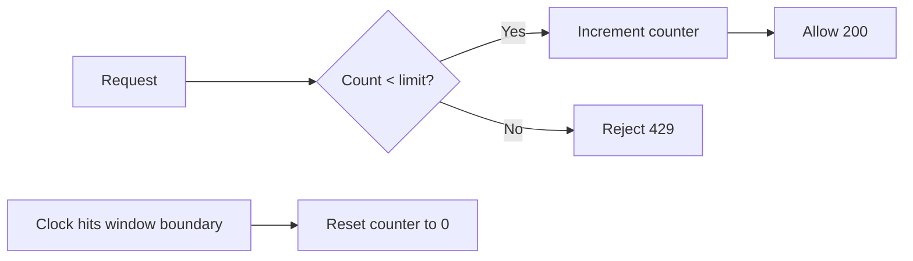

# Fixed Window Counter

> **Related:** Product tiers → [api-design §5 Rate-limit tiers](../../api-design-and-protection/includes/05-rate-limit-tiers.md) · Decision guide → [§10](10-decision-guide.md) · Gateway enforcement → [§7 Deployment layers](07-deployment-layers.md)

## What it is

Counts requests in **fixed time buckets** (e.g. per minute). The counter resets when the window boundary is reached.

## Flow



## Pros

- Simple, fast, low memory
- Easy to implement in Redis (`INCR` + TTL)
- Good for coarse quotas (daily/monthly limits)

## Cons

- **Boundary burst problem** — e.g. 100 requests at `12:00:59` + 100 at `12:01:00` = 200 in 2 seconds
- Uneven traffic distribution at window edges
- Poor for strict per-second fairness

## When to use

- Daily or monthly API(Application Programming Interface) quotas
- Coarse API tier limits (free vs paid)
- Internal services where edge bursts are acceptable
- Billing/usage metering where exact per-second fairness is not required

## Implementation note

```text
Key:   ratelimit:{client_id}:{window_start}
Value: request count
TTL:   window duration
```

## Common mistakes

| Mistake | Fix |
|---------|-----|
| Using fixed window for strict per-second fairness | Use sliding window counter or log for login/OTP endpoints |
| Ignoring boundary burst at window rollover | Prefer sliding window counter for public APIs |
| Daily quota keyed to UTC while product is regional | Align window timezone to billing or document UTC clearly |
