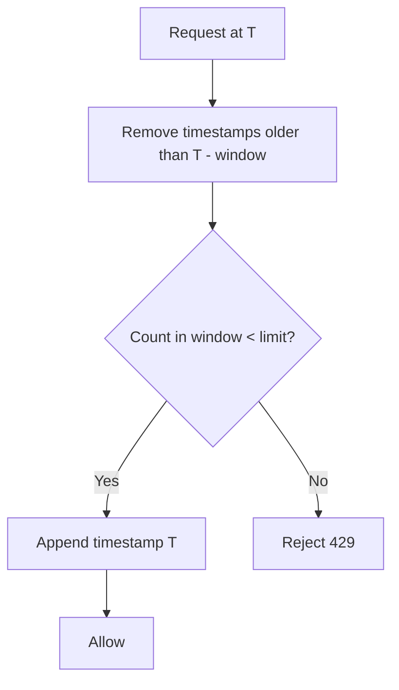

# Sliding Window Log

> **Related:** Default hybrid alternative → [§3 Sliding window counter](03-sliding-window-counter.md) · Sensitive endpoints → [api-design §5](../../api-design-and-protection/includes/05-rate-limit-tiers.md) · Common mistakes → [§11](11-common-mistakes-and-architecture.md) · Redis keys → [§6](06-scope-identity.md)

---

## At a glance

| | Sliding window log |
|--|-------------------|
| **Memory** | O(requests in window) — one timestamp per request |
| **Redis ops** | `ZADD` + `ZREMRANGEBYSCORE` + `ZCARD` (3+ per request) |
| **Fairness** | Exact sliding window — no boundary burst |
| **Best fit** | Auth endpoints at low–medium RPS |

---

## What it is

Stores a **timestamp for every request**. On each new request, count only timestamps within the last N seconds.

## Flow



## Pros

- Accurate — true sliding window behavior
- No boundary burst problem
- Fair per-client limits

## Cons

- **Memory-heavy** — one timestamp per request
- Expensive at high request rates (RPS)
- Hard to scale without pruning or sampling strategies

## When to use

- Low-to-medium traffic APIs
- Strict fairness requirements
- Sensitive endpoints: login, password reset, OTP verification, account recovery

## Redis implementation

```text
Key:   ratelimit:user:usr_9f2a:auth
Type:  sorted set (score = unix timestamp)
Ops:   ZREMRANGEBYSCORE key 0 (now - window)
       ZCARD key → if < limit: ZADD key now now
       EXPIRE key window_seconds
```

Use scope `user` or `ip` for auth endpoints — not per-endpoint path keys. Layer with global/IP checks first → [§6 layered keys](06-scope-identity.md#layered-keys-in-one-request). At high RPS, switch to [§3 sliding window counter](03-sliding-window-counter.md).

## Common mistakes

| Mistake | Fix |
|---------|-----|
| Storing every timestamp at high RPS | Use sliding window counter (§3) or sample/prune aggressively |
| Same Redis key without TTL | Set TTL ≥ window size; prune on read |
| Log per IP behind carrier NAT | Combine with per-identity limits ([§6](06-scope-identity.md)) |
| Key without scope prefix | Use `ratelimit:ip:{ip}:auth` not `ratelimit:{ip}:{window}` |