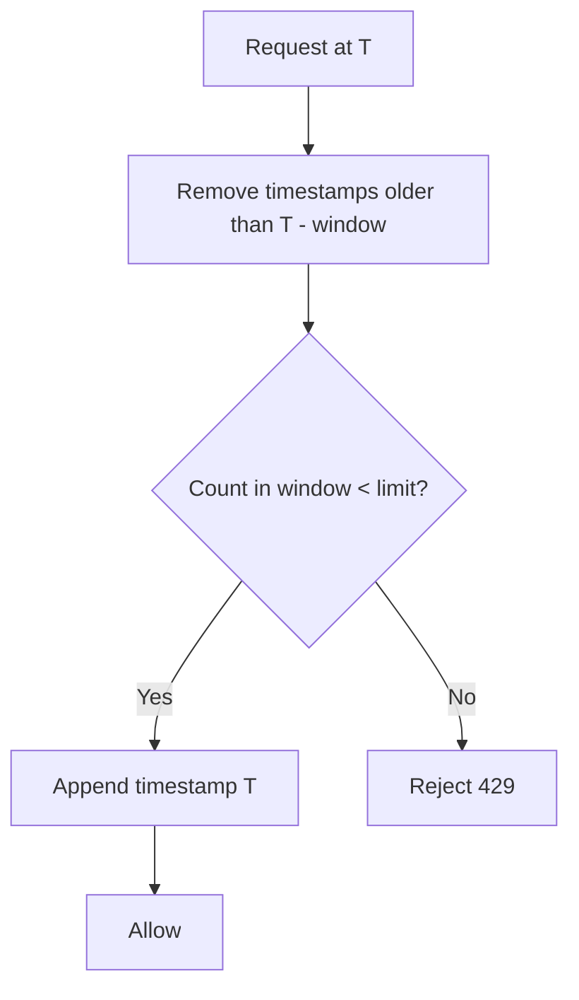

# Sliding Window Log

> **Related:** Default hybrid alternative → [§3 Sliding window counter](03-sliding-window-counter.md) · Sensitive endpoints → [api-design §5](../../api-design-and-protection/includes/05-rate-limit-tiers.md) · Common mistakes → [§11](11-common-mistakes-and-architecture.md)

## What it is

Stores a **timestamp for every request**. On each new request, count only timestamps within the last N seconds.

## Flow



## Pros

- Accurate — true sliding window behavior
- No boundary burst problem
- Fair per-client limits

## Cons

- **Memory-heavy** — one timestamp per request
- Expensive at high request rates (RPS)
- Hard to scale without pruning or sampling strategies

## When to use

- Low-to-medium traffic APIs
- Strict fairness requirements
- Sensitive endpoints: login, password reset, OTP verification, account recovery

## Implementation note

```text
Key:   ratelimit:{client_id}:log
Value: sorted set of timestamps (or list with pruning)
```

Prune entries older than `now - window_size` on each request.

## Common mistakes

| Mistake | Fix |
|---------|-----|
| Storing every timestamp at high RPS | Use sliding window counter (§3) or sample/prune aggressively |
| Same Redis key without TTL | Set TTL ≥ window size; prune on read |
| Log per IP behind carrier NAT | Combine with per-identity limits ([§6](06-scope-identity.md)) |
