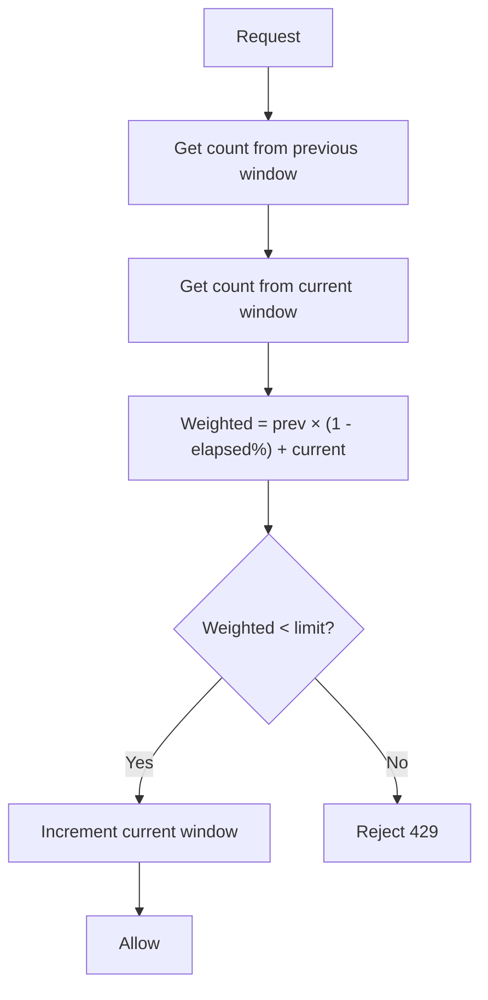

# Sliding Window Counter (Hybrid)

> **Related:** Product tiers → [api-design §5](../../api-design-and-protection/includes/05-rate-limit-tiers.md) · Gateway stack → [§7 Deployment layers](07-deployment-layers.md) · Overload coupling → [HTS §9 Backpressure](../../high-throughput-systems/includes/09-backpressure-and-limits.md)

## What it is

Combines the **previous window** and **current window** with weighted overlap. The most common production choice for public APIs.

## Flow



## Pros

- Smooths fixed-window boundary bursts
- Memory-efficient (only 2 counters per client)
- **Best general-purpose choice** for most APIs
- Works well with Redis atomic operations

## Cons

- Slightly more complex than fixed window
- Approximation — not mathematically perfect (but close enough in practice)
- Requires a distributed store for multi-instance deployments

## When to use

- Public REST or GraphQL APIs
- SaaS products with per-plan limits
- API gateways (Kong, AWS API Gateway, Envoy)
- Any production API where fairness matters but log-based storage is too costly

## Implementation note

```text
weighted_count = prev_window_count × (1 - elapsed_in_current_window)
               + current_window_count

if weighted_count < limit → allow and increment current window
else → reject 429
```

## Common mistakes

| Mistake | Fix |
|---------|-----|
| Per-app-instance counters | Shared Redis (or equivalent) — see [§11 fail-open vs fail-closed](11-common-mistakes-and-architecture.md) |
| Clock skew across Redis and app nodes | Use Redis time for window boundaries |
| One global counter for all endpoints | Layer global → IP → tier → expensive endpoint ([§6](06-scope-identity.md)) |
