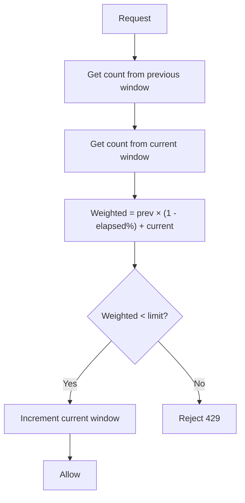

# Sliding Window Counter (Hybrid)

> **Related:** Product tiers → [api-design §5](../../api-design-and-protection/includes/05-rate-limit-tiers.md) · Gateway stack → [§7 Deployment layers](07-deployment-layers.md) · Overload coupling → [HTS §9 Backpressure](../../high-throughput-systems/includes/09-backpressure-and-limits.md) · Redis keys → [§6](06-scope-identity.md) · Distributed → [§12](12-distributed-rate-limiting.md)

---

## At a glance

| | Sliding window counter |
|--|------------------------|
| **Memory** | Two integers per key (previous + current window) |
| **Redis ops** | `GET` ×2 + weighted math + `INCR` (or Lua script, 1 round trip) |
| **Fairness** | Smooths boundary bursts; ~99% as fair as log |
| **Best fit** | **Default for public production APIs** |

---

## What it is

Combines the **previous window** and **current window** with weighted overlap. The most common production choice for public APIs.

## Flow



## Pros

- Smooths fixed-window boundary bursts
- Memory-efficient (only 2 counters per client)
- **Best general-purpose choice** for most APIs
- Works well with Redis atomic operations

## Cons

- Slightly more complex than fixed window
- Approximation — not mathematically perfect (but close enough in practice)
- Requires a distributed store for multi-instance deployments

## When to use

- Public REST(Representational State Transfer) or GraphQL APIs
- SaaS(Software as a Service) products with per-plan limits
- API(Application Programming Interface) gateways (Kong, AWS API Gateway, Envoy)
- Any production API where fairness matters but log-based storage is too costly

## Redis implementation

Two keys per identity (current + previous window):

```text
ratelimit:key:key_abc123:global:1735689660   ← current minute
ratelimit:key:key_abc123:global:1735689600   ← previous minute
```

```text
weighted = prev_count × (1 - elapsed_in_current_window) + curr_count
if weighted < limit → INCR current key; allow
else → 429
```

Prefer a **Lua script** for atomic read-compute-increment → [§12 clock skew](12-distributed-rate-limiting.md#clock-skew-and-window-boundaries). Key shape → [§6 template](06-scope-identity.md#key-template).

## Common mistakes

| Mistake | Fix |
|---------|-----|
| Per-app-instance counters | Shared Redis (or equivalent) — see [§11 fail-open vs fail-closed](11-common-mistakes-and-architecture.md) |
| Clock skew across Redis and app nodes | Use Redis time for window boundaries |
| One global counter for all endpoints | Layer global → IP → tier → expensive endpoint ([§6](06-scope-identity.md)) |
| Separate keys without shared scope prefix | Use `ratelimit:key:{id}:…` consistently with [§12](12-distributed-rate-limiting.md) |