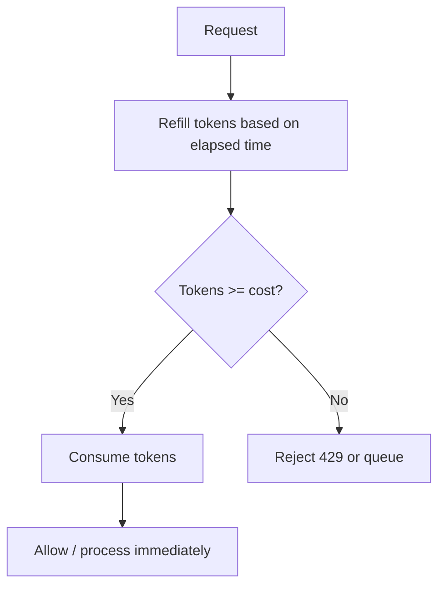

# Token Bucket

> **Related:** vs leaky bucket → [§5 Leaky bucket](05-leaky-bucket.md) · Product burst tiers → [api-design §5](../../api-design-and-protection/includes/05-rate-limit-tiers.md) · Partner traffic → [HTS §12](../../high-throughput-systems/includes/12-decision-guide-and-common-mistakes.md)

## What it is

A bucket holds **tokens** that refill at a steady rate. Each request consumes one or more tokens. Unused tokens accumulate up to a **maximum capacity**, allowing controlled bursts.

## Flow

## Pros

- **Allows bursts** up to bucket capacity
- Smooth average rate over time
- Natural fit for variable workloads (mobile apps, batch jobs)
- Easy to explain: "100 requests/minute with burst up to 20"

## Cons

- Large bursts can still stress backends if capacity is set too high
- Tuning `refill_rate` and `capacity` requires thought
- Stateless refill math can drift across nodes without shared state

## When to use

- APIs where occasional bursts are acceptable
- Mobile app backends
- Batch upload or webhook delivery endpoints
- Background job consumers
- Streaming or long-polling APIs

## Key parameters

| Parameter | Meaning | Example |
|-----------|---------|---------|
| `refill_rate` | Tokens added per second | 10 tokens/sec = 600/min |
| `capacity` | Max tokens in bucket (burst size) | 50 |
| `cost` | Tokens per request | 1 (or higher for expensive ops) |

## vs Leaky Bucket

| | Token Bucket | Leaky Bucket |
|---|-------------|--------------|
| Burst | Allows bursts | Queues excess, no burst |
| Output | Immediate if tokens available | Fixed steady output rate |
| Use case | Variable client traffic | Protect slow downstream |

## Common mistakes

| Mistake | Fix |
|---------|-----|
| High `capacity` that overwhelms DB on burst | Size burst to what downstream can absorb; pair with [§8 concurrent limits](08-specialized-limiters.md) |
| Per-node token state | Centralize in Redis for multi-instance APIs |
| Token bucket for strict OTP fairness | Use sliding window log ([§2](02-sliding-window-log.md)) on auth endpoints |
