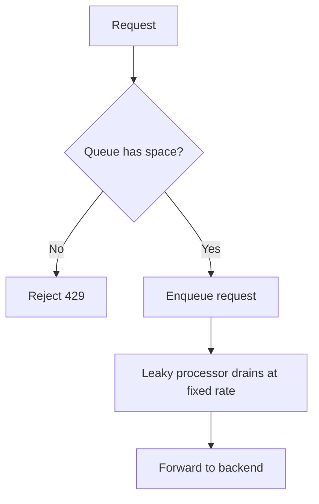

# Leaky Bucket

> **Related:** vs token bucket → [§4 Token bucket](04-token-bucket.md) · DB write protection → [PG §12 bulk](../../postgresql-performance/includes/12-bulk-operations-and-concurrency.md) · Backpressure → [HTS §9](../../high-throughput-systems/includes/09-backpressure-and-limits.md)

---

## At a glance

| | Leaky bucket |
|--|--------------|
| **Memory** | Queue depth + leak rate state |
| **Placement** | Downstream worker or sidecar — rarely at public API(Application Programming Interface) edge |
| **Fairness** | Fixed output rate; input bursts queue or drop |
| **Best fit** | DB write protection, third-party API contracts |

---

## What it is

Requests enter a **queue**. They "leak" out to the backend at a **fixed rate**. Excess requests are dropped or delayed.

## Flow

## Pros

- **Strict output rate** to downstream systems
- Protects fragile backends from overload
- Smooth, predictable load on databases and third-party APIs

## Cons

- Adds **latency** (requests wait in queue)
- Queue overflow causes drops or timeouts
- More complex to operate (queue depth, worker sizing)

## When to use

- Protecting databases from write storms
- Legacy systems with hard throughput caps
- Third-party API(Application Programming Interface) integrations with strict rate contracts
- Message processors and async job ingestion
- Any downstream that cannot handle burst traffic

## Where to enforce

| Layer | Leaky bucket? | Why |
|-------|---------------|-----|
| **Public API edge** | Rarely | Adds latency; prefer [§4 token bucket](04-token-bucket.md) or [§3 sliding window](03-sliding-window-counter.md) |
| **Worker / consumer** | Yes | Cap writes to DB or partner API at fixed leak rate |
| **Sidecar to legacy service** | Yes | Shield fragile system without changing its code |

Not a Redis counter pattern — usually an in-process queue or dedicated rate limiter library with bounded buffer.

## vs Token Bucket

Use **Leaky Bucket** when you need a **steady output rate** regardless of input bursts.

Use **Token Bucket** when you want to **allow bursts** but cap the average rate over time.

## Common mistakes

| Mistake | Fix |
|---------|-----|
| Unbounded queue depth | Cap queue size; reject with `429` when full |
| Leaky bucket at edge for user-facing latency | Prefer token bucket or sliding window at API; reserve leaky for downstream protection |
| Same leak rate for reads and writes | Tighter leak rate on write paths |
| Leaky bucket without timeout on queued requests | Return `504` or `429` when wait exceeds SLA(Service Level Agreement) |