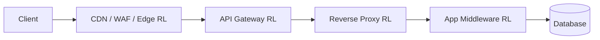

# Deployment Layers

> **Scope:** **Technical lens** — which infrastructure layer enforces limits (edge, gateway, app, Redis). Product tier quotas and header contract → [api-design §5 Rate-limit tiers](../../api-design-and-protection/includes/05-rate-limit-tiers.md).
>
> **Related:** Gateway architecture → [api-design §3 Gateway](../../api-design-and-protection/includes/03-api-gateway.md) · Entry / edge → [HTS §2 Entry and edge](../../high-throughput-systems/includes/02-entry-and-edge.md) · Production architecture → [§11](11-common-mistakes-and-architecture.md)

Where you enforce rate limits matters as much as which algorithm you choose.

## Comparison

| Layer | Examples | Pros | Cons | When to use |
|-------|----------|------|------|-------------|
| **CDN(Content Delivery Network) / Edge** | Cloudflare, Fastly, Akamai | Blocks abuse before origin; global PoPs | Limited custom logic | Public APIs, DDoS absorption |
| **API(Application Programming Interface) Gateway** | Kong, AWS API Gateway, Apigee | Central policy, no app code changes | Extra hop, config sprawl | Microservices, multi-team APIs |
| **Reverse Proxy** | Nginx `limit_req`, Envoy | High performance, close to app | Per-instance unless shared store | Single-region, moderate scale |
| **App Middleware** | Express, Spring, Django | Business-aware limits (plan tier) | Duplicated across services | Plan-based quotas, cost-aware limits |
| **Service Mesh** | Istio, Linkerd | Per-service, mTLS(Mutual Transport Layer Security)-aware | Operational complexity | Large Kubernetes estates |

## Traffic flow

## Rule of thumb

| Concern | Best layer |
|---------|------------|
| Block garbage traffic | Edge / CDN (as early as possible) |
| Enforce API key validity | API Gateway |
| Per-plan business quotas | App middleware |
| Protect database writes | App middleware or leaky bucket near DB |

## Distributed vs local storage

| Type | Pros | Cons | When to use |
|------|------|------|-------------|
| **In-memory (per instance)** | Fastest, no network | Inconsistent across replicas | Dev, single-node, soft limits |
| **Centralized (Redis)** | Consistent global view | Latency, dependency on Redis | Production multi-instance |
| **Local + sync (gossip)** | No single bottleneck | Eventually consistent | Very large edge deployments |

**Production pattern:** Redis with atomic `INCR` or Lua scripts; optional local shadow cache to reduce round-trips.

## Fail-open vs fail-closed

If Redis (or your limit store) is down, choose per endpoint class. Full tradeoffs, war stories, and production checklist → [§11 Common mistakes & production architecture](11-common-mistakes-and-architecture.md#5-fail-open-vs-fail-closed).

**Rule of thumb:** fail-open with a conservative local cap for reads; fail-closed on auth and expensive writes.

## Common mistakes

| Mistake | Fix |
|---------|-----|
| Rate limit only in app middleware | Add edge/gateway layer for abuse — see traffic flow above |
| In-memory limits on horizontally scaled app | Redis or gateway counters ([§11](11-common-mistakes-and-architecture.md)) |
| Fail-open on expensive write routes during Redis outage | Fail-closed on export, payment, and auth endpoints |