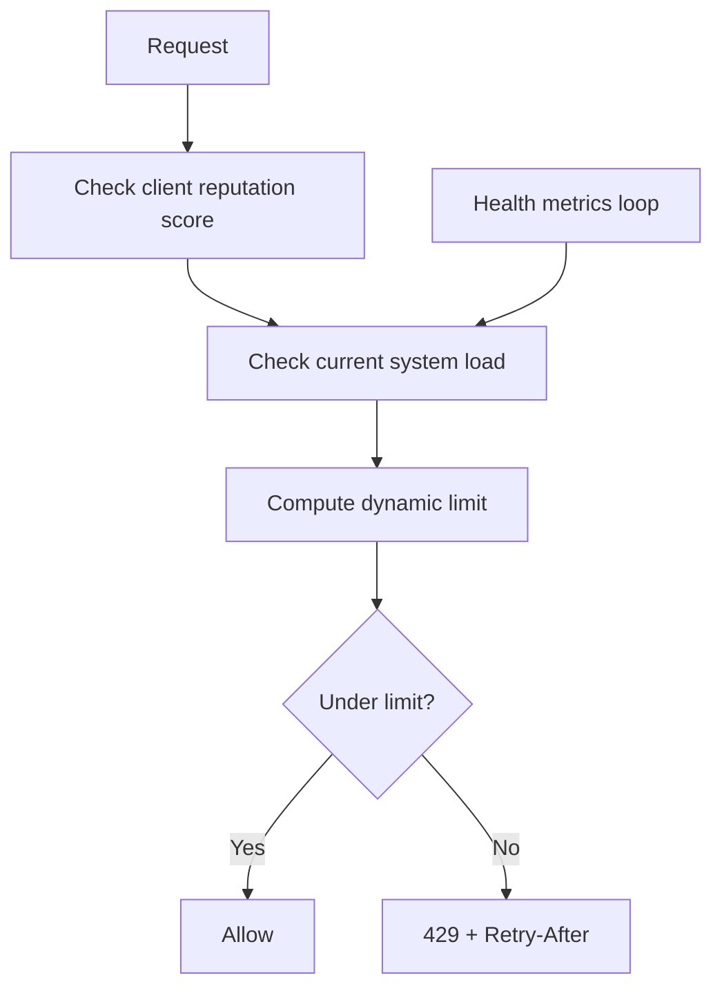

# Specialized Limiters

> **Related:** Expensive endpoint multipliers → [api-design §5](../../api-design-and-protection/includes/05-rate-limit-tiers.md#per-endpoint-multipliers) · Async long jobs → [api-design §10 Async](../../api-design-and-protection/includes/10-async-patterns.md) · Decision guide → [§10](10-decision-guide.md)

Beyond standard request-per-second algorithms.

---

## Concurrent Request Limiter

Limits **in-flight** requests, not requests per second.

| Pros | Cons |
|------|------|
| Prevents thread/connection exhaustion | Does not stop fast-completing request floods |
| Great for long-running operations | Timeouts make counting tricky |

**When to use:** Report generation, video transcoding, DB-heavy queries, WebSocket connections.

---

## Quota / Credit System

Time-based budgets: e.g. 10,000 calls/month. Endpoints can have different credit costs.

| Pros | Cons |
|------|------|
| Aligns with billing and plans | Needs persistence and reset logic |
| Flexible per-plan pricing | Users hit walls at period boundaries |

**When to use:** Paid API(Application Programming Interface) products, freemium tiers, marketplace APIs.

---

## Cost-Based / Weighted Limiting

Different endpoints consume different "weight" from the same bucket.

| Pros | Cons |
|------|------|
| Fair for mixed light/heavy endpoints | Requires accurate cost modeling |
| One bucket per user | Hard to explain to API consumers |

**When to use:**

- GraphQL (query complexity scoring)
- Search + CRUD on the same API key
- LLM(Large Language Model) APIs (tokens as cost unit)

**Example weights:**

| Endpoint | Cost |
|----------|------|
| `GET /users` | 1 |
| `POST /search` | 5 |
| `POST /export` | 20 |
| `POST /inference` | 50 |

---

## Adaptive / Dynamic Rate Limiting

Limits change based on server load, error rate, or client reputation.

| Pros | Cons |
|------|------|
| Self-protecting under stress | Complex to implement and tune |
| Punishes bad actors automatically | Can surprise legitimate users |

**When to use:** High-scale public APIs, platforms under frequent attack, auto-scaling clusters.

---

## Bandwidth / Throughput Limiter

Limits bytes per second, not request count.

**When to use:** File upload/download APIs, streaming endpoints, CDN(Content Delivery Network) origin protection.

## Common mistakes

| Mistake | Fix |
|---------|-----|
| Concurrent limit without request timeout | Stale in-flight count when clients disconnect |
| GraphQL complexity scoring without depth cap | Combine with query depth limit → [api-design §1](../../api-design-and-protection/includes/01-api-design.md) |
| Monthly quota without `Retry-After` at period boundary | Return reset timestamp in headers ([§9](09-response-strategies.md)) |