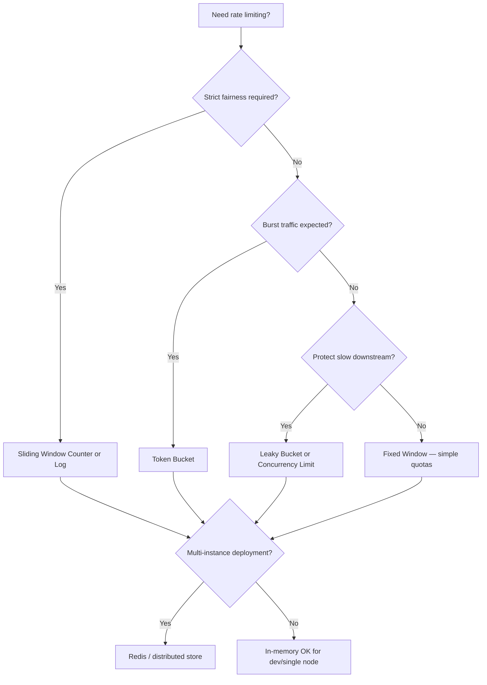

# Decision Guide — Choosing a Limiter

> **Related:** Algorithm sections §1–§5 · Deployment layers → [§7](07-deployment-layers.md) · Distributed store → [§12](12-distributed-rate-limiting.md) · Common mistakes → [§11](11-common-mistakes-and-architecture.md) · Product tiers → [api-design §5](../../api-design-and-protection/includes/05-rate-limit-tiers.md)

## Algorithm decision flow



## Scenario recommendations

| Scenario | Recommended stack |
|----------|-------------------|
| Public REST(Representational State Transfer) API (SaaS) | Sliding window + per API key + per-endpoint on heavy routes |
| Mobile app backend | Token bucket (burst-friendly) + per user |
| Login / auth endpoints | Sliding window log, strict per-IP + per-username |
| Internal microservices | Gateway global limit + per-service concurrency |
| GraphQL | Cost-based limiting + query depth/complexity analysis |
| File upload API | Per-user quota + concurrent upload limit + bandwidth cap |
| LLM(Large Language Model) / inference API | Token bucket on tokens/min + per-user daily quota |
| DDoS(Distributed Denial of Service) / volumetric attack | Edge/CDN(Content Delivery Network) rate limit + WAF(Web Application Firewall) before app logic |
| Paid API with tiers | Quota system + per API key + graduated response |

## Common stack combinations

### Starter (single service)

```text
Nginx limit_req (per-IP) → App middleware (per user) → Handler
```

### Production SaaS

```text
Cloudflare (edge) → Kong (per API key, sliding window) → App (per-endpoint weights) → Redis
```

### High-stakes / attack-prone

```text
CDN + WAF → API Gateway → Adaptive limits → Redis → App concurrency semaphore
```

## Common mistakes

| Mistake | Fix |
|---------|-----|
| One algorithm for all endpoints | Match algorithm to fairness and burst needs |
| In-memory limiter on multi-node app | Redis or gateway-enforced distributed store |
| Login endpoint same limit as read API | Stricter per-IP + per-username on auth routes |
| GraphQL with only request count | Cost-based limits + depth/complexity caps |
| No fail-open/closed policy documented | Define behavior when Redis is unavailable |