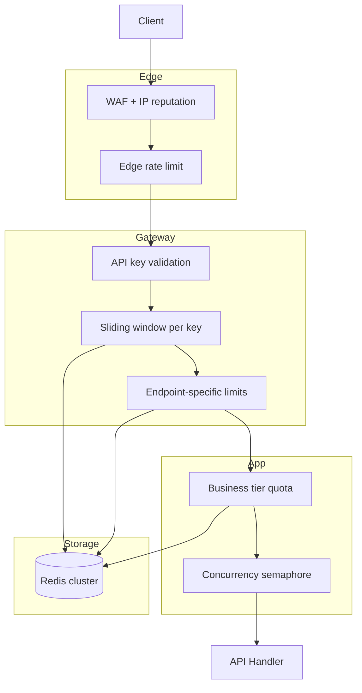

# Common Mistakes & Production Architecture

> **Related:** Decision guide → [§10](10-decision-guide.md) · Response headers → [§9](09-response-strategies.md) · Gateway enforcement → [§7](07-deployment-layers.md)

## Common mistakes

### 1. Rate limiting is not security

Attackers rotate IPs, API(Application Programming Interface) keys, and accounts. Rate limiting reduces abuse volume — it does not stop determined attackers.

### 2. Clock skew

Distributed window counters need synchronized time or TTL-based buckets. Avoid relying on wall-clock alignment across nodes.

### 3. Retry storms

Clients that retry on every `429` amplify load. Always return `Retry-After` and document backoff in your API reference.

### 4. Shared IPs

Corporate NAT, VPNs, and mobile carriers punish strict per-IP limits. Combine with authenticated identity limits when possible.

### 5. Fail-open vs fail-closed

If your rate limit store (Redis) is down:

- **Fail-open** — traffic flows (risk of overload)
- **Fail-closed** — all traffic blocked (causes outage)

Most teams choose **fail-open with a conservative local emergency cap**.

### 6. No observability

Without metrics per limiter rule, you cannot tune thresholds. Track:

- `429` rate per rule
- Remaining capacity distribution
- Top clients hitting limits
- False positive rate (legitimate users blocked)

---

## Minimal production architecture

## Checklist before going live

- [ ] Limits defined per tier (free, paid, enterprise)
- [ ] `429` response includes `Retry-After` and rate limit headers
- [ ] Redis (or store) has failover strategy documented
- [ ] Metrics and alerts on `429` spike per endpoint
- [ ] Auth endpoints have stricter limits than read endpoints
- [ ] API docs explain limits and backoff behavior
- [ ] Load test validates limits do not block normal traffic patterns

---

## Production war stories

### Redis primary fails over

| Symptom | All counters reset or split-brain limits |
|---------|------------------------------------------|
| **Cause** | New Redis primary empty; windows restart |
| **Mitigation** | Redis Cluster with persistence; conservative local cap during failover; monitor `429` spike |
| **Prevention** | Document fail-open policy; run failover game day |

### OAuth(Open Authorization) token refresh burst

| Symptom | `/oauth/token` hammers rate limit; legitimate apps get `429` |
|---------|----------------------------------------------------------------|
| **Cause** | Shared IP + per-IP limit; all clients refresh at hour boundary |
| **Mitigation** | Per-client_id limit; separate bucket for token endpoint; jitter refresh in SDK docs |
| **Prevention** | Load test token path separately from API path |

### Global vs regional counters

| Symptom | Limit exceeded in EU but US idle |
|---------|-----------------------------------|
| **Cause** | Global Redis key; viral traffic in one region |
| **Mitigation** | Regional limit keys + global cap; or geo-sharded Redis |
| **Prevention** | Define whether quota is per-account global or per-region |

### Partner on corporate NAT

| Symptom | One `429` blocks entire enterprise |
|---------|-------------------------------------|
| **Cause** | Strict per-IP on authenticated API |
| **Mitigation** | Require API key; rate limit by `client_id` not IP |
| **Prevention** | Never IP-only limits for B2B authenticated APIs |

### Retry storm after partial outage

| Symptom | Recovery slower than outage — clients retry into `429` |
|---------|--------------------------------------------------------|
| **Cause** | No `Retry-After`; exponential backoff missing in SDK |
| **Mitigation** | Return `Retry-After`; document backoff; temporary raise ceiling |
| **Prevention** | Client SDK defaults + integration test for `429` handling |
