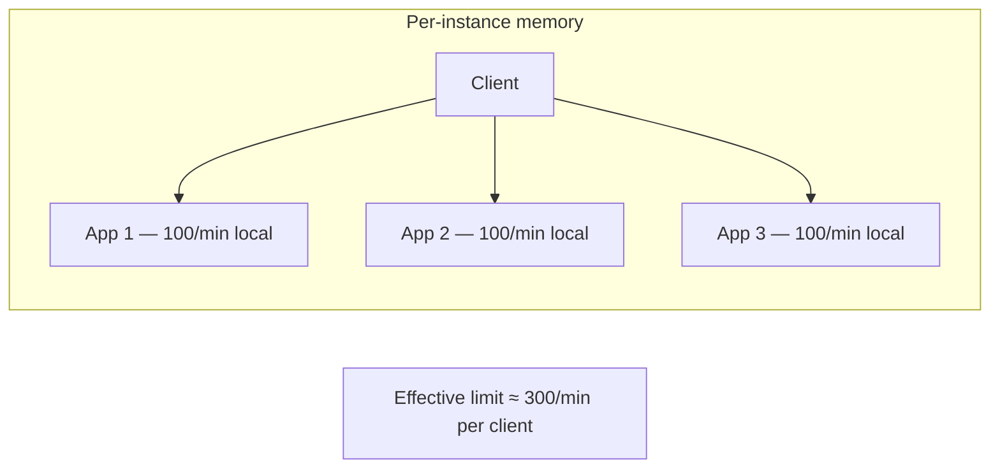
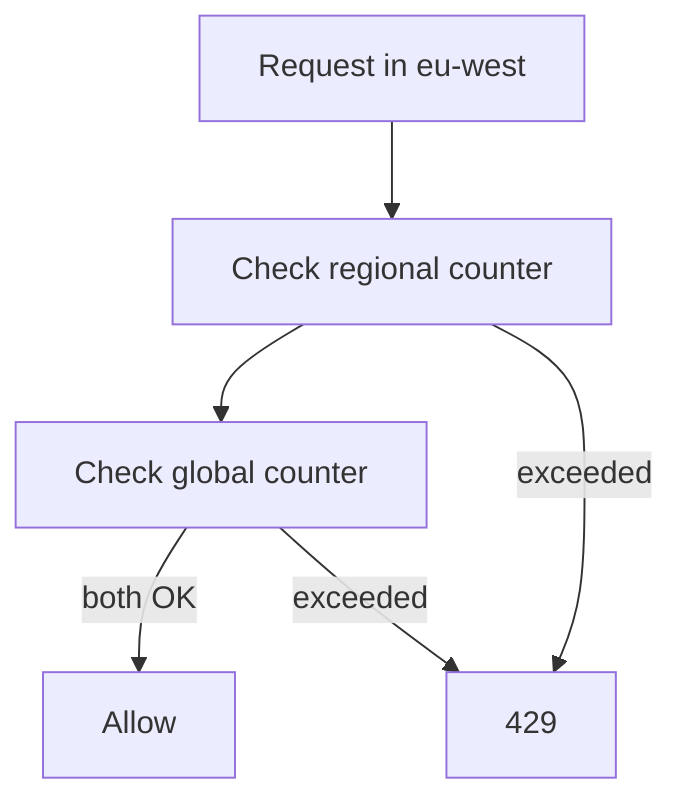

# Distributed Rate Limiting

Multi-instance APIs cannot rate limit in process memory — counters must live in a **shared store** (usually Redis) with explicit policies for failover, hot keys, clock skew, and global vs regional quotas.

> **Scope:** **Distributed counter mechanics** — Redis topology, key design, sync/async updates, regional sharding. Where to enforce in the stack → [§7 Deployment layers](07-deployment-layers.md). Algorithm choice → [§10 Decision guide](10-decision-guide.md).
>
> **Related:** Fail-open vs fail-closed → [§11 Common mistakes](11-common-mistakes-and-architecture.md) · Product tiers → [api-design §5](../../api-design-and-protection/includes/05-rate-limit-tiers.md) · Hot keys (cache) → [HTS §4](../../high-throughput-systems/includes/04-caching-layers.md#hot-key-problem)

---

## At a glance

| Concern | Default approach |
|---------|------------------|
| **Store** | Redis Cluster or managed Redis (ElastiCache, Memorystore) with persistence |
| **Key** | `ratelimit:{scope}:{identity}:{window}` — hash tag for shard affinity when needed |
| **Algorithm at scale** | Sliding window counter or token bucket in Redis (`INCR`, `GET`, Lua scripts) |
| **Hot identity** | Sub-shard keys (`user_id % 32`) or local token bucket + periodic sync |
| **Clock skew** | TTL-based windows — do not assume wall-clock alignment across nodes |
| **Global quota** | Single counter per account **or** regional counters + optional global cap |
| **Store down** | Fail-open + conservative local emergency cap (document policy) |

**Rule of thumb:** Every limiter node must read/write the **same logical counter** for an identity — or use a bounded local approximation with documented error.

---

## Why local counters fail



With N replicas, an in-memory limit of `100/min` becomes `N × 100/min` under round-robin. Shared Redis (or gateway-enforced limits) fixes this.

---

## Redis topologies

| Topology | Pros | Cons | When |
|----------|------|------|------|
| **Single primary + replica** | Simple | Hot key + failover reset risk | Small APIs, dev |
| **Redis Cluster** | Horizontal shard scale | Hash-slot planning; multi-key Lua care | Production SaaS |
| **Regional Redis per region** | Low cross-region latency | Global quota needs federation | Multi-region APIs |
| **Gateway-only limits** | No app Redis dependency | Weaker per-endpoint / business rules | MVP |

Use **AOF** or **RDB** persistence if counter loss on failover is unacceptable — or accept reset + conservative caps during failover (see [§11 war stories](11-common-mistakes-and-architecture.md#production-war-stories)).

---

## Key design

```text
ratelimit:{tier}:{client_id}:{endpoint_bucket}:{window_start}
```

| Pattern | Example | Why |
|---------|---------|-----|
| Per API(Application Programming Interface) key | `ratelimit:paid:key_abc:global:1735689600` | Billing-aligned |
| Per user | `ratelimit:free:user_42:write:1735689600` | Fairness |
| Per endpoint class | `ratelimit:paid:key_abc:export:1735689600` | Protect expensive routes |
| Hash tag (cluster) | `ratelimit:{shard_7}:user_42:...` | Co-locate related keys on one slot |

**Hot key:** One viral `client_id` or shared integration user → single Redis slot saturates. Mitigations:

| Mitigation | Tradeoff |
|------------|----------|
| Sub-shard keys `user_id % K` | Slightly higher effective limit (K × local burst) |
| Local token bucket + Redis sync every N ms | Approximate; document overshoot |
| Dedicated high-tier pool | Ops complexity |

Same patterns as cache hot keys → [HTS §4](../../high-throughput-systems/includes/04-caching-layers.md#hot-key-problem).

---

## Clock skew and window boundaries

Distributed nodes must **not** assume identical `window_start` from local `time.now()` without coordination.

| Approach | Detail |
|----------|--------|
| **TTL buckets** | `INCR key` + `EXPIRE key window_seconds` on first increment — window anchored at first request in bucket |
| **Fixed UTC windows** | `window_start = floor(unix / 60) * 60` — document UTC for billing |
| **Sliding window counter** | Redis stores current + previous window weights — no cross-node clock sync required |

Avoid: two gateways computing different `window_start` from unsynchronized clocks → double capacity at boundary.

Token bucket in Redis often uses **Lua** for atomic `refill + deduct` — one round trip, no race between GET and SET.

---

## Global vs regional counters

| Model | Key shape | Good for |
|-------|-----------|----------|
| **Global per account** | `ratelimit:acct_99:global` | Contract quota "10k/hour worldwide" |
| **Regional per account** | `ratelimit:acct_99:eu-west` | Data residency; absorb regional spikes |
| **Both** | Regional bucket + lower global cap | Enterprise "50k/h global, 20k/h per region" |



**Anti-pattern:** Global Redis in `us-east-1` for all regions — every limit check crosses the ocean. Prefer **regional Redis** + optional async global aggregator for analytics-only quotas.

---

## Sync vs async limiter updates

| Mode | Behavior | Latency | Consistency |
|------|----------|---------|-------------|
| **Sync Redis** | Every request awaits `INCR` / Lua | +1–3 ms typical | Strong per key |
| **Local approximate** | Process memory bucket; flush to Redis every 100–500 ms | Lowest | Can overshoot briefly |
| **Gateway edge** | CDN(Content Delivery Network)/WAF(Web Application Firewall) or API GW enforces before app | Zero app cost | Coarse (IP, key) |

Most production APIs: **sync Redis at gateway** for coarse limits + **sync Redis at app** for expensive endpoint classes only.

---

## Failover and split brain

| Event | Effect | Mitigation |
|-------|--------|------------|
| Primary failover | Counters may reset or lag | Persistence; fail-open + local cap |
| Network partition | App can't reach Redis | Fail-open policy documented |
| Split brain (rare on managed Redis) | Inconsistent counts | Use managed failover; avoid DIY dual-primary |

Checklist item from [§11](11-common-mistakes-and-architecture.md#checklist-before-going-live): Redis failover strategy documented and game-day tested.

---

## Common mistakes

| Mistake | Fix |
|---------|-----|
| In-memory limiter on horizontally scaled app | Shared Redis or gateway enforcement |
| One Redis key per request type globally | Shard hot identities |
| Wall-clock windows without UTC policy | Document timezone; use TTL buckets |
| Global Redis far from users | Regional limiter clusters |
| No limit on Redis round-trips per request | Batch checks; limit only write paths |
| Fail-closed when Redis blips | Fail-open + emergency local cap |
| Ignoring `429` retry storms | `Retry-After` + client backoff docs |

---

## Pros and cons

### Centralized Redis counters

**Pros:** Accurate cross-replica limits; familiar ops; works with all algorithms in §1–§5.

**Cons:** Hot keys; latency; failover behavior; cost at very high QPS.

### Local approximate + periodic sync

**Pros:** Lower Redis QPS; absorbs micro-bursts.

**Cons:** Temporary overshoot; harder to explain quotas to customers.
