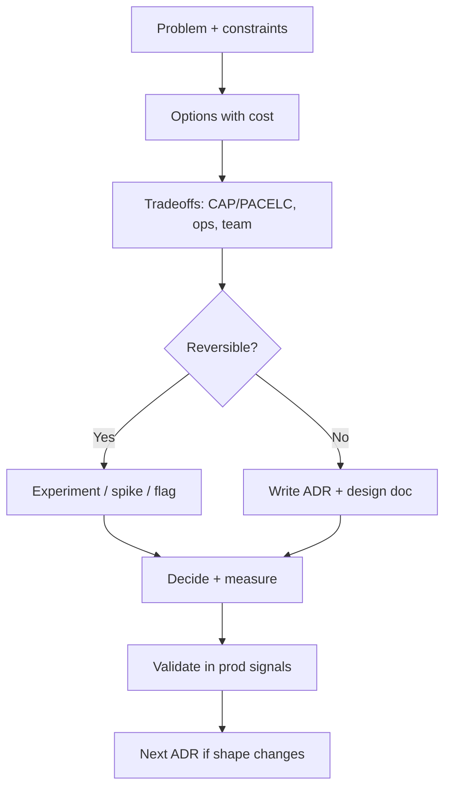

# Overview — Architecture Decisions

What Tech Leads own when shaping systems: boundaries, consistency, integration, and failure blast radius — not every class name or ticket estimate.

**Rule of thumb:** Prefer reversible, measurable decisions. Record irreversible ones as an ADR(Architecture Decision Record) before the first merge that hardens them.

> **Related:**
> - API(Application Programming Interface) contracts and gateway → [api-design-and-protection](../../api-design-and-protection/README.md)
> - Event-driven write models → [event-sourcing-and-cqrs](../../event-sourcing-and-cqrs/README.md)
> - Throughput and overload → [high-throughput-systems](../../high-throughput-systems/README.md)
> - Resilience stack → [resilience-patterns](../../resilience-patterns/README.md)
> - Capstone → [12-decision-guide.md](12-decision-guide.md)
> - Org/stage/pricing fit → [14-org-stage-and-pricing-fit.md](14-org-stage-and-pricing-fit.md)

---

## At a glance

| Decision class | Tech Lead owns | Team owns |
|----------------|----------------|-----------|
| **System shape** | Monolith vs modular vs services | Module package layout |
| **Boundaries** | Bounded contexts, ownership | Internal APIs inside a context |
| **Consistency** | Sync vs async, strong vs eventual | Transaction boundaries in one DB |
| **Integration** | Style (API, events, batch) | Payload fields and serializers |
| **Failure** | Domains, dependency tiers | Retry knobs within agreed policy |
| **Tenancy** | Isolation model | Per-tenant feature flags |

---

## Decision process

| Step | What good looks like |
|------|----------------------|
| **Frame** | One sentence problem; non-goals explicit |
| **Options** | At least two real options (including “do nothing”) |
| **Tradeoffs** | Latency, consistency, cost, team topology — see [§6](06-tradeoff-frameworks.md) |
| **Decide** | Named owner, date, consequences |
| **Record** | ADR for lasting shape; RFC for broad review — [§5](05-adrs-and-design-docs.md) |
| **Validate** | SLOs, incident learnings, FinOps(Cloud Financial Operations) signals |

---

## What Tech Leads decide vs defer

| Decide now | Defer safely |
|------------|--------------|
| Who owns which data | Exact table indexes |
| Sync vs async between contexts | Queue library choice |
| Isolation model for tenants | CDN(Content Delivery Network) cache TTLs |
| Failure domain map | Alert threshold fine-tuning |
| Strangler seams | Pixel-perfect UI rewrite order |

Deferring a **boundary** decision while shipping features usually creates an accidental distributed monolith. Deferring a **library** decision rarely does.

---

## Document map

| # | Topic | File |
|---|-------|------|
| 1 | Monolith, modular, microservices | [01-monolith-modular-microservices.md](01-monolith-modular-microservices.md) |
| 2 | Service boundaries | [02-service-boundaries-and-decomposition.md](02-service-boundaries-and-decomposition.md) |
| 3 | Domain-driven design | [03-domain-driven-design.md](03-domain-driven-design.md) |
| 4 | Strangler and modernization | [04-strangler-and-modernization.md](04-strangler-and-modernization.md) |
| 5 | ADRs and design docs | [05-adrs-and-design-docs.md](05-adrs-and-design-docs.md) |
| 6 | Tradeoff frameworks | [06-tradeoff-frameworks.md](06-tradeoff-frameworks.md) |
| 7 | Integration styles | [07-integration-styles.md](07-integration-styles.md) |
| 8 | Data ownership | [08-data-ownership.md](08-data-ownership.md) |
| 9 | BFF(Backend for Frontend) and API composition | [09-bff-and-api-composition.md](09-bff-and-api-composition.md) |
| 10 | Multi-tenant models | [10-multi-tenant-system-models.md](10-multi-tenant-system-models.md) |
| 11 | Failure domains | [11-failure-domains.md](11-failure-domains.md) |
| 12 | Decision guide | [12-decision-guide.md](12-decision-guide.md) |

---

## Common mistakes

| Mistake | Fix |
|---------|-----|
| Microservices for org chart vanity | Match [team topology](01-monolith-modular-microservices.md) to deploy needs |
| No written decision for irreversible cuts | ADR before first cross-repo merge |
| Optimizing for peak scale on day one | Modular monolith + measured seams |
| Ignoring failure domains | Map dependency tiers — [§11](11-failure-domains.md) |
| Shared DB “for speed” | Explicit ownership — [§8](08-data-ownership.md) |