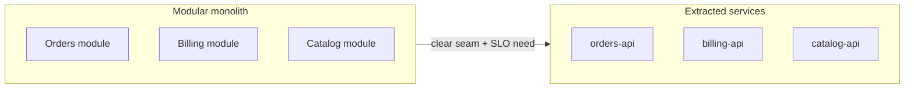

# Monolith, Modular, Microservices

When each shape fits — and what distribution actually costs in ops, latency, and team coordination.

> **Related:** Team Topologies depth → [§1A](01A-team-topologies.md) · Boundaries → [02-service-boundaries-and-decomposition.md](02-service-boundaries-and-decomposition.md) · Failure domains → [11-failure-domains.md](11-failure-domains.md) · Org/stage/pricing defaults → [§14](14-org-stage-and-pricing-fit.md) · Throughput order → [high-throughput-systems](../../high-throughput-systems/README.md)

---

## At a glance

| Shape | Deploy unit | Data | Best when |
|-------|-------------|------|-----------|
| **Monolith** | One binary/service | One DB (usually) | Small team, unclear domain, fast iteration |
| **Modular monolith** | One deploy; hard module boundaries | One DB; schema ownership by module | Growing product; want seams without network |
| **Microservices** | Many independently deployable services | DB per service (ideal) | Independent scale/release; clear contexts; platform ready |

**Rule of thumb:** Default to a **modular monolith** until a measured need (scale, blast radius, or team autonomy) forces a network boundary.

---

## Team topology

| Topology signal | Prefer |
|-----------------|--------|
| 1–2 squads, shared on-call | Monolith or modular monolith |
| Squads own distinct domains end-to-end | Modular → extract services at seams |
| Platform team + many product teams | Microservices with paved road (CI, observability, auth) |
| Outsourced “shared platform” without product ownership | Avoid — creates tickets-as-architecture |

Team types (stream-aligned, platform, enabling, complicated-subsystem) and interaction modes → [§1A](01A-team-topologies.md).

---

## Cost of distribution

Every network hop adds:

| Cost | Example |
|------|---------|
| **Latency** | p99 stacks across sync fan-out |
| **Partial failure** | Timeouts, retries, inconsistency windows |
| **Ops** | More deploys, dashboards, on-call pages |
| **Data** | No shared transactions; sagas or eventual consistency |
| **Versioning** | Contract CI(Continuous Integration), compatibility windows |
| **Local DX** | Compose many services for one feature |

Compare resilience obligations in [resilience-patterns](../../resilience-patterns/README.md) before extracting.

---

## When each wins

### Keep a monolith

- Domain still changing weekly
- Strong need for ACID(Atomicity, Consistency, Isolation, Durability) across features
- Team cannot staff independent service on-call

### Modular monolith

- Clear modules with **allowed dependency direction** (e.g. billing → orders, never reverse)
- Module APIs in-process; no cross-module SQL(Structured Query Language) joins
- Extract path documented when metrics demand it

### Microservices

- Independent scale (e.g. catalog reads 100× order writes)
- Regulatory isolation (PCI segment)
- Different release cadence with real customer impact
- Team size and platform maturity support it

---

## Extraction checklist

Before splitting a module into a service:

- [ ] Bounded context and ownership clear — [§2](02-service-boundaries-and-decomposition.md)
- [ ] Data ownership plan (no shared tables) — [§8](08-data-ownership.md)
- [ ] Sync vs async integration chosen — [§7](07-integration-styles.md)
- [ ] Timeouts/retries/circuit policy agreed — [resilience-patterns](../../resilience-patterns/README.md)
- [ ] Observability: RED(Rate, Errors, Duration) + traces across the cut
- [ ] Rollback story for dual-running period — [strangler](04-strangler-and-modernization.md)

---

## Common mistakes

| Mistake | Fix |
|---------|-----|
| “Microservices = modern” | Start modular; extract on evidence |
| Distributed monolith (shared DB + chatty sync) | Own data; prefer async at boundaries |
| One service per CRUD table | Align to domain capability, not tables |
| Extract without platform (auth, logs, CI) | Build paved road first |

## Pros and cons

| | Monolith / modular | Microservices |
|--|--------------------|---------------|
| **Pros** | Simple ops, ACID, fast refactors | Independent scale/release, isolation |
| **Cons** | Scale and blast radius coupled | Ops cost, consistency complexity |