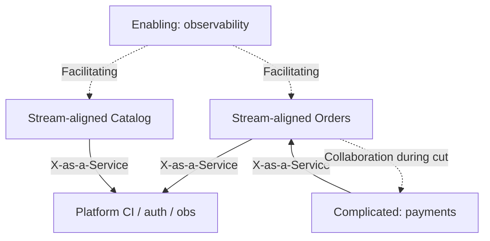

# Team Topologies

Shape teams so architecture stays changeable — four team types and three interaction modes from Team Topologies, mapped to this guide’s defaults.

> **Scope:** Org design for delivery: stream-aligned, platform, enabling, complicated-subsystem; interaction modes; reverse Conway. System shape defaults → [§1](01-monolith-modular-microservices.md). Fit by stage/pricing → [§14](14-org-stage-and-pricing-fit.md). Platform paved road vs product → [cicd §9](../../cicd-and-environments/includes/09-decision-guide.md).
>
> **Related:** Boundaries → [§2](02-service-boundaries-and-decomposition.md) · Cross-team API ownership → [tech-lead §8](../../tech-lead-practice/includes/08-cross-team-api-ownership.md) · Ownership/escalation → [tech-lead §10](../../tech-lead-practice/includes/10-ownership-and-escalation.md)

---

## At a glance

| Team type | Purpose | Architecture implication |
|-----------|---------|--------------------------|
| **Stream-aligned** | Deliver a value stream end-to-end | Own a bounded context; prefer modular monolith or few services they can operate |
| **Platform** | Internal products that reduce cognitive load | Paved road (CI, auth, obs, deploy); self-service > tickets |
| **Enabling** | Upskill stream teams for a gap | Temporary; leave behind capability, not a permanent bottleneck |
| **Complicated-subsystem** | Deep specialty (e.g. fraud ML, payments core) | Clear API; do not scatter specialty across every squad |

**Rule of thumb:** Architecture that needs more team types than you have **creates waiting**. Prefer fewer deployables until platform and ownership exist — [§1](01-monolith-modular-microservices.md) · [§14](14-org-stage-and-pricing-fit.md).

---

## Interaction modes

| Mode | Meaning | Healthy use |
|------|---------|-------------|
| **Collaboration** | Two teams work closely for a period | Discovery of a new boundary; early platform adoption |
| **X-as-a-Service** | Clear API/SLA; minimal sync meetings | Mature platform; stable domain APIs |
| **Facilitating** | Enabling team coaches; does not own forever | Migration to new practices (observability, testing) |

**Smell:** Permanent “collaboration” with platform = platform is not a product yet (ticket queue in disguise).

---

## Reverse Conway

| Org reality | Likely architecture unless you intervene |
|-------------|------------------------------------------|
| One squad | Modular monolith (good default) |
| Squads cut by layer (FE / BE / DB) | Chatty sync, unclear ownership |
| Squads cut by domain | Cleaner services **if** data ownership follows |
| Platform missing | Every squad reinvents CI/auth/obs |

**Inverse Conway maneuver:** design the **team boundaries you want**, then grow architecture to match — [§2](02-service-boundaries-and-decomposition.md) — instead of copying a slide-deck microservice map onto a layered org.

---

## Mapping to system shape

| Topology maturity | Prefer | Avoid |
|-------------------|--------|-------|
| 1–2 stream teams, no platform | Modular monolith | Many services |
| Several stream teams + thin platform | Modular + extract measured seams | Premature mesh |
| Strong platform (X-as-a-Service) | Services at bounded contexts | Shared DB across stream teams |
| Complicated-subsystem present | Hard API + SLO; bulkheads | Embedding specialty in every BFF |

Failure domains and dependency tiers → [§11](11-failure-domains.md).

---

## Cognitive load checklist

Stream-aligned teams should not need to understand the whole estate.

- [ ] One primary domain language per stream team — [§3](03-domain-driven-design.md)
- [ ] Platform covers auth, deploy, logs/metrics/traces, secrets baseline
- [ ] On-call matches what the team can fix — [sre §8](../../sre-and-incidents/includes/08-on-call-design.md)
- [ ] Cross-team contracts have owners — [tech-lead §8](../../tech-lead-practice/includes/08-cross-team-api-ownership.md)
- [ ] Enabling work has an end date or graduation criteria

---

## Common mistakes

| Mistake | Why it hurts | Fix |
|---------|--------------|-----|
| “Platform team” as helpdesk | Slow delivery; hidden coupling | Treat platform as product with UX and SLOs |
| Microservices for FE/BE/DB teams | Distributed monolith | Re-cut teams by stream/domain first |
| Enabling team becomes permanent owners | Bottleneck; no upskilling | Facilitation mode + exit |
| Every specialty is a new team | Coordination tax | Prefer complicated-subsystem sparingly |
| Ignoring cognitive load | Burnout; SEVs | Fewer services; stronger paved road |

---

## Pros and cons

| Approach | Pros | Cons |
|----------|------|------|
| **Topology-aware architecture** | Changeable systems; clearer on-call | Requires org honesty |
| **Architecture-first org ignore** | Fast on slides | Waiting, thrash, reverse Conway pain |
| **Heavy platform early** | Nice DX later | Costly before second stream team exists |

---

## See also

| Guide | Topics |
|-------|--------|
| [§1 Monolith / modular / microservices](01-monolith-modular-microservices.md) | Shape defaults and extraction |
| [§14 Org/stage/pricing fit](14-org-stage-and-pricing-fit.md) | Stage and GTM constraints |
| [§2 Boundaries](02-service-boundaries-and-decomposition.md) | Where to cut services |
| [tech-lead §8 / §10](../../tech-lead-practice/includes/08-cross-team-api-ownership.md) | Contracts and escalation |
| [cicd-and-environments](../../cicd-and-environments/README.md) | Platform vs product pipeline ownership |
