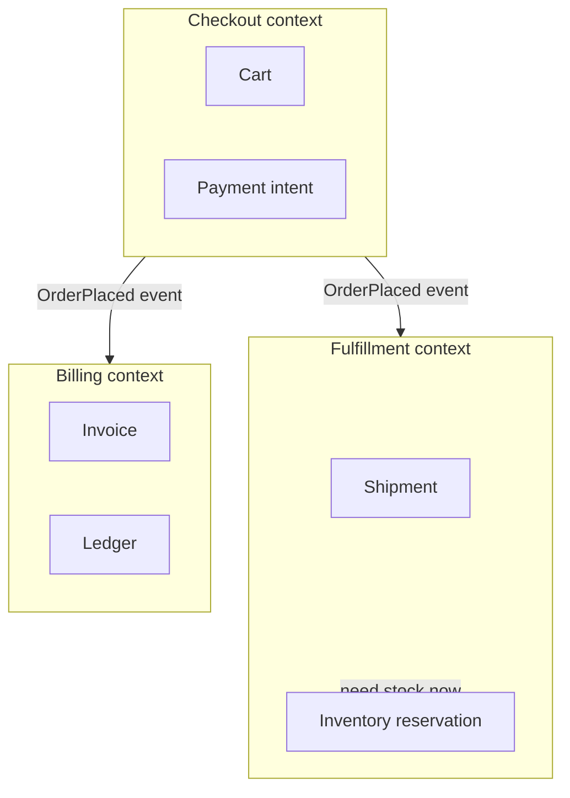

# Service Boundaries and Decomposition

How to draw cuts that survive contact with production — and smell tests that catch bad ones early.

> **Related:** DDD vocabulary → [03-domain-driven-design.md](03-domain-driven-design.md) · Data ownership → [08-data-ownership.md](08-data-ownership.md) · Shape choice → [01-monolith-modular-microservices.md](01-monolith-modular-microservices.md)

---

## At a glance

| Good boundary | Bad boundary |
|---------------|--------------|
| Aligns to business capability | Aligns to “one table = one service” |
| One team can ship end-to-end | Every change needs three teams |
| Clear data owner | Shared mutable tables |
| Few sync dependencies | Chatty request chains |
| Stable ubiquitous language | Same word means different things |

**Rule of thumb:** Draw boundaries where **language and change cadence** diverge, not where the ER diagram has a foreign key.

---

## How to draw boundaries

1. **Map capabilities** — checkout, fulfillment, billing, identity — not Controllers.
2. **Listen for language** — if “Order” means different things in sales vs warehouse, split contexts.
3. **Find change axes** — features that always ship together stay together.
4. **Check data ownership** — who writes the source of truth?
5. **Minimize sync fan-out** — prefer events for “notify others”; sync for “need answer now.”
6. **Name the seam** — public API(Application Programming Interface) or event contract, not internal DTOs.

---

## Smell tests

| Smell | What it usually means |
|-------|------------------------|
| **Distributed transaction** across services for the happy path | Boundary too fine; merge or use saga consciously |
| **Join across service DBs** in one request | Wrong ownership or missing read model |
| **Shared library of domain entities** | Hidden coupling; publish contracts instead |
| **Ping-pong APIs** (A→B→A→B) | Incomplete capability in one place |
| **Same deploy always** | Not independent — keep modular monolith |
| **Copy-paste “user” tables** | Identity should be a shared kernel or ACL(Access Control List), not N copies of truth |

---

## Decomposition strategies

| Strategy | Use when | Risk |
|----------|----------|------|
| **By business capability** | Default | Needs domain workshops |
| **By subdomain** (core / supporting / generic) | Large org | Mis-labeling core |
| **Strangler by route or use case** | Legacy migration | Long dual-run |
| **By team (Inverse Conway)** | Strong org redesign | Org ≠ domain forever |

Prefer capability first; adjust with team topology second — [§1](01-monolith-modular-microservices.md).

---

## Sync dependency budget

| Sync depth | Guidance |
|------------|----------|
| 0–1 hop | Ideal for user-facing request |
| 2 hops | Acceptable with tight timeouts + bulkhead |
| 3+ hops | Redesign — BFF(Backend for Frontend) compose in parallel or go async |

See [BFF composition](09-bff-and-api-composition.md) and [resilience-patterns](../../resilience-patterns/README.md).

---

## Common mistakes

| Mistake | Fix |
|---------|-----|
| Split by technical layer (UI / API / DB services) | Split by capability |
| “Nano-services” for every entity | Aggregate related write rules — [§3](03-domain-driven-design.md) |
| Boundary without contract tests | Contract CI(Continuous Integration) — [api-design §15](../../api-design-and-protection/includes/15-contract-and-schema-testing.md) |
| Ignoring read models | CQRS(Command Query Responsibility Segregation)-style projections when queries cross contexts — [event-sourcing-and-cqrs](../../event-sourcing-and-cqrs/README.md) |

## Pros and cons

| Approach | Pros | Cons |
|----------|------|------|
| Few coarse services | Simple ops, fewer sagas | Larger blast radius |
| Many fine services | Scale isolation | Coordination tax |
| Modular monolith seams | Cheap to adjust | Discipline required |