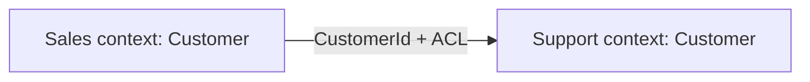

# Domain-Driven Design

Bounded contexts, ubiquitous language, aggregates, and ACL(Anti-Corruption Layer)s — enough DDD(Domain-Driven Design) to make architecture decisions stick.

> **Related:** Event-sourced aggregates → [event-sourcing §1 aggregates](../../event-sourcing-and-cqrs/includes/01-core-concepts.md) · Boundaries → [02-service-boundaries-and-decomposition.md](02-service-boundaries-and-decomposition.md) · Integration → [07-integration-styles.md](07-integration-styles.md)

---

## At a glance

| Concept | Meaning | Architecture impact |
|---------|---------|---------------------|
| **Bounded context** | Explicit boundary where a model is valid | Often maps to a service or module |
| **Ubiquitous language** | Shared terms inside one context | Names APIs, events, tables |
| **Aggregate** | Consistency boundary for writes | Transaction / lock scope |
| **ACL** | Translation at the edge of a foreign model | Protects your model from legacy/partner shapes |
| **Shared kernel** | Small model shared by agreement | Use sparingly; version strictly |

**Rule of thumb:** One ubiquitous language per bounded context. If two teams argue about what “Account” means, you likely have two contexts — not one entity.

---

## Bounded contexts

| Practice | Do | Don't |
|----------|-----|-------|
| Naming | `SalesCustomer`, `SupportTicketRequester` at edges | One global `Customer` table shared mutably |
| Contracts | Publish IDs + needed facts | Expose entire internal aggregate |
| Evolution | Version events/APIs per context | Require lockstep renames |

---

## Aggregates

An aggregate enforces invariants in one consistency boundary. Prefer small aggregates; reference others by ID.

| Question | Guidance |
|----------|----------|
| What must be atomic? | Those fields belong in one aggregate |
| Cross-aggregate rule? | Domain event + eventual consistency, or rethink boundary |
| Event sourcing? | Stream ≈ aggregate — see [ES aggregates](../../event-sourcing-and-cqrs/includes/01-core-concepts.md) |

CRUD modules can still use aggregate thinking: one root, clear invariants, no “god” transaction across the whole DB.

---

## Anti-corruption layer

Use an ACL when integrating with:

- Legacy cores you do not want to mirror
- Partner APIs with awkward schemas
- Another bounded context with a conflicting model

| ACL owns | Downstream owns |
|----------|-----------------|
| Mapping, validation, retries at the edge | Canonical domain model |
| Adapter DTOs | Persistence of *your* model |

Pair with strangler seams — [§4](04-strangler-and-modernization.md).

---

## Context map patterns (practical)

| Pattern | When |
|---------|------|
| **Partnership** | Two teams co-evolve contracts |
| **Customer/Supplier** | Downstream depends on upstream roadmap |
| **Conformist** | You adopt their model as-is (rare; prefer ACL) |
| **Open host** | You publish a stable public protocol |
| **Published language** | Shared event/API(Application Programming Interface) schema across many consumers |

---

## Common mistakes

| Mistake | Fix |
|---------|-----|
| DDD ceremony without language workshops | Start with glossary + context map sketch |
| Giant aggregates for “consistency” | Split; use sagas for workflows — [ES §7](../../event-sourcing-and-cqrs/includes/07-sagas-and-distributed-workflows.md) |
| ACL that leaks foreign types into core | Map at the edge only |
| Shared kernel that grows forever | Extract contexts; shrink kernel |

## Pros and cons

| | Using DDD intentionally | Ignoring domain language |
|--|-------------------------|--------------------------|
| **Pros** | Stable boundaries, clearer ownership | Faster early coding |
| **Cons** | Upfront modeling cost | Accidental coupling, rewrite pressure |