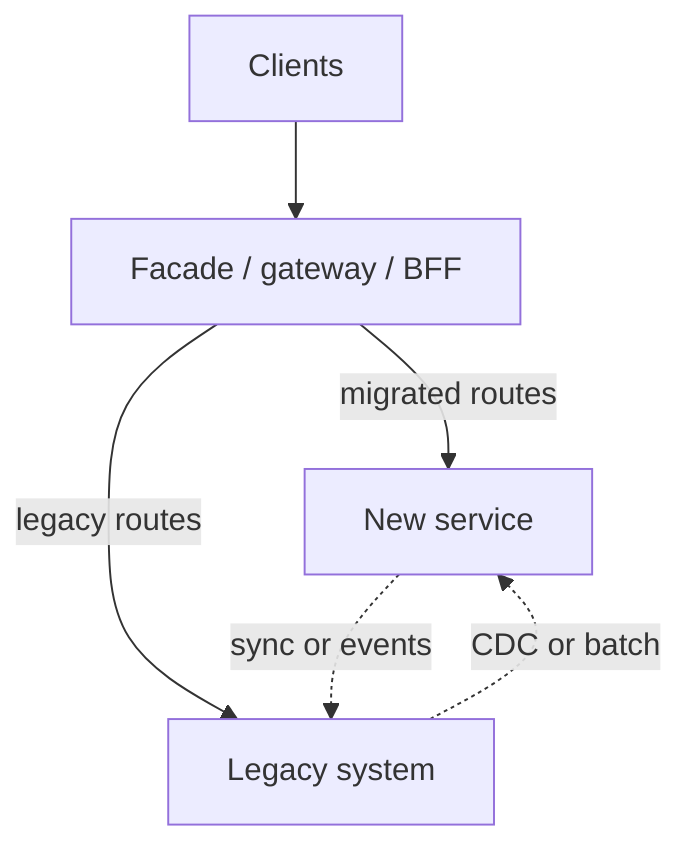

# Strangler and Modernization

Incremental rewrite with the strangler fig pattern — replace legacy capability by capability without a big-bang cutover.

> **Related:** Multi-quarter program → [§4A](04A-modernization-program.md) · Boundaries → [02-service-boundaries-and-decomposition.md](02-service-boundaries-and-decomposition.md) · Deploy safety → [deployment-strategies](../../deployment-strategies/README.md) · Dual-run data → [08-data-ownership.md](08-data-ownership.md)

---

## At a glance

| Approach | Risk | When |
|----------|------|------|
| **Big-bang rewrite** | High | Almost never for core revenue systems |
| **Strangler fig** | Medium, manageable | Default for modernization |
| **Branch by abstraction** | Medium | Deep internals without clear HTTP(Hypertext Transfer Protocol) edge |
| **Freeze + wrap** | Low change, high debt | Short-term containment only |

**Rule of thumb:** Put a **facade** in front of the legacy system, route new or migrated paths to the new implementation, and shrink the old surface until it can be retired.

---

## Strangler fig flow

| Phase | Goal |
|-------|------|
| **1. Facade** | Single entry; no client rewrites for every cut |
| **2. Divert** | Route one use case to new stack |
| **3. Dual-run** | Compare results; shadow if needed — [deployment §6](../../deployment-strategies/includes/06-shadow.md) |
| **4. Cut read/write** | Move source of truth carefully — [§8](08-data-ownership.md) |
| **5. Retire** | Delete dead paths; stop paying legacy tax |

---

## Choosing what to strangler first

| Prefer first | Defer |
|--------------|-------|
| High change rate, clear boundary | Deep shared transactional core |
| Read-heavy paths with cache | Cross-cutting auth rewrites alone |
| Painful ops (deploys, scaling) | Cosmetic UI-only rewrites |
| Well-understood domain language | Speculative “platform” with no consumer |

---

## Data during migration

| Pattern | Use |
|---------|-----|
| **New writes → new DB; sync back** | Legacy still system of record briefly |
| **CDC(Change Data Capture) legacy → new** | Build new read models safely — [HTS §15](../../high-throughput-systems/includes/15-cdc-and-search-indexing.md) |
| **Expand/contract schema** | Same DB modular split — [PG §15](../../postgresql-performance/includes/15-schema-migration-checklist.md) |
| **Event bridge** | Legacy emits; new consumes — [Kafka](../../apache-kafka/README.md) |

Never leave two **mutable** sources of truth without a written reconciliation plan.

---

## Incremental rewrite practices

- Feature flags for route ownership — [deployment §7](../../deployment-strategies/includes/07-feature-flags.md)
- Contract tests on the facade
- Idempotent cutover steps — [api-design §13](../../api-design-and-protection/includes/13-idempotency.md)
- Rollback = flip traffic, not restore a weekend dump alone
- Measure: error rate, latency, parity diffs on dual-run

---

## Common mistakes

| Mistake | Fix |
|---------|-----|
| Rewrite everything behind one flag | Slice by use case |
| No facade — clients talk to both forever | Centralize routing |
| Dual-write without reconciliation | Explicit owner + repair jobs |
| Modernize platform before any user path | Ship one strangler slice end-to-end |
| Ignore ACL(Access Control List) at legacy edge | Translate — [§3](03-domain-driven-design.md) |

## Pros and cons

| | Strangler | Big-bang |
|--|-----------|----------|
| **Pros** | Continuous delivery, early learning | Clean break (in theory) |
| **Cons** | Dual-run complexity | Long dark period, high risk |