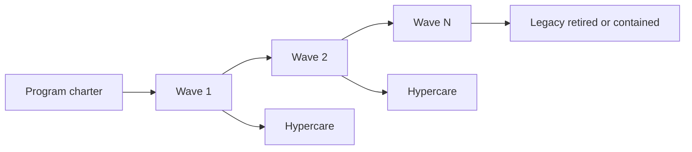

# Modernization Program (Multi-Quarter)

Run strangler modernization as a **program**: waves, dual-run KPIs, cutover RACI(Responsible, Accountable, Consulted, Informed), and exit criteria — not a never-ending rewrite.

> **Scope:** Program management of large modernization. Single-slice strangler tactics → [§4](04-strangler-and-modernization.md). Deploy safety → [deployment-strategies](../../deployment-strategies/README.md). Data ownership during cutover → [§8](08-data-ownership.md). Team capacity / topology → [§1A](01A-team-topologies.md).
>
> **Related:** ADRs for irreversible cuts → [§5](05-adrs-and-design-docs.md) · Governance → [§5A](05A-architecture-governance.md) · Debt portfolio → [tech-lead §5](../../tech-lead-practice/includes/05-tech-debt-portfolio.md) · Hypercare per wave → [sre §10A](../../sre-and-incidents/includes/10A-hypercare-checklist.md)

---

## At a glance

| Element | Meaning |
|---------|---------|
| **Wave** | Time-boxed slice with user-visible or ops-visible outcome |
| **Dual-run KPI(Key Performance Indicator)** | Parity / error / lag metrics that gate cutover |
| **Cutover RACI** | Who decides go/no-go, who executes, who is informed |
| **Program exit** | Legacy surface retired or formally contained with owner |

**Rule of thumb:** If you cannot name the **next wave outcome** and the **metric that allows traffic flip**, you have a hobby rewrite — not a program.

---

## Program vs project vs slice

| Level | Horizon | Owns |
|-------|---------|------|
| **Slice (strangler step)** | Days–weeks | One facade divert + dual-run — [§4](04-strangler-and-modernization.md) |
| **Wave** | Weeks–quarter | Several slices; one business capability done |
| **Program** | Multi-quarter | Sequence of waves; budget; risk; exit |

---

## Charter (write once)

| Field | Content |
|-------|---------|
| Problem / outcome | Why modernize (speed, risk, cost, compliance) |
| Non-goals | What you will not rewrite |
| Success metrics | e.g. deploy lead time, SEV rate, legacy % traffic, $/env |
| Constraints | Dates, residency, freeze windows |
| Topology | Which stream/platform teams — [§1A](01A-team-topologies.md) |
| Decision rights | Wave go/no-go; production cutover — [§5A](05A-architecture-governance.md) |
| Exit | Definition of “program done” |

Record irreversible program choices as ADRs (tenancy, SoR moves, facade location).

---

## Wave design

| Wave planning question | Good answer |
|------------------------|-------------|
| What capability finishes? | Named bounded context or journey |
| What stays on legacy? | Explicit residual surface |
| Dual-run proof? | KPI thresholds + duration |
| Rollback? | Traffic flip / flag; data rollback limits written |
| Who is on-call for cutover? | Named; runbook updated |
| Hypercare window? | 24–72 h — [sre §10A](../../sre-and-incidents/includes/10A-hypercare-checklist.md) |

Prefer waves that **shrink legacy** measurably (routes, tables, batch jobs retired) over “platform only” waves with no traffic move.

---

## Dual-run KPIs (examples)

| KPI | Gate idea |
|-----|-----------|
| Parity diff rate | Under 0.1% material mismatches for N days |
| Error rate new vs old | New ≤ old baseline |
| Lag (CDC / sync) | Under agreed RPO(Recovery Point Objective)-style bound |
| p99 latency | Within SLO(Service Level Objective) budget for the journey |
| Shadow mismatch | Trend down before write cutover — [deployment §6](../../deployment-strategies/includes/06-shadow.md) |

Never cut writes with two mutable sources of truth and no reconciliation owner — [§4](04-strangler-and-modernization.md) · [§8](08-data-ownership.md).

---

## Cutover RACI (example)

| Activity | Responsible | Accountable | Consulted | Informed |
|----------|-------------|-------------|-----------|----------|
| Dual-run health | Stream TL | Program lead | SRE(Site Reliability Engineering) | Support |
| Go / no-go | Program lead | Eng director / area owner | Security if regulated | Stakeholders |
| Traffic / flag flip | On-call + TL | Program lead | Platform | Support |
| Abort / rollback | On-call | Program lead | SRE | All hands channel |
| Hypercare close | Stream TL | Program lead | Product | Program steering |

Tune names to your org; keep **one** accountable for go/no-go.

---

## Sequencing heuristics

| Prefer earlier waves | Defer |
|----------------------|-------|
| High change-rate edges with clear facade | Deep shared transactional core |
| Read path + CDC(Change Data Capture) to new SoR | Big-bang write cut |
| Painful deploy/ops surfaces | Cosmetic rewrites |
| Compliance / residency blockers | Speculative shared platform with no consumer |

Org/stage constraints → [§14](14-org-stage-and-pricing-fit.md).

---

## Program health checklist

- [ ] Charter and exit criteria published
- [ ] Wave backlog ranked; next wave outcome named
- [ ] Dual-run KPIs and thresholds per active wave
- [ ] Cutover RACI filled before first production flip
- [ ] Legacy retirement tickets linked to each wave (not “later”)
- [ ] Capacity for debt/reliability during waves — [tech-lead §5](../../tech-lead-practice/includes/05-tech-debt-portfolio.md) · [§5A](../../tech-lead-practice/includes/05A-debt-business-cx-balance.md)
- [ ] Steering cadence (biweekly): KPI, risk, go/no-go forecast

---

## Common mistakes

| Mistake | Why it hurts | Fix |
|---------|--------------|-----|
| Endless “foundation” waves | No user/ops value; political fatigue | Traffic or retirement every wave |
| No dual-run KPIs | Faith-based cutover | Thresholds before flip |
| Two accountable executives | Freeze at go/no-go | Single accountable |
| Rewrite equals big-bang date | Existential risk | Strangler slices — [§4](04-strangler-and-modernization.md) |
| Ignoring team topology | Platform/stream thrash | [§1A](01A-team-topologies.md) |
| Closing program while legacy serves 40% | Permanent dual tax | Exit = retire or formal containment ADR |

---

## Pros and cons

| Approach | Pros | Cons |
|----------|------|------|
| **Program + waves** | Visible progress; managed risk | Coordination overhead |
| **Opportunistic strangler only** | Flexible | May never finish; no exit |
| **Big-bang rewrite program** | Simple story | High failure rate on cores |

---

## See also

| Guide | Topics |
|-------|--------|
| [§4 Strangler and modernization](04-strangler-and-modernization.md) | Facade, divert, dual-run tactics |
| [deployment §14](../../deployment-strategies/includes/14-feature-to-prod-playbook.md) | Per-wave ship gates |
| [data-platforms §6](../../data-platforms/includes/06-migration-coordination.md) | Org-scale data migration sequencing |
| [tech-lead §5 / §5A](../../tech-lead-practice/includes/05-tech-debt-portfolio.md) | Funding modernization vs features |