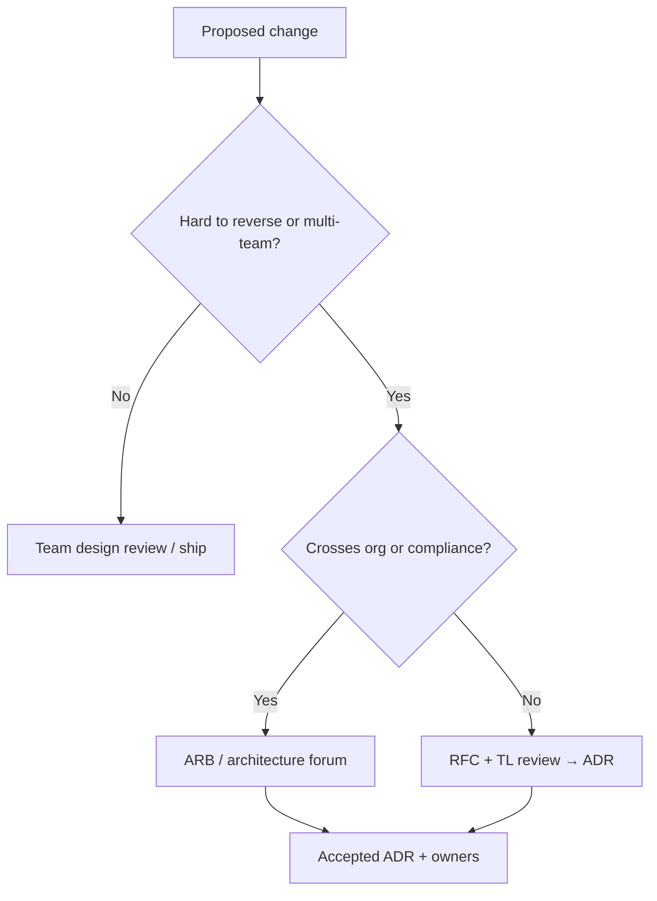

# Architecture Governance (ARB and Decision Rights)

Who decides what — lightweight Architecture Review Board (ARB) practice, RFC/ADR cadence, and decision rights by blast radius.

> **Scope:** Governance process and escalation — not the ADR template itself. ADR/RFC artifacts → [§5](05-adrs-and-design-docs.md). Facilitation of reviews → [tech-lead §2](../../tech-lead-practice/includes/02-design-reviews.md). Org fit constraints → [§14](14-org-stage-and-pricing-fit.md).
>
> **Related:** Tradeoffs → [§6](06-tradeoff-frameworks.md) · Decision guide → [§12](12-decision-guide.md) · Secure SDLC(Software Development Life Cycle) gates → [enterprise-security-compliance](../../enterprise-security-compliance/README.md)

---

## At a glance

| Mechanism | Purpose | Cadence |
|-----------|---------|---------|
| **Team design review** | Catch local architectural risk | Per significant change — [tech-lead §2](../../tech-lead-practice/includes/02-design-reviews.md) |
| **RFC → ADR** | Record lasting choice | As needed — [§5](05-adrs-and-design-docs.md) |
| **ARB (or equivalent)** | Cross-team / high blast-radius decisions | Office hours or weekly slot; not every ticket |
| **Standards / paved road** | Defaults that need no meeting | Owned by platform; exceptions via ADR |

**Rule of thumb:** Govern **irreversibility and blast radius**, not taste. Most work should never touch an ARB.

---

## Decision rights by blast radius

| Blast radius | Who decides | Artifact |
|--------------|-------------|----------|
| Single service, reversible | Owning TL / seniors | Ticket or short design note |
| Cross-team API(Application Programming Interface) or event contract | Owning TL + consumer TLs | RFC → ADR |
| New bounded context / data ownership change | Area TL + affected owners | Design review + ADR |
| Company-wide platform, tenancy, multi-region, security baseline | ARB (or staff+/principal forum) | RFC → ADR; security co-sign if needed |
| Exception to paved road | Platform + requesting TL | ADR with expiry or revisit date |

---

## Lightweight ARB shape

Skip bureaucracy theater. Prefer **office hours + async RFC** over standing committees that rubber-stamp.

| Element | Guidance |
|---------|----------|
| **Membership** | 3–7 people: staff/principal eng, platform, security liaison, rotating product-area TL |
| **Input** | RFC with options, NFR(Non-Functional Requirement) sheet, cost, rollback — [§14](14-org-stage-and-pricing-fit.md) |
| **Time-box** | Async comments 3–5 days; live 30–45 min only if contested |
| **Output** | Accept / revise / defer-with-spike; ADR owner named |
| **Non-goals** | Approving every story; debating library fashion |

Small org (1–2 teams): **no formal ARB** — TL + written ADRs are enough. Grow the forum when cross-team thrash or compliance demands it.

---

## What ARB should (and should not) own

| Own | Do not own |
|-----|------------|
| Cross-cutting standards exceptions | Sprint prioritization |
| Tenancy / residency / shared data model | Class naming |
| New shared platform services | Pixel-level UX |
| Patterns that create multi-team ops load | Routine dependency bumps |
| Security/architecture hold on high-risk paths | Replacing product discovery |

Product discovery stays with PM + TL — [tech-lead §1A](../../tech-lead-practice/includes/01A-product-discovery.md).

---

## Cadence and SLAs

| Item | Target |
|------|--------|
| RFC comment window | 5 business days default |
| ARB live slot | Weekly optional; cancel if empty |
| Decision recorded | Same day as accept |
| Exception ADRs | Revisit date ≤ 6 months unless permanent |

Link accepted ADRs from a single index (`docs/adr/` or architecture README) so on-call can find truth — [§5](05-adrs-and-design-docs.md).

---

## Governance checklist

- [ ] Decision-rights table known to TLs (this section)
- [ ] ADR threshold understood (irreversibility) — [§5](05-adrs-and-design-docs.md)
- [ ] Paved-road defaults documented; exceptions expire
- [ ] ARB membership and charter one-pager (if ARB exists)
- [ ] Security / compliance path for regulated changes — [ESC](../../enterprise-security-compliance/README.md)
- [ ] No duplicate “shadow architecture” Slack approvals without ADR

---

## Common mistakes

| Mistake | Why it hurts | Fix |
|---------|--------------|-----|
| ARB on every PR | Bottleneck; shadow process | Blast-radius table |
| Decisions only in meetings | No audit trail | RFC → ADR |
| Architecture by HIPPO | Relitigation | Options + consequences in writing |
| Permanent exceptions | Paved road dies | Expiry + revisit |
| ARB without platform voice | Unoperable standards | Include platform + on-call reality |
| Governance without discovery | Perfect architecture for wrong problem | [tech-lead §1A](../../tech-lead-practice/includes/01A-product-discovery.md) |

---

## Pros and cons

| Approach | Pros | Cons |
|----------|------|------|
| **Lightweight ARB + ADRs** | Alignment on hard calls; onboarding | Needs discipline to stay small |
| **No governance** | Fast early | Cross-team thrash; tribal memory |
| **Heavyweight board** | Feels “enterprise” | Slow; rubber stamps; politics |

---

## See also

| Guide | Topics |
|-------|--------|
| [§5 ADRs and design docs](05-adrs-and-design-docs.md) | Templates and lifecycle |
| [tech-lead §2 Design reviews](../../tech-lead-practice/includes/02-design-reviews.md) | Facilitation agenda |
| [§12 Decision guide](12-decision-guide.md) | Technical defaults |
| [enterprise-security-compliance](../../enterprise-security-compliance/README.md) | Mandatory gates vs architecture taste |