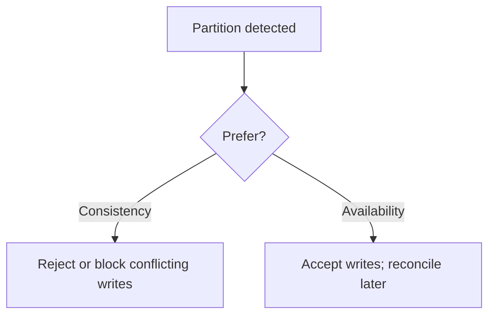

# Tradeoff Frameworks

CAP(Consistency, Availability, Partition Tolerance), PACELC, and practical axes — consistency vs latency vs cost — for architecture decisions.

> **Related:** PostgreSQL consistency promises → [PG §14](../../postgresql-performance/includes/14-consistency-promises-and-costs.md) · Multi-region reads → [HTS §13](../../high-throughput-systems/includes/13-multi-region-read-routing.md) · Cost lens → [finops-and-cost](../../finops-and-cost/README.md) · Mechanisms (quorums, hashing, clocks) → [distributed-systems-primitives](../../distributed-systems-primitives/README.md)

---

## At a glance

| Framework | Question it answers |
|-----------|---------------------|
| **CAP** | During a **network partition**, do you prefer consistency or availability? |
| **PACELC** | If partition (**P**), choose A or C; **else** (**E**) choose latency (**L**) or consistency (**C**) |
| **Consistency vs latency vs cost** | Everyday product tradeoffs without pretending partitions are the only issue |

**Rule of thumb:** Most product systems are PACELC **PA/EL** or **PC/EC** hybrids by tier — strong on money paths, eventual on feeds — not a single global choice.

---

## CAP (partition case)

| Choice | Behavior | Fit |
|--------|----------|-----|
| **CP** | May refuse requests to avoid split-brain | Ledger, inventory reservation |
| **AP** | Keep serving; heal later | Social feed, recommendations |
| **CA** | Only meaningful when partitions are assumed absent | Single-primary LAN OLTP |

You always “have” partition tolerance as a design concern in distributed systems; CAP forces the **C vs A** priority under partition.

---

## PACELC (everyday + partition)

| Pattern | Under partition | Else | Example |
|---------|-----------------|------|---------|
| **PC/EC** | Prefer C | Prefer C | Consensus store, primary-only reads |
| **PA/EL** | Prefer A | Prefer low latency | CDN(Content Delivery Network) caches, replicas |
| **PA/EC** | Prefer A | Prefer C when healthy | Rare; often accidental |
| **PC/EL** | Prefer C | Prefer latency when healthy | Tuned with careful stale reads |

Map concrete PostgreSQL behaviors in [PG §14 consistency](../../postgresql-performance/includes/14-consistency-promises-and-costs.md).

---

## Consistency vs latency vs cost

| Axis | Pushing harder usually means… |
|------|-------------------------------|
| **Stronger consistency** | Higher latency, lower multi-region scale, more coordination |
| **Lower latency** | More caching/replicas, staleness risk, invalidation cost |
| **Lower cost** | Fewer regions/replicas, more queueing, shared tenancy risk |

| Workload | Default lean |
|----------|--------------|
| Checkout / payments | Consistency + idempotency |
| Product browse | Latency + cache |
| Analytics | Cost + batch/eventual |
| Cross-region profile | Read-your-writes tricks, not global sync always |

---

## Decision checklist

- [ ] Which user journeys **cannot** show stale state?
- [ ] What is the max acceptable lag (seconds/minutes)?
- [ ] What is the cost of dual-write repair vs blocking?
- [ ] Is the bottleneck partition risk or ordinary load?
- [ ] Document the choice in an ADR — [§5](05-adrs-and-design-docs.md)

---

## Common mistakes

| Mistake | Fix |
|---------|-----|
| “We need CAP theorem compliance” as a slogan | Name PACELC per tier |
| Strong consistency everywhere | Pay only where product needs it |
| Ignoring cost of multi-region active-active | Prefer [HTS §13](../../high-throughput-systems/includes/13-multi-region-read-routing.md) patterns |
| Treating replica lag as a bug always | Productize eventual with UX |

## Pros and cons

| Stance | Pros | Cons |
|--------|------|------|
| Strong-by-default | Simple mental model | Scale and latency tax |
| Eventual-by-default | Fast, cheap reads | Complex repairs, support load |
| Tiered (recommended) | Fit-for-purpose | Needs clear docs and tests |