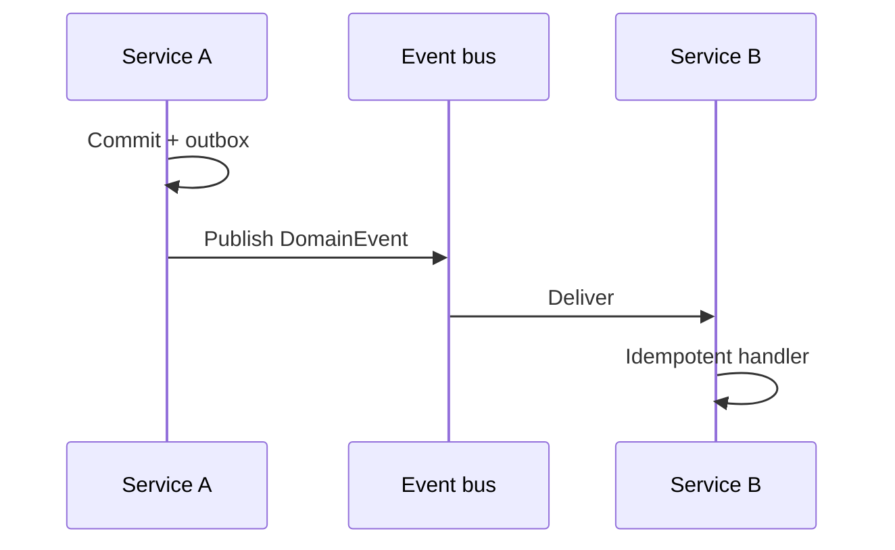

# Integration Styles

Sync API(Application Programming Interface) vs async events vs batch/files — choose the coupling and failure model deliberately.

> **Related:** Async HTTP(Hypertext Transfer Protocol) patterns → [api-design §10](../../api-design-and-protection/includes/10-async-patterns.md) · Outbox → [ES §5](../../event-sourcing-and-cqrs/includes/05-async-integration.md) · Kafka → [apache-kafka](../../apache-kafka/README.md) · Delivery semantics → [resilience §8](../../resilience-patterns/includes/08-delivery-semantics.md)

---

## At a glance

| Style | Coupling | Latency | Failure mode |
|-------|----------|---------|--------------|
| **Sync API** | Temporal + interface | Low when healthy | Caller blocked; cascade risk |
| **Async events** | Interface; time-decoupled | Higher end-to-end | Lag, reordering, at-least-once |
| **Batch / files** | Schedule + schema | Hours/day typical | Late data; easier ops replay |

**Rule of thumb:** Sync when the user **must wait for an answer**. Async when work can finish later. Batch when volume and freshness SLAs are coarse.

---

## Sync API

| Good for | Avoid for |
|----------|-----------|
| AuthZ checks, price quote, stock check | Fan-out to 5+ services on one click |
| Strong read-your-writes UX | Long reports / PDF generation |
| Simple request/response | Partner systems with poor SLOs |

Protect with timeouts, bulkheads, and circuit breakers — [resilience-patterns](../../resilience-patterns/README.md). Prefer parallel composition in a BFF(Backend for Frontend) — [§9](09-bff-and-api-composition.md).

---

## Async events

| Good for | Requires |
|----------|----------|
| Notify many consumers | Schema evolution plan |
| Decouple release cadence | Idempotency + DLQ(Dead Letter Queue) |
| Audit / projections | Clear delivery semantics |

Use transactional outbox for reliability — [ES §5](../../event-sourcing-and-cqrs/includes/05-async-integration.md).

---

## Batch and files

| Good for | Patterns |
|----------|----------|
| Nightly reconciliation | Staging tables + `COPY` |
| Partner EDI / CSV drops | Schema contract + checksum |
| Warehouse loads | ETL(Extract, Transform, Load) / ELT(Extract, Load, Transform) |

Prefer CDC(Change Data Capture) over brittle DB dumps when freshness matters — [HTS §15](../../high-throughput-systems/includes/15-cdc-and-search-indexing.md).

---

## Choosing matrix

| Need | Prefer |
|------|--------|
| User waits under ~200ms for answer | Sync |
| Side effects to many teams | Events |
| Bulk historical / partner file | Batch |
| Exactly-once illusion across orgs | Idempotent at-least-once + dedup |
| Temporary bridge during strangler | Events or CDC dual-run |

---

## Common mistakes

| Mistake | Fix |
|---------|-----|
| Sync chain as default architecture | Budget hops; go async for notifications |
| Events without ownership of schema | Published language + registry |
| Batch for interactive UX | Wrong style |
| Fire-and-forget without DLQ | Alert on poison messages |

## Pros and cons

| Style | Pros | Cons |
|-------|------|------|
| Sync | Simple, immediate | Cascades, latency stack |
| Async | Decoupled, scale fan-out | Eventual consistency |
| Batch | Cheap, replayable | Stale; operational windows |