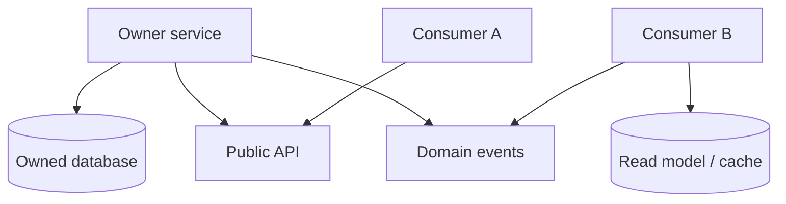

# Data Ownership

Who owns which data, how others consume it, and why a shared mutable database across services is an antipattern.

> **Related:** Boundaries → [02-service-boundaries-and-decomposition.md](02-service-boundaries-and-decomposition.md) · Multi-tenant isolation → [10-multi-tenant-system-models.md](10-multi-tenant-system-models.md) · DB credentials → [database-connection-and-security](../../database-connection-and-security/README.md)

---

## At a glance

| Principle | Meaning |
|-----------|---------|
| **Single writer** | One service (or module) may mutate the source of truth |
| **Readers via contract** | Others use API(Application Programming Interface), events, or replicas — not foreign tables |
| **Derived data OK** | Caches and projections may copy; they are not truth |
| **Explicit exceptions** | Rare shared DB needs an ADR and sunset plan |

**Rule of thumb:** If two deployables can `UPDATE` the same row, you do not have independent services — you have a distributed monolith.

---

## Ownership model

| Consumer need | Pattern |
|---------------|---------|
| Latest authoritative value | Sync API to owner |
| React to change | Subscribe to events |
| Query across owners | Composite read model / BFF(Backend for Frontend) |
| Analytics | CDC(Change Data Capture) or warehouse pipeline — [data-platforms](../../data-platforms/README.md) |

---

## Shared database antipattern

| Symptom | Consequence |
|---------|-------------|
| Cross-service joins | Deploy lockstep; schema fear |
| Shared ORM models | Hidden coupling |
| “Just add a column for them” | Ownership erosion |
| One connection pool storm | Noisy neighbor across domains |

**Allowed transitional forms** (with ADR):

- Modular monolith, one DB, **schema-per-module** and no cross-module FK writes
- Strangler dual-run with clear cutover owner — [§4](04-strangler-and-modernization.md)

---

## Practical rules

1. Name the **owner** in the service README.
2. Foreign keys across ownership boundaries become **IDs in events/APIs**, not DB constraints across services.
3. Migrations owned by the writer; consumers tolerate expand/contract — [deployment §12](../../deployment-strategies/includes/12-schema-migrations-and-deploy.md).
4. Connection credentials scoped per owner — [database-connection-and-security](../../database-connection-and-security/README.md).
5. PII(Personally Identifiable Information) and tenancy policies follow the owner — [§10](10-multi-tenant-system-models.md).

---

## Common mistakes

| Mistake | Fix |
|---------|-----|
| “Shared DB for performance” | Measure; use read models instead |
| Reporting queries hitting OLTP(Online Transaction Processing) of many services | Warehouse / CDC path |
| Copying tables without lag UX | Document staleness |
| Owner unclear after reorg | Reaffirm in ADR |

## Pros and cons

| Model | Pros | Cons |
|-------|------|------|
| DB per service | Autonomy, clear blast radius | Joins become composition |
| Shared DB | Easy queries early | Coupling, scale cliffs |
| Schema-per-module monolith | Balance | Needs discipline |