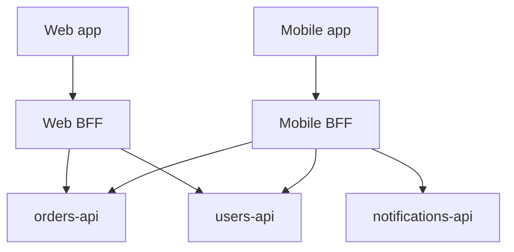

# BFF and API Composition

When to add a BFF(Backend for Frontend), how to compose downstream APIs, and how to avoid a second monolith at the edge.

> **Scope:** **Architecture decision** — whether and how to introduce BFF/composition. Client-framework depth, channel-specific UX wiring → [fullstack-bff-and-clients](../../fullstack-bff-and-clients/README.md).
>
> **Related:** Gateway vs BFF → [api-design §3](../../api-design-and-protection/includes/03-api-gateway.md) · GraphQL BFF notes → [api-design §17](../../api-design-and-protection/includes/17-graphql-and-grpc.md) · Resilience of fan-out → [resilience-patterns](../../resilience-patterns/README.md)

---

## At a glance

| Pattern | Owns | Does not own |
|---------|------|--------------|
| **API gateway** | Auth, routing, coarse limits | Channel-specific aggregation |
| **BFF** | Per-channel composition, shaping | Domain write rules (those stay in services) |
| **Domain services** | Source of truth | Mobile payload cosmetics |

**Rule of thumb:** Add a BFF when **multiple clients need different shapes** of the same backends — not when you only need TLS(Transport Layer Security) termination and routing (that is the gateway).

---

## When a BFF pays off

| Signal | Action |
|--------|--------|
| Mobile needs 1 round-trip; web needs another | Channel BFFs or one BFF with profiles |
| Chatty UI → N+1 against many services | Compose server-side in parallel |
| Frontend team blocked on backend prioritization | BFF owned with frontend or platform |
| Public partner API must stay stable | Keep partner API separate from BFF |

---

## Composition rules

1. **Parallelize** independent downstream calls; budget total timeout.
2. **Bulkheads** per dependency — [resilience §4](../../resilience-patterns/includes/04-bulkheads.md).
3. **Partial responses** when product allows (degrade section, not whole page) — [resilience §5](../../resilience-patterns/includes/05-load-shedding-and-degradation.md).
4. **No domain writes** that bypass service invariants; BFF calls commands.
5. **Cache** carefully at BFF with tenancy and auth awareness.

---

## BFF vs GraphQL vs gateway

| Need | Prefer |
|------|--------|
| Edge policy only | Gateway |
| Channel-specific REST(Representational State Transfer) aggregation | BFF |
| Flexible field selection for one app family | GraphQL at BFF — [api-design §17](../../api-design-and-protection/includes/17-graphql-and-grpc.md) |
| Partner public contract | Versioned REST/OpenAPI, not mobile BFF |

---

## Common mistakes

| Mistake | Fix |
|---------|-----|
| One mega-BFF for all channels forever | Split when teams/cadence diverge |
| Business rules only in BFF | Push invariants to domain services |
| Sync waterfall composition | Parallel + timeouts |
| BFF as shared mutable DB accessor | Respect [data ownership](08-data-ownership.md) |
| Skipping idempotency on composed POSTs | [api-design §13](../../api-design-and-protection/includes/13-idempotency.md) |

## Pros and cons

| | Dedicated BFF | Clients call services directly |
|--|---------------|--------------------------------|
| **Pros** | Fewer round-trips, tailored payloads | Fewer hops, simpler ops |
| **Cons** | Extra deployable, fan-out risk | Chatty clients, version churn |