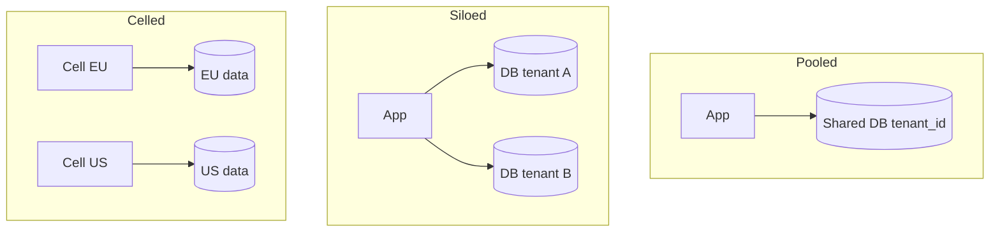

# Multi-Tenant System Models

Isolation models for SaaS — from shared-everything to siloed — and how they couple to API(Application Programming Interface) and database controls.

> **Scope:** **System isolation architecture** (tenancy model choice). HTTP(Hypertext Transfer Protocol) multi-tenant API concerns → [api-design §16](../../api-design-and-protection/includes/16-multi-tenant-apis.md). PostgreSQL RLS(Row Level Security) mechanics → [PG §17](../../postgresql-performance/includes/17-row-level-security-multi-tenant.md).
>
> **Related:** Data ownership → [08-data-ownership.md](08-data-ownership.md) · Failure domains → [11-failure-domains.md](11-failure-domains.md) · Compliance → [enterprise-security-compliance](../../enterprise-security-compliance/README.md)

---

## At a glance

| Model | Isolation | Cost | Typical fit |
|-------|-----------|------|-------------|
| **Pool (shared DB + tenant_id)** | Logical | Lowest | SMB SaaS, early stage |
| **Pool + RLS** | Logical + DB enforced | Low–medium | Regulated shared tenancy |
| **Schema per tenant** | Medium | Medium | Mid-market, custom schema drift risk |
| **Database per tenant** | Strong | High | Enterprise, noisy-neighbor sensitive |
| **Stack / cell per tenant or segment** | Strongest | Highest | Sovereign, huge customers |

**Rule of thumb:** Start **pool** with airtight tenant checks; move a tenant (or tier) to silo when **compliance, performance isolation, or contractual** needs demand it — not on day one for every customer.

---

## Isolation diagram

---

## Decision drivers

| Driver | Lean toward |
|--------|-------------|
| Many small tenants | Pool |
| Noisy-neighbor incidents | Separate pools/cells by tier |
| Data residency | Regional cells |
| Per-tenant custom schema | Schema/DB silo (carefully) |
| Enterprise contract “dedicated” | DB or stack silo |
| Cost efficiency | Pool + strong quotas — [api-rate-limiting](../../api-rate-limiting/README.md) |

---

## Cross-cutting requirements (all models)

1. **Tenant identity on every request** — claim, header, or path — [api-design §16](../../api-design-and-protection/includes/16-multi-tenant-apis.md).
2. **Authorization** cannot trust client-supplied tenant alone.
3. **Encryption and keys** may be per-tenant for higher tiers — [enterprise-security-compliance](../../enterprise-security-compliance/README.md).
4. **Backups/restore** tested per isolation model (restore one tenant without exposing others).
5. **Observability** tags `tenant_id` (careful with cardinality).

---

## Migration between models

| Move | Pattern |
|------|---------|
| Pool → DB silo | Export tenant slice; dual-run; cut DNS(Domain Name System)/config |
| Silo → pool | Rare; only with strong RLS and customer consent |
| Add cell | Route by residency; replicate selectively |

Record the model in an ADR — [§5](05-adrs-and-design-docs.md).

---

## Common mistakes

| Mistake | Fix |
|---------|-----|
| Tenant_id filter only in app, never tested | Defense in depth + RLS where needed |
| One giant shared Redis without key prefix | Prefix/isolate caches |
| Silo everything early | Cost explosion; ops toil |
| Ignoring restore isolation | Practice tenant-level PITR(Point-in-Time Recovery) drills |

## Pros and cons

| Model | Pros | Cons |
|-------|------|------|
| Pool | Cheap, simple ops | Noisy neighbor, weaker isolation story |
| Silo | Strong isolation | Cost, version skew |
| Hybrid tiers | Fit packaging | More platform complexity |