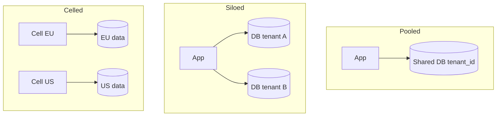

# Multi-Tenant System Models

Isolation models for SaaS(Software as a Service) — from shared-everything to siloed — and how they couple to API(Application Programming Interface) and database controls.

> **Scope:** **System isolation architecture** (tenancy model choice). HTTP(Hypertext Transfer Protocol) multi-tenant API concerns → [api-design §16](../../api-design-and-protection/includes/16-multi-tenant-apis.md). B2B(Business-to-Business) IdP(Identity Provider) / multi-issuer OIDC(OpenID Connect) → [auth §2d](../../auth-oauth-oidc-and-login-security/includes/02D-multi-tenant-oidc-and-b2b-sso.md). PostgreSQL RLS(Row-Level Security) mechanics → [PG §17](../../postgresql-performance/includes/17-row-level-security-multi-tenant.md). Schema/DB-per-tenant ops → [PG §18](../../postgresql-performance/includes/18-schema-and-database-per-tenant.md). Cells / data residency → [§10A](10A-regional-cells-and-residency.md).
>
> **Related:** Data ownership → [08-data-ownership.md](08-data-ownership.md) · Failure domains → [11-failure-domains.md](11-failure-domains.md) · Regional cells → [§10A](10A-regional-cells-and-residency.md) · Compliance → [enterprise-security-compliance](../../enterprise-security-compliance/README.md) · Auth federation → [auth §2d](../../auth-oauth-oidc-and-login-security/includes/02D-multi-tenant-oidc-and-b2b-sso.md)

---

## At a glance

| Model | Isolation | Cost | Typical fit |
|-------|-----------|------|-------------|
| **Pool (shared DB + tenant_id)** | Logical | Lowest | SMB(Small and Medium Business) SaaS, early stage |
| **Pool + RLS** | Logical + DB enforced | Low–medium | Regulated shared tenancy |
| **Schema per tenant** | Medium | Medium | Mid-market, custom schema drift risk |
| **Database per tenant** | Strong | High | Enterprise, noisy-neighbor sensitive |
| **Stack / cell per tenant or segment** | Strongest | Highest | Sovereign, huge customers |

**Rule of thumb:** Start **pool** with airtight tenant checks; move a tenant (or tier) to silo when **compliance, performance isolation, or contractual** needs demand it — not on day one for every customer.

---

## Isolation diagram

---

## Decision drivers

| Driver | Lean toward |
|--------|-------------|
| Many small tenants | Pool |
| Noisy-neighbor incidents | Separate pools/cells by tier |
| Data residency | Regional cells |
| Per-tenant custom schema | Schema/DB silo (carefully) |
| Enterprise contract “dedicated” | DB or stack silo |
| Cost efficiency | Pool + strong quotas — [api-rate-limiting](../../api-rate-limiting/README.md) |

---

## Cross-cutting requirements (all models)

1. **Tenant identity on every request** — claim, header, or path — [api-design §16](../../api-design-and-protection/includes/16-multi-tenant-apis.md).
2. **Authorization** cannot trust client-supplied tenant alone.
3. **Encryption and keys** may be per-tenant for higher tiers — [enterprise-security-compliance](../../enterprise-security-compliance/README.md).
4. **Backups/restore** tested per isolation model (restore one tenant without exposing others) — [Tenant restore drill](#tenant-restore-drill).
5. **Observability** tags `tenant_id` (careful with cardinality).
6. **Classify shared vs tenant data** — platform catalogs are not RLS-scoped the same way as customer rows — [PG §17 shared tables](../../postgresql-performance/includes/17-row-level-security-multi-tenant.md#shared-vs-tenant-scoped-tables).

---

## Shared platform data

| Data | Lives where | Isolation |
|------|-------------|-----------|
| Pricing plans, feature catalog, geo seeds | Shared tables / config service | App read; admin write |
| Tenant settings, orders, users | Tenant-scoped store | RLS, schema, or DB boundary |
| Cache / queue payloads | Shared infra with tenant prefix | Same discipline as SQL(Structured Query Language) — [api-design §16](../../api-design-and-protection/includes/16-multi-tenant-apis.md#cache-and-queue-isolation) |

Do not put customer PII(Personally Identifiable Information) in “global” tables for convenience.

---

## Migration between models

| Move | Pattern |
|------|---------|
| Pool → DB/schema silo | Export tenant slice → provision → dual-run/CDC(Change Data Capture) → cutover router → drain pool — [PG §18](../../postgresql-performance/includes/18-schema-and-database-per-tenant.md#pool--silo-migration) |
| Silo → pool | Rare; only with strong RLS and customer consent |
| Add cell | Route by residency; replicate selectively |

### Pool → silo checklist

- [ ] Driver documented (contract, noisy neighbor, residency) — ADR — [§5](05-adrs-and-design-docs.md)
- [ ] Target schema version matches pool
- [ ] Export + continuous sync path tested on a non-prod clone
- [ ] Router flips on `tenant_id` from auth, not from client body
- [ ] Row-count / checksum verification at cutover
- [ ] Pool slice drained or archived after soak
- [ ] Backup/restore runbook updated for the new model
- [ ] API rate limits and cache prefixes still tenant-scoped

Record the model in an ADR — [§5](05-adrs-and-design-docs.md).

---

## Tenant restore drill

| Model | Drill goal |
|-------|------------|
| **Pool** | Restore **one** tenant’s slice into a clone without reading other tenants’ rows |
| **Schema silo** | Restore or copy **one** schema |
| **DB silo** | PITR(Point-in-Time Recovery)/snapshot **one** database; swap routing after verify |

- [ ] Runbook states which model each tier uses
- [ ] Quarterly drill on non-prod with measured RTO(Recovery Time Objective)
- [ ] Artifact review: no cross-tenant data in dump/import
- [ ] Prod change-control path for slice import is written

Deep ops → [PG §18 tenant restore](../../postgresql-performance/includes/18-schema-and-database-per-tenant.md#tenant-restore-drills) · [PG §16](../../postgresql-performance/includes/16-backup-restore-and-pitr.md).

---

## Common mistakes

| Mistake | Fix |
|---------|-----|
| Tenant_id filter only in app, never tested | Defense in depth + RLS where needed |
| One giant shared Redis without key prefix | Prefix/isolate caches |
| Silo everything early | Cost explosion; ops toil |
| Schema-per-tenant at huge N | Migration fan-out collapses — prefer pool or DB silo for outliers |
| Ignoring restore isolation | Practice tenant-level restore drills |
| Duplicating isolation matrices in every API doc | Decide here; link from API/DB guides |

## Pros and cons

| Model | Pros | Cons |
|-------|------|------|
| Pool | Cheap, simple ops | Noisy neighbor, weaker isolation story |
| Silo | Strong isolation | Cost, version skew |
| Hybrid tiers | Fit packaging | More platform complexity |