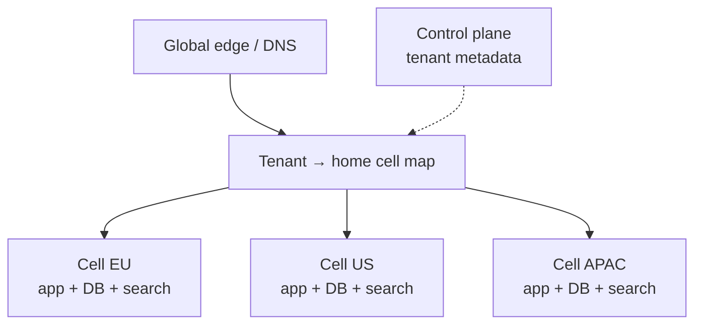

# Regional cells and data residency

arch §10 chooses **pool vs silo**. This section covers **where** a tenant’s data and compute live — cells, residency pins, and what must not cross a border.

> **Scope:** Cell topology, residency keys, routing, replication limits, cutover, compliance drills. Isolation model choice → [§10](10-multi-tenant-system-models.md). Multi-region **read** routing → [HTS §13](../../high-throughput-systems/includes/13-multi-region-read-routing.md). Consistency costs → [PG §14](../../postgresql-performance/includes/14-consistency-promises-and-costs.md). API(Application Programming Interface) residency table → [api-design §16](../../api-design-and-protection/includes/16-multi-tenant-apis.md). Erasure in-region → [ESC §7A](../../enterprise-security-compliance/includes/07A-erasure-and-dsar.md).
>
> **Related:** Failure domains → [§11](11-failure-domains.md) · Capacity → [§13](13-capacity-estimation.md) · Auth tenant resolution → [auth §2d](../../auth-oauth-oidc-and-login-security/includes/02D-multi-tenant-oidc-and-b2b-sso.md) · Kafka multi-region / DR(Disaster Recovery) → [apache-kafka §10](../../apache-kafka/includes/10-operations-dr-security-and-observability.md)

---

## At a glance

| Concept | Meaning |
|---------|---------|
| **Cell** | Independent stack slice (app + data + deps) serving a segment of tenants or a region |
| **Residency pin** | Contract: tenant data (and often processing) stays in region X |
| **Home cell** | Authoritative cell for a tenant’s writes |
| **Global edge** | DNS(Domain Name System)/gateway that routes to the home cell |

**Rule of thumb:** Treat residency as a **hard placement constraint**, not a CDN(Content Delivery Network) preference. If legal says “EU data stays in EU,” do not silently replicate PII(Personally Identifiable Information) to a US analytics cluster.

---

## When you need cells

| Driver | Cell response |
|--------|----------------|
| Data residency / sovereignty | Region-pinned cells; no PII cross-region replicate |
| Blast radius | Limit outage to one cell; [§11](11-failure-domains.md) |
| Noisy neighbor / huge tenant | Dedicated cell or silo inside a region — [§10](10-multi-tenant-system-models.md) |
| Scale-out of control plane | Split tenant directory by cell |

SMB(Small and Medium Business) single-region pool is fine until contracts or scale force otherwise.

---

## Topology patterns



| Pattern | Writes | Reads | Residency |
|---------|--------|-------|-----------|
| **Active-passive per cell** | Home region only | Local or failover | Strong |
| **Read replicas in-region** | Home AZ/region | Local replicas | Strong if replicas stay in pin |
| **Global table for non-PII** | Replicated metadata | Anywhere | Only for non-restricted classes — [ESC §7](../../enterprise-security-compliance/includes/07-pii-and-data-classification.md) |
| **True multi-master across regions** | Conflict-prone | Local | Usually **incompatible** with strict residency |

HTS §13 covers product read-routing; cells add **tenant→cell** binding and **forbidden replication** lists.

---

## Residency key and routing

| Artifact | Practice |
|----------|----------|
| **`residency_region` / `home_cell_id`** | Immutable (or change via explicit migration); store on tenant record |
| **Edge route** | Resolve tenant (host/path/token) → cell base URL — align with [auth §2d](../../auth-oauth-oidc-and-login-security/includes/02D-multi-tenant-oidc-and-b2b-sso.md) HRD(Home-Realm Discovery) |
| **Tokens** | Include `tenant_id` + optionally `cell`/`region` claim; APIs reject wrong-cell calls |
| **Jobs / SCIM(System for Cross-domain Identity Management) / webhooks** | Execute in home cell; do not pull EU subjects into US workers |
| **Analytics** | In-region warehouse **or** anonymized export only |

```text
tenants(id, slug, home_cell_id, residency_region, ...)
cell_routes(cell_id, region, api_base_url, status)
```

---

## What not to replicate

| May cross region | Must not (typical residency contract) |
|------------------|----------------------------------------|
| Encrypted backups to approved geo | Raw PII to global search/warehouse |
| Aggregated metrics without identifiers | Support tooling that mirrors prod DB globally |
| Public marketing content | IdP(Identity Provider) assertion archives with personal claims (unless approved) |

Document exceptions with legal sign-off; encrypt + access review if temporary.

---

## Cutover and migration

| Move | Steps |
|------|-------|
| **New tenant** | Assign home cell at signup from contract/geo |
| **Pool → cell** | Export/import or logical replication; freeze writes; cut DNS/token; verify; decommission source copy |
| **Cell → cell (region change)** | Rare; treat as project: dual-run, legal approval, DSAR(Data Subject Access Request)/erasure map update — [ESC §7A](../../enterprise-security-compliance/includes/07A-erasure-and-dsar.md) |
| **Failover** | In-region first; cross-region only if contract allows (often RPO(Recovery Point Objective)/RTO(Recovery Time Objective) vs residency tradeoff) |

---

## Drills and checklist

- [ ] Every tenant has `home_cell_id` + `residency_region`
- [ ] Edge and auth resolve to home cell; wrong-cell API returns clear error
- [ ] Data-map marks which stores are region-pinned — [ESC §7A](../../enterprise-security-compliance/includes/07A-erasure-and-dsar.md)
- [ ] No unauthorized PII pipelines to other regions (CI check / catalog)
- [ ] Cell outage runbook: capacity, status page, in-region failover only
- [ ] Tenant restore drill per cell — [§10](10-multi-tenant-system-models.md), [PG §16](../../postgresql-performance/includes/16-backup-restore-and-pitr.md)
- [ ] Quarterly: pick a tenant, prove data plane locality (DB endpoints, object buckets, Kafka cluster)

---

## Common mistakes

| Mistake | Fix |
|---------|-----|
| CDN geo ≠ residency | Pin origin/data, not only PoPs |
| Global Redis/search “for convenience” | Per-cell or redact |
| Auth in region A, data in B without review | Co-locate session/token validation with data plane when required |
| Silent MM2(MirrorMaker 2) / DB replica across pin | Block in platform policy |
| Cell share one Kafka cluster with mixed topics and no ACLs | Per-cell bus or strong tenant isolation — [kafka §2](../../apache-kafka/includes/02-topics-partitions-and-replication.md#multi-tenant-isolation) |

---

## Pros and cons

### Region-pinned cells

**Pros:** Clear compliance story; limited blast radius; scales by adding cells.

**Cons:** Higher fixed cost; feature rollout fan-out; cross-cell collaboration features are hard.

### Single global pool

**Pros:** Simple ops early.

**Cons:** Fails enterprise residency RFPs; blast radius is the world.