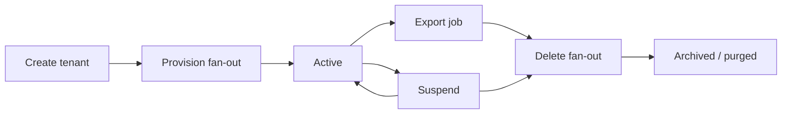

# Tenant Lifecycle — Provision, Suspend, Delete

A tenant (org/workspace) is a **long-lived boundary** — not only a row in `organizations`. Lifecycle spans provisioning resources, operational suspend, export, and delete with fan-out across data, identity, billing, and regional cells.

> **Scope:** Program-level tenant lifecycle — create → provision → suspend → delete/export orchestration. Isolation model choice → [§10](10-multi-tenant-system-models.md). Regional cells / residency → [§10A](10A-regional-cells-and-residency.md). HTTP(Hypertext Transfer Protocol) tenancy → [api-design §16](../../api-design-and-protection/includes/16-multi-tenant-apis.md). PostgreSQL RLS(Row-Level Security) → [PG §17](../../postgresql-performance/includes/17-row-level-security-multi-tenant.md). Schema/DB silos → [PG §18](../../postgresql-performance/includes/18-schema-and-database-per-tenant.md). Erasure / DSAR(Data Subject Access Request) → [ESC §7A](../../enterprise-security-compliance/includes/07A-erasure-and-dsar.md). SCIM(System for Cross-domain Identity Management) membership → [api-design §12C](../../api-design-and-protection/includes/12C-scim-and-jml-provisioning.md).
>
> **Related:** API(Application Programming Interface) contracts for lifecycle → [api-design §16A](../../api-design-and-protection/includes/16A-tenant-lifecycle-apis.md) · Data ownership → [§8](08-data-ownership.md) · Failure domains → [§11](11-failure-domains.md) · Subscription suspend → [payments §5A](../../payments-and-fintech/includes/05A-subscription-billing-and-dunning.md)

---

## At a glance

| Phase | Goal | Exit criteria |
|-------|------|---------------|
| **Create** | Record tenant + admin; no heavy resources yet | Id issued; default roles seeded |
| **Provision** | Async fan-out: DB, search, buckets, webhooks | All required resources `ready` |
| **Active** | Normal operation | — |
| **Suspend** | Block writes/login; retain data | Billing + security triggers documented |
| **Export / delete** | Customer exit; regulatory erasure | Jobs complete; attestations logged |

**Rule of thumb:** **Provision and delete are workflows**, not synchronous API handlers. Status endpoints and idempotent job keys — [api-design §16A](../../api-design-and-protection/includes/16A-tenant-lifecycle-apis.md).

---

## Lifecycle orchestration

| Fan-out target | Provision | Delete |
|----------------|-----------|--------|
| **OLTP(Online Transaction Processing) schema / RLS** | Seed tenant row + policies — [PG §17](../../postgresql-performance/includes/17-row-level-security-multi-tenant.md) | Drop or anonymize per retention |
| **Search index** | Empty tenant prefix — [data-platforms §2](../../data-platforms/includes/02-search-systems.md) | Delete-by-query async |
| **Object storage** | Prefix + IAM(Identity and Access Management) | Lifecycle purge |
| **IdP(Identity Provider) / SCIM** | Optional org link — [api §12C](../../api-design-and-protection/includes/12C-scim-and-jml-provisioning.md) | Disable users; revoke tokens |
| **Billing** | Subscription attach | Final invoice; cancel — [payments §5A](../../payments-and-fintech/includes/05A-subscription-billing-and-dunning.md) |

---

## Suspend semantics

| Trigger | Suspend flavor |
|---------|----------------|
| **Non-payment** | Soft → hard per [payments §5A](../../payments-and-fintech/includes/05A-subscription-billing-and-dunning.md) |
| **Security / ATO(Account Takeover)** | Immediate login block + token revoke — [auth §03B](../../auth-oauth-oidc-and-login-security/includes/03B-revoke-logout-denylist.md) |
| **Contract / legal hold** | Read-only; block new users |
| **Admin action** | Audited; reason code required |

Suspended tenants must not enqueue side effects (webhooks, emails, meter events) that imply active service.

---

## Export and delete

| Requirement | Practice |
|-------------|----------|
| **Export before delete** | Offer JSON/CSV bundle; async job with TTL(Time To Live) download |
| **DSAR alignment** | Map tenant delete to subject erasure where applicable — [ESC §7A](../../enterprise-security-compliance/includes/07A-erasure-and-dsar.md) |
| **Residency** | Delete in tenant's cell — [§10A](10A-regional-cells-and-residency.md) |
| **Silo tenants** | DB-per-tenant drop is fast; pool requires scoped delete scripts — [PG §18](../../postgresql-performance/includes/18-schema-and-database-per-tenant.md) |
| **Proof** | Completion certificate + audit event |

Never hard-delete from a single monolith transaction across all stores.

---

## Operational checklist

- [ ] Provision workflow idempotent on retry
- [ ] Suspend propagates to gateway, AuthZ(Authorization), and workers within SLO(Service Level Objective)
- [ ] Export job size limits and encryption documented
- [ ] Delete runbook names owners per datastore
- [ ] Enterprise contracts define retention after cancel

---

## Common mistakes

| Mistake | Fix |
|---------|-----|
| Sync `POST /tenants` blocks on full provision | 202 + status poll — [api §16A](../../api-design-and-protection/includes/16A-tenant-lifecycle-apis.md) |
| Suspend only updates one service | Orchestrated fan-out + cache bust |
| Delete without export window | Mandatory export offer for B2B(Business-to-Business) |
| Pool delete misses object storage | Checklist per [§8](08-data-ownership.md) |
| SCIM still provisions into deleted org | Tombstone + 410 on org id — [api §12C](../../api-design-and-protection/includes/12C-scim-and-jml-provisioning.md) |
| Cross-cell delete | Route to home cell — [§10A](10A-regional-cells-and-residency.md) |

---

## Pros and cons

| Model | Pros | Cons |
|-------|------|------|
| **Central lifecycle orchestrator** | One status surface; consistent suspend | Another service to operate |
| **Ad-hoc per-team hooks** | Fast to start | Drift; incomplete suspend |
| **DB-per-tenant delete** | Clean boundary — [PG §18](../../postgresql-performance/includes/18-schema-and-database-per-tenant.md) | Cost at scale |
